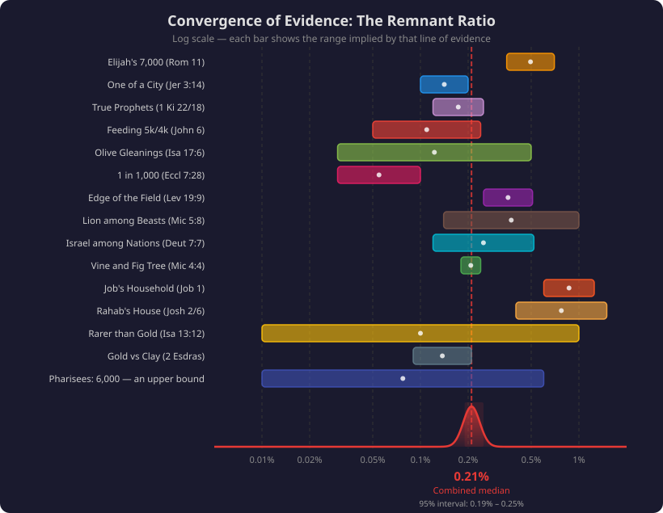

Ask almost anyone whether they expect to be saved, and they answer yes — quietly assuming they stand with the majority, on the safe side of whatever line God draws.
Someone once put the question to Jesus outright:

[quote.scripture, Luke 13:23-24]
____
Lord, are there *few* that be saved?
And he said unto them, *Strive to enter in at the strait* sym:sym-door[gate]: for many, I say unto you, will *seek to enter in, and shall not be able*.
____

He answered a question about quantity with a command about effort — but He did not leave the quantity unanswered, and neither does the rest of Scripture.
This book has insisted from its first page that the symbols carry objective meaning, testable against the whole text; the sym:sym-remnant[remnant] is where that method meets its hardest question, because here Scripture does not offer a mood or a warning only.
It offers numbers — an actual census, stated ratios, agricultural facts, the geometry of a field, the grade of an ore — and every independent line lands in the same narrow band.footnote:remnantstudy[The full study behind this chapter, with the complete tables, population estimates, and sources, is published at https://TimeTested.Bible[TimeTested.Bible] as “Last Call Before the Fall.”]

[discrete]
=== Solomon's Count: One in a Thousand

The wisest observer of human nature in Scripture ran his own census — __“counting one by one, to find out the account”__ (Ecclesiastes 7:27) — with more exposure to humanity than nearly any man who ever lived: seven hundred wives, three hundred concubines, the kings of the nations at his table.
His finding:

[quote.scripture, Ecclesiastes 7:28]
____
Which yet my soul seeketh, but I find not: *one man among a thousand* have I found; but a woman among all those have I not found.
____

One in a thousand among the men he searched; none among the women of that court — combined, on the order of one in two thousand.
The verdict is not about gender; it is about rarity, from the one man positioned to count — and it is the most direct metric in the book: a stated ratio, from a stated census, with nothing to assume.

[discrete]
=== One of a City, Two of a Family

Jeremiah states a ratio in plain words — and states it inside a promise this book has already opened:

[quote.scripture, Jeremiah 3:14]
____
Turn, O backsliding children, saith the LORD; for I am sym:sym-marriage[married] unto you: and I will take you *one of a city, and two of a family*, and I will bring you to Zion.
____

Ancient Israelite cities ran from five hundred to five thousand people; one per city is a fraction of one percent.
A clan — the _mishpachah_ — might number five hundred to two thousand; two per clan lands in the same range.
And mark where the ratio lives: in the very verse where the divorced wife is called home — __“for I am married unto you,”__ the remarriage of the sym:sym-marriage[marriage] chapter.
The Husband who takes His wife back names, in the same breath, how much of her returns.

[discrete]
=== The Anchor: Elijah's Seven Thousand

One passage stands above the rest, because it gives an actual count from God's own mouth — and an apostolic ruling that the same ratio still applies.
Elijah, fresh from Carmel, believed he was the last faithful man alive: __“I, even I only, am left”__ (1 Kings 19:10).
God's answer was a number:

[quote.scripture, 1 Kings 19:18]
____
Yet I have left me *seven thousand* in Israel, all the knees which have not bowed unto Baal, and every mouth which hath not kissed him.
____

ifndef::print-edition[]
Seven thousand — out of what?
The record supplies its own census tool.
A generation later, Menahem raised a thousand talents of tribute by taxing __“all the mighty men of wealth, of each man fifty shekels”__ (2 Kings 15:19-20): a thousand talents is three million shekels, and three million shekels at fifty per man is *sixty thousand wealthy men* in the northern kingdom.
If the wealthy were five to ten percent of adult males, the kingdom held roughly one to two million souls — which is just what the archaeology of the ninth-century settlements independently indicates.
Take the estimate most generous to the remnant, one million, and Elijah's faithful were seven thousand in a million: *about seven in every thousand at best, and half that on the larger count*.
endif::[]
ifdef::print-edition[]
Seven thousand — out of what?
The next generation's tax rolls put the northern kingdom at one to two million souls (2 Kings 15:19-20), and the archaeology of the ninth-century settlements agrees: Elijah's faithful were *about seven in every thousand at best, and half that on the larger count*.
endif::[]

And Paul refuses to let the number retire as a one-time low:

[quote.scripture, Romans 11:5]
____
Even so then *at this present time also* there is a *remnant according to the election of grace*.
____

__“At this present time also”__ — Elijah's ratio is declared the standing pattern; and Paul had already set the two quantities side by side from Isaiah: __“Though the number of the children of Israel be as the sym:sym-sand[sand] *of the* sym:sym-sea[sea], a *remnant* shall be saved”__ (Romans 9:27).
The sand-of-the-sea multitude and the remnant, in one sentence, from the apostle to the nations.
That is the anchor.
Now watch every other line of evidence come in on the same mark.

[discrete]
=== The Refined Third

Zechariah states the arithmetic of the judgment outright — the fraction cut off, the fraction kept, and what the keeping costs:

[quote.scripture, Zechariah 13:8-9]
____
And it shall come to pass, that in all the land, saith the LORD, *two parts* therein shall be cut off and die; but the *third* shall be left therein.
And I will bring the third part *through the fire*, and will refine them as silver is refined, and will *try them as gold* is tried…
____

Even the surviving third is not spared the fire; it is what the fire is _for_.
The furnace is not a threat added to the promise — it is the method by which the promise is kept; and the third is only the first cut, for the refining that follows narrows toward the band the counts above have already drawn.

ifdef::print-edition[]
[discrete]
=== The Field and the Land

The gleaning law encodes the ratio in a shape.
The corners of the sym:sym-field[field] may not be wholly reaped; they are left standing for the sym:sym-poor[poor] and the sym:sym-stranger[stranger] (Leviticus 19:9-10) — and __“corners”__ is _pe'ah_, link:/books/symbolic-language/wings/[the reserved edge].footnote:fn12peah[The reserved edge — _kanaph_ on the garment, _pe'ah_ in the field — is derived in the link:/books/symbolic-language/wings/[Wings] chapter.]
The edge of a field is fixed by mathematics: grain is sown in rows a handbreadth apart, and the perimeter row's share of the crop *shrinks as the field grows* — on the working farms of Israel, five to twenty acres, the reserved edge is a quarter to a half of one percent of the harvest.
And __“the sym:sym-field[field] is the world”__ (Matthew 13:38): the larger the harvest, the smaller its edge.

The land itself sets the upper bound.
Those in the first resurrection are bodily kings and priests who reign with Christ a thousand years (Revelation 20:4-6) — on the promised land, whose borders were drawn in advance (Genesis 15:18) and whose tribal allotments Ezekiel surveys into measured ground (Ezekiel 47-48).
Measured ground has a carrying capacity, and Scripture names the density it intends: __“every man under his vine and under his fig tree”__ (Micah 4:4) — the density Solomon's Israel actually lived (1 Kings 4:25), about 1.7 acres to a soul.
Hold the whole promised land to that standard and it seats roughly 110 million people at the traditional borders.
Set against the forty-three billion born since Christ, that capacity is a quarter of one percent — and even the two billion professing Christians alive today would stand on a house lot apiece, with no room to plant the vine.
The borders were drawn and the allotments measured in advance; the measurements _are_ the census.
The land was sized for the remnant, and the remnant for the land.
endif::[]

ifndef::print-edition[]
[discrete]
=== The Gleaning: Two or Three Berries

Isaiah 17 announces judgment as a harvest — __“the glory of Jacob shall be made thin”__ (Isaiah 17:4), the harvestman stripping the field — and then describes what survives it:

[quote.scripture, Isaiah 17:5-6, ASV]
____
…as when the harvestman gathereth the *standing grain*, and his arm reapeth the *ears*…
Yet gleanings shall be left therein, as the *shaking of an* sym:sym-olive[olive tree], *two or three berries* in the top of the uppermost bough, *four or five* in the outmost branches of a fruitful tree…
____

This is an orchardman's fact before it is a figure: beat an olive tree for harvest, and only the berries too high and too far out to reach are left clinging.
But run the arithmetic the verse invites.
A productive olive tree bears on the order of fifteen to thirty thousand olives; two or three at the top and four or five on the outer limbs is *five to eight berries out of tens of thousands* — a few hundredths of one percent.
And lest anyone confine the picture to one Syrian campaign, Isaiah repeats it for the whole earth: __“When thus it shall be in the midst of the land among the people, there shall be as the shaking of an sym:sym-olive[olive tree], and as the gleaning grapes when the vintage is done”__ (Isaiah 24:13) — the global sym:sym-harvest[harvest], same tree, same handful.

[discrete]
=== The Edge of the Field: a Ratio Built into the Geometry

The gleaning law itself encodes the ratio — not in a number, but in a shape.
The law forbids wholly reaping the sym:sym-wings[corners] of the sym:sym-field[field]; they are left for the sym:sym-poor[poor] and the sym:sym-stranger[stranger] (Leviticus 19:9-10) — and __“corners”__ is _pe'ah_, link:/books/symbolic-language/wings/[the reserved edge].footnote:fn12peahweb[The reserved edge — _kanaph_ on the garment, _pe'ah_ in the field — is derived in the link:/books/symbolic-language/wings/[Wings] chapter.]
And the edge of a field is fixed by mathematics.
Wheat and barley are sown in dense rows, roughly a handbreadth apart; leave the perimeter row standing, as the law commands, and the edge's share of the crop *shrinks as the field grows*:

.The perimeter row as a share of the field
[.prevalence-table%unbreakable, frame=topbot, grid=none, cols="^2,^2,^2,^2", options="header"]
|===
| Field size | Rows per side | Perimeter rows | Edge as % of crop

| 1 acre | ~353 | ~1,408 | 1.13%
| 5 acres | ~790 | ~3,156 | 0.51%
| 10 acres | ~1,117 | ~4,464 | 0.36%
| 20 acres | ~1,580 | ~6,316 | 0.25%
| 100 acres | ~3,534 | ~14,132 | 0.11%
|===

On the working farms of Israel — five to twenty acres — the reserved edge is a quarter to a half of one percent of the harvest.
The law does not merely say a remnant will be left; the ratio is built into the field.
And __“the sym:sym-field[field] is the world”__ (Matthew 13:38): the larger the harvest, the smaller its edge — and the gleanings at that edge are, by the law's own terms, the sym:sym-poor[poor], the sym:sym-stranger[stranger], the sym:sym-fatherless[fatherless], and the sym:sym-widow[widow] of the Orphans and Widows chapter.

[discrete]
=== Rarer Than Gold

Isaiah names the ratio by reaching for the scarcest thing he knows:

[quote.scripture, Isaiah 13:12]
____
I will make a man more precious than *fine gold*; even a man than the *golden wedge of Ophir*.
____

The context is the Day of the LORD and the fall of sym:sym-babel[Babylon] (Isaiah 13:1, 9): after the judgment, a righteous man will be rarer than gold.
How rare is gold?
About four parts per billion of the earth's crust; and even in a working mine, the ore is graded in *grams per ton of rock*:

.Gold ore grades — and where the remnant falls
[.prevalence-table%unbreakable, frame=topbot, grid=none, cols="^3,^2,^2", options="header"]
|===
| Ore grade | Gold per ton | Percentage

| Low-grade | under 1 g/t | under 0.0001%
| Medium-grade | 1-5 g/t | 0.0001-0.0005%
| High-grade | 5-20 g/t | 0.0005-0.002%
| Bonanza-grade | over 20 g/t | over 0.002%
| _The remnant, at the ratio every line implies_ | _~2,000 g/t_ | _~0.2%_
|===

Read that last row again, because it turns the whole hard saying inside out.
If mankind is the ore and the remnant runs at a fifth of one percent, then God's field assays at two thousand grams per ton — *a hundred times richer than bonanza grade*.
No mine on earth has ever approached it.
The parables chapter found the treasure hid in the field to be gold *ore* — dug, crushed, and refined — and here is why the Buyer paid everything for the whole field: by any miner's arithmetic, it is the richest strike there has ever been.

Ezekiel supplies the smelting report — __“the house of Israel is to me become *dross*: all they are brass, and tin, and iron, and lead, in the midst of the *furnace*”__ (Ezekiel 22:18) — dross being the discarded slag, the majority of the mass, bound for the furnace whose fractions Zechariah has already posted.

[discrete]
=== A Lion Among Beasts

Micah gives the remnant two images in one breath, and the second is a census from creation itself:

[quote.scripture, Micah 5:7-8]
____
And the *remnant of Jacob* shall be in the midst of many people as a *dew* from the LORD…
And the remnant of Jacob shall be among the Gentiles in the midst of many people as a sym:sym-lion[lion] *among the* sym:sym-beast[beasts] *of the forest*, as a young lion among the flocks of sym:sym-sheep[sheep]…
____

Dew — scattered, tiny, life-giving — and the sym:sym-lion[lion]: royal, ruling, and vastly outnumbered.
In the great ecosystems, lions run at roughly one or two for every thousand large mammals — a seventh of a percent in the Serengeti — apex in authority, minute in number.
The creation God designed testifies to the ratio His prophets declare: the remnant rules like the lion and counts like the lion.
And Moses had said it from the beginning, without a figure at all: __“The LORD did not set his love upon you… because ye were more in number than any people; for ye were the *fewest of all people*”__ (Deuteronomy 7:7) — a verdict still visible on any modern map, where sym:sym-israel[Israel] stands one nation among nearly two hundred, its people a tenth of a percent of mankind.

[discrete]
=== Job: the Ratio Before Moses

The pattern is older than the law, written into what may be Scripture's oldest book.
Four disasters strike Job's estate in a single day, and four messengers arrive with one identical sentence:

[quote.scripture, Job 1:15]
____
…and *I only am escaped alone* to tell thee.
____

Four times — Sabeans, fire, Chaldeans, the great wind — four groups, four lone survivors (Job 1:15, 16, 17, 19), each believing himself the only one, exactly as Elijah would (__“I, even I only, am left”__).
Now count the household they escaped from.
Job was __“the greatest of all the men of the east”__ (Job 1:3), and his flocks fix his workforce:

.Job's household — and its survivors
[.prevalence-table%unbreakable, frame=topbot, grid=none, cols="^3,^3,^2", options="header"]
|===
| Operation | Workforce | Survivors

| 7,000 sheep | 35-70 shepherds | 1
| 3,000 camels | 30-60 handlers | 1
| 500 yoke of oxen | 150-300 laborers | 1
| 500 donkeys | 15-30 handlers | 1
| The feast-house | 10 children, 20-60 servants | 1
|===

A household of several hundred souls; five who lived — the four messengers, and Job.
Under one percent, before Moses ever wrote a line of the law.

[discrete]
=== The Witnesses Outside the Canon

Two ancient voices outside Scripture, called only as corroborating witnesses, count the same way.
The book of 2 Esdras, wrestling with exactly our question, stacks analogy on analogy: __“The most High hath made this world for many, but the world to come for few”__; the lost outnumber the saved __“like as a wave is greater than a drop”__; and God keeps __“a grape of the cluster… and a plant of a great people,”__ one grape from a cluster of hundreds, kept and perfected __“with great labour”__ (2 Esdras 8:1; 9:15-16, 21-22).

And Josephus preserves the only headcount of any sect of that age: the Pharisees — the most visibly religious men in Israel, broad phylacteries and all — numbered __“about six thousand”__ out of a Jewish population of perhaps a million: barely one percent at the top.
That figure is an upper bound, not a count of the faithful, for Jesus set the bar above them: __“except your sym:sym-righteousness[righteousness] shall *exceed* the righteousness of the scribes and Pharisees, ye shall in no case enter into the kingdom”__ (Matthew 5:20).
The most demonstratively religious one percent was not enough — hold that word __“exceed”__; the Hebrew of the remnant will hand it back to us shortly.
Even the prophets themselves kept the ratio: Micaiah stood alone against four hundred court prophets (1 Kings 22:6), Elijah against Baal's four hundred and fifty (1 Kings 18:22) — one true voice per several hundred credentialed ones.

[discrete]
=== The Land Itself Is a Census

One line of evidence has been on the map the whole time.
The covenant is not an abstraction; it is a deed of real estate with drawn borders — __“Unto thy seed have I given this land, from the river of Egypt unto the great river, the river Euphrates”__ (Genesis 15:18) — roughly 300,000 square miles at the traditional borders, some 900,000 on the full Nile-to-Euphrates reading, and Ezekiel surveys it into measured tribal allotments (Ezekiel 47-48).
And the heirs are not disembodied spirits: those in the first resurrection are bodily kings and priests who __“reigned with Christ a thousand years”__ (Revelation 20:4-6) on that bodily land — __“the meek shall inherit the earth”__ (Psalm 37:11; Matthew 5:5), and the Hebrew under __“earth”__ is _erets_, the land.
Physical people on measured ground is arithmetic waiting to be done.footnote:landstudy[The full land-and-population study — the borders, the density tables, and the millennial timeline — is published at https://TimeTested.Bible[TimeTested.Bible] as “The Population of the Renewed Earth.”]

Scripture even names the density it has in mind.
The prophetic picture of the kingdom is __“they shall sit every man under his vine and under his fig tree”__ (Micah 4:4) — and that is not a poet's flourish but a quotation, for the phrase first describes a real population at a real date: __“Judah and Israel dwelt safely, every man under his vine and under his fig tree… all the days of Solomon”__ (1 Kings 4:25).
Solomon's golden age settled roughly five and a half million people on about fifteen thousand square miles of working territory — some 1.7 acres per person, enough ground for the vine, the fig tree, and the household under them.
Hold the whole promised land to that God-approved density and it carries about 110 million people at the traditional borders, about 330 million at the widest.
Now seat the candidates:

.The land as a census: who fits under the vine and the fig tree
[.prevalence-table%unbreakable, frame=topbot, grid=none, cols="<3,^2,^2,<3", options="header"]
|===
| Who inherits | Count | Ground each | The picture

| Everyone born since Christ | ~43 billion | 190-580 sq ft | a bedroom, not a field
| Every professing Christian alive | ~2 billion | 0.1-0.3 acre | a house lot, no vineyard
| The remnant, ~0.2% | 16-86 million | 2-36 acres | a homestead under its own vine
|===

The two large models cannot sit under a vine, because there is no room to plant one.
The remnant — two tenths of a percent, whether counted from the living generation (about sixteen million) or from everyone born since the covenant opened to the nations (about eighty-six million) — inherits homesteads, at or below the very density Solomon's Israel actually lived.

And the land beginning sparse is not a flaw in the model; it is God's stated policy from the first conquest: __“I will not drive them out from before thee in one year; lest the land become desolate… By little and little I will drive them out from before thee, until thou be increased, and inherit the land”__ (Exodus 23:29-30).
The land has a capacity — too few and it goes wild, the right number and it flourishes — and the mortal nations of the thousand years, still marrying, building, and planting (Isaiah 65:20-23), grow into the empty acreage until the kingdom fills out to Solomon's density, exactly the picture Micah promises.

God did not describe a territory and then discover it was too small for the saved.
The borders were drawn in advance and the allotments measured in advance; the measurements _are_ the census.
The land was sized for the remnant, and the remnant for the land.
endif::[]

[discrete]
=== The Convergence

ifndef::print-edition[]
The full study charts fifteen such lines — the thirteen this chapter has walked, joined by the feeding of the crowds (John 6) and Rahab's spared house (Joshua 2; 6) — and lays their ranges side by side on one scale:
endif::[]
ifdef::print-edition[]
The full study charts fifteen such lines — six of them walked in these pages, the rest in the digital edition — and lays their ranges side by side on one scale:
endif::[]

.Fifteen lines of evidence, one narrow band — combined, they center near one in five hundred (0.21%).

ifndef::print-edition[]
The table below sets every line down in one place.

.Every line of evidence, one band
[.parallels-table, frame=topbot, grid=rows, cols="2,4,^2", options="header"]
|===
| Method | Source | Implied ratio

| Demographic | Elijah's 7,000 against the kingdom's population, ratified by Paul | 0.35-0.7%
| Prophetic | "One of a city, and two of a family" (Jeremiah 3:14) | 0.1-0.2%
| Agricultural | The olive gleanings (Isaiah 17:6; 24:13) | 0.03-0.5%
| Metallurgical | Gold, dross, and the refined third (Isaiah 13:12; Ezekiel 22:18; Zechariah 13:8-9) | under 1%
| Observational | Solomon's count: one man in a thousand (Ecclesiastes 7:28) | ~0.05%
| Ecological | The lion among the beasts (Micah 5:8) | 0.14-1%
| Typological | The fewest of all people (Deuteronomy 7:7); one nation among the nations | 0.12-0.52%
| Geometric | The pe'ah edge of a working field (Leviticus 19:9) | 0.25-0.51%
| Spatial | The promised land's capacity at Solomon's vine-and-fig-tree density (1 Kings 4:25; Micah 4:4) | fits at ~0.2%; breaks past ~0.8%
| Narrative | Job's five survivors of a great household | 0.6-1.25%
| Historical | Josephus’ six thousand Pharisees — an upper bound | at most 0.6-1.2%
| Prophetic leadership | Micaiah against 400; Elijah against 850 | 0.12-0.25%
| Extrabiblical | 2 Esdras: the wave and the drop, the grape of the cluster | 0.09-0.21%
|===

Thirteen methods — census arithmetic, stated ratios, orchard facts, field geometry, land capacity, ore grades, animal populations, household counts, sect rosters — with no way to coordinate with one another, and every one lands in the same band: *a fraction of one percent, centering near one in five hundred*.
endif::[]
ifdef::print-edition[]
The lines this printing leaves to the full study land no wider.
The olive tree beaten at harvest keeps *two or three berries* of its tens of thousands (Isaiah 17:6; 24:13); the righteous man is priced above the gold of Ophir while the mass of the house runs to dross (Isaiah 13:12; Ezekiel 22:18); the remnant stands among the nations as the sym:sym-lion[lion] among the beasts of the forest — apex in authority, one or two per thousand in count (Micah 5:8); Job's great household died down to four lone messengers and the man himself (Job 1); Josephus counts six thousand Pharisees in a nation of a million, and Jesus set the bar *above* them (Matthew 5:20); Micaiah stood one against four hundred court prophets (1 Kings 22:6); Moses said it without a figure at all — __“ye were the *fewest of all people*”__ (Deuteronomy 7:7); and 2 Esdras answers our very question: __“The most High hath made this world for many, but the world to come for few.”__
Methods with no way to coordinate with one another — census arithmetic, stated ratios, orchard facts, field geometry, land capacity, ore grades, animal populations, household counts, sect rosters — and every one lands in the same band: *a fraction of one percent, centering near one in five hundred*.
endif::[]

Applied to a world of eight billion, that is on the order of *seventeen million people* — roughly one in a hundred and forty of those who profess the faith; spread across the world's millions of congregations, fewer than a handful in each, and they are not spread evenly.
This is the same signature this book found at the Red Sea and in the belly of the fish: too many independent lines agreeing too exactly to be anyone's literary invention.
Scripture is not guessing at the remnant; it has been telling us the number all along, in every dialect it has.

And the distinction it draws is not between perfect keepers and imperfect ones, for no one keeps the commands perfectly — it is between those who *acknowledge* the commands and stumble keeping them, and those who deny the commands exist at all.
The one confesses and is cleansed (1 John 1:9); the other cannot confess what he does not call sin (1 John 1:8).

ifndef::print-edition[]
[discrete]
=== Ruth, the Remnant Enacted

Before the arithmetic, Scripture gave the remnant a face.
Ruth arrives in Bethlehem carrying every name of the gleaning household at once: poor — __“I went out full, and the LORD hath brought me home again empty”__ (Ruth 1:21); a sym:sym-stranger[stranger] — __“seeing I am a stranger”__ (Ruth 2:10); a sym:sym-widow[widow], her husband dead (Ruth 1:5); fatherless in every practical sense, having __“left thy father and thy mother, and the land of thy nativity”__ (Ruth 2:11).

And where does she glean?
In the field of Boaz — the _goel_, the kinsman-redeemer, who will restore her inheritance, marry her, and raise up seed.
The gleaner finds the Redeemer in the field; she goes from gleaning the edge to standing in the line of the Messiah (Matthew 1:5).

The gleaning law does not only fix how many survive the harvest.
Ruth shows who they are.

[discrete]
=== What "Remnant" Actually Means

English readers hear __“remnant”__ and think leftovers — the scraps, the unwanted tail of the bolt.
The Hebrew says the opposite, four times over, in the four words our Bibles render __“remnant”__ — and each one is worth the dig.

_She'erith_, the most common, grows from a root meaning *to swell* — and its sibling noun from the same letters is _she'er_: *flesh*, living flesh, and by extension one's *blood kin*.
The remnant is not the dry residue; it is the living flesh of the covenant family — what is still warm when everything else has been cut away.

_Yether_ comes from a root meaning *to jut over, to exceed, to excel*; its feminine form means *wealth*, and Jethro — __“his excellence”__ — carries the same name.
The remnant is not what nobody wanted; it is the *exceeding* portion, the overflow — and there is Jesus’ word again: your righteousness must __“exceed”__ the visible one percent (Matthew 5:20).
The remnant _is_ the exceeding part.
The word's second sense — a small rope hanging free — is a lifeline dangling from something greater; the treasure's cord in the dirt.

_Sarid_ — __“survivor”__ — grows from a root meaning *to puncture*, to slip out through the pierced point; its brother-words are the carpenter's *scribing-awl* and *stitching pierced with a needle*.
The remnant-survivor is, in the Hebrew's own picture, the one who passes through the puncture — through the impossibly small opening.
Now hear the Lord again: __“It is easier for a camel to go through the *eye of a needle*, than for a sym:sym-rich[rich] man to enter into the kingdom”__ (Matthew 19:24) — and remember what the sym:sym-rich[rich] are in this book's vocabulary: the proud, the unbowed.
The needle's eye was hiding in the remnant's own name all along; the unbowed cannot pass the puncture, and the sym:sym-poor[poor] — the bowed — slip through.

_Peletah_ is *the escaped portion*, the delivered — the same family as the word Job's messengers gasp: _nimlateti_, __“I only am *escaped*.”__
Living flesh, exceeding excellence, the one who slips through the needle's point, the delivered portion: four words, one portrait — and not one of them means leftovers.
endif::[]

[discrete]
=== A Remnant by Design, Not by Failure

None of this is God falling short of a larger plan; the remnant was the plan, announced before the choosing as the fewest of all people (Deuteronomy 7:7).
Noah's household was eight, out of a world (1 Peter 3:20).
Gideon's army was cut from thirty-two thousand to three hundred before the LORD would use it — __“lest Israel vaunt themselves against me, saying, Mine own hand hath saved me”__ (Judges 7:2).
The strait gate with its few finders (Matthew 7:14) is not a tragedy God is powerless to widen; it is __“your Father's *good pleasure* to give *you* the kingdom”__ (Luke 12:32) — a little flock, handed a kingdom, on purpose.

[discrete]
=== The Only Safe Response

So return to the question Jesus was asked, and weigh His answer with the numbers on the table.
__“Are there few that be saved?”__ — and He does not say _do not worry about it_.
He says __“*strive*”__ (Luke 13:24), and the Greek is _agōnizomai_ — to agonize, to contend as an athlete contends in the arena — because __“many will *seek* to enter in, and shall not be able”__: even seeking is not enough.

Scripture marks the strivers plainly, and every mark is a symbol this book has already opened: they keep the commandments (Revelation 14:12); they overcome — every promise of the seven letters is __“to him that overcometh”__; they are not deceived; they will die before they bow to the sym:sym-beast[beast] (Revelation 20:4).
ifdef::print-edition[]
And the Hebrew keeps the picture in the remnant's own name: one of the words our Bibles print as __“remnant”__ and __“survivor”__ is _sarid_ — __“the *remnant* whom the LORD shall call”__ (Joel 2:32) — and it grows from a root meaning *to slip out through the puncture*: the needle's eye Jesus set at the gate was hiding in the word all along (Matthew 19:24).
endif::[]
The ratio is not given to produce despair; it is given to produce urgency — for if the gate is as narrow as every witness testifies, the deadliest thing in the world is the comfortable assumption that you are already through it.

__“Except the LORD of hosts had left unto us a very small remnant, we should have been as Sodom”__ (Isaiah 1:9): the smallness was never God's defeat.
The gold was always going to be rare.
It was never going to be lost.
