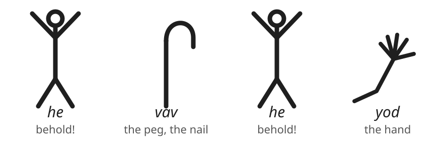

The square Hebrew letters on a Torah scroll today are not the letters the prophets first wrote.
That square hand came back from Babylon with the exiles; before it, Israel and Judah wrote in the old script — the one still found cut into Hezekiah's tunnel, stamped on Judean seals and coins — and that script descends from the first alphabet the world ever had, scratched out in the mining camps of Sinai in the very age Israel served in Egypt.
And in that first alphabet, the letters were not abstract marks.
They were pictures — small drawings of common things — and each letter still wears the name of the thing it drew.

This is not conjecture; the names are Bible words.
_Vav_ means hook or peg, and Scripture spends the word exactly thirteen times — every one of them a hook of the tabernacle: __“their *hooks* shall be of gold”__ (Exodus 26:32), the pegs that held the hangings and the veil.
_Yod_ is the little form of _yad_, the hand — the __“*mighty hand*”__ and __“stretched out arm”__ by which God takes a nation for Himself (Deuteronomy 4:34) — and it is the smallest letter of the alphabet, the very jot whose preservation Jesus pledged.
_He_ is the exclamation of the alphabet, the little word of wonder — __“*Behold*, I have bought you this day”__ (Genesis 47:23) — the syllable a man utters when he wants another to look.
And Scripture is conscious of its letters as letters: the 119th Psalm walks the whole alphabet eight verses at a time, Lamentations weeps through it, the virtuous wife of Proverbs 31 is praised down its length — and one jot or one tittle shall in no wise pass from the law.

First, the rule — because pictures are where a method goes to die.
A picture proves nothing by itself; it can be made to say whatever its handler is selling.
So in this book the pictures keep the same law as every reading: they may illustrate what the verses prove; they may never prove what the verses do not.
Hold that rule, and now spell the Name.

The Name of God is four letters: 𐤉𐤄𐤅𐤄 — _yod, he, vav, he_, read from right to left.
Those are the forms Judah's coins and Hezekiah's tunnel carry, already simplified for the chisel; behind them stand the first drawings.

.The Name in the first alphabet's pictures — read right to left

_Yod_: an arm with its hand.
_He_: a man with arms lifted, crying out — _look, behold_.
_Vav_: the peg, the nail that fastens.
_He_: behold, again.
Hand — behold; nail — behold.
Read the pictures as pictures, and the Name says: *Behold the hand; behold the nail.*

If that stood alone it would be a curiosity, and this book would not print it.
It does not stand alone.
The prophets say the same sentence in words, and they put it in the mouth of the Name-bearer Himself:

[quote.scripture, Zechariah 12:10]
____
And I will pour upon the house of David, and upon the inhabitants of Jerusalem, the spirit of grace and of supplications: and they shall *look upon me whom they have pierced*, and they shall mourn for him, as one mourneth for his only son.
____

The speaker is 𐤉𐤄𐤅𐤄 — the verse opens __“And I will pour”__ — and He says the beholding and the piercing of *Himself*: look upon *me*, whom *they pierced*.
John stands at the cross and cites it: __“They shall look on him whom they pierced”__ (John 19:37).
Isaiah asks the yod's question — __“to whom is the *arm* of the LORD *revealed*?”__ (Isaiah 53:1) — and answers it five verses later: __“he was *wounded* for our transgressions.”__
The psalm of the cross carries the same wounds in the same members — __“they *pierced* my hands and my feet”__ — the verse whose one disputed letter this part has already weighed.
And when the risen Lord meets the disciple who demanded __“the print of the *nails*”__ (John 20:25), He answers him in the Name's own grammar:

[quote.scripture, John 20:27]
____
Reach hither thy finger, and *behold my hands*; and reach hither thy hand, and thrust it into my side: and be not faithless, but believing.
____

_Behold my hands_ — the yod and the he, spoken aloud as an invitation.
And God had already said where to look for the engraving: __“*Behold*, I have *graven* thee upon the palms of my *hands*”__ (Isaiah 49:16) — behold, a graving, and hands, in one verse; His people are cut into the very place the nails went.

The word under __“palms”__ is _kaph_ — the palm proper, the hollow of the hand — and it has drawn an objection: much modern teaching moves the nails to the wrist, arguing that a palm cannot bear a body's weight.
The objection has been answered on its own terms.
Medical examiners who studied crucifixion — Frederick Zugibe foremost — showed that a nail driven at an angle through the upper palm, entering near the base of the thumb, passes between the bones of the hand, bears the full weight, and exits at the back of the wrist, where the wound on the Shroud of Turin sits.
And mark what that path does not do: it breaks no bone.
Scripture had fixed that condition more than a thousand years ahead — the Passover lamb, __“neither shall ye *break a bone* thereof”__ (Exodus 12:46); the psalm, __“He keepeth all his bones: *not one of them is broken*”__ (Psalm 34:20) — fulfilled at the cross when the soldiers __“brake not his legs… that the scripture should be fulfilled, A bone of him shall not be broken”__ (John 19:33, 36).
The nail's own path through the _kaph_ keeps the Passover rule.

Even the vav keeps its own house in order.
The thirteen hooks of Scripture hold up the tabernacle's hangings and its veil — and the veil, Hebrews says plainly, __“is to say, his flesh”__ (Hebrews 10:20), the freshly-slain and living way the Way chapter opened.
What the pegs held, the nails opened: __“the veil of the temple was rent in twain from the top to the bottom”__ (Matthew 27:51).
Zechariah hangs the kingdom on the same picture in a different word — __“Out of him came forth the corner, out of him the *nail*, out of him the battle sym:sym-bow[bow]”__ (Zechariah 10:4): out of Judah the cornerstone, the nail, the bow.
The word there is _yated_, the tent-peg, not _vav_ — a different word wearing the same picture, and this book says so plainly rather than claim a match the letters do not make.
Isaiah drives it into the ground: __“I will fasten him as a *nail* in a sure place; and he shall be for a glorious throne to his father's house”__ (Isaiah 22:23) — the same oracle whose key of David the risen Lord takes for His own title (Revelation 3:7).

Weigh what this layer is, and what it is not.
It decides no doctrine; the verses above stand complete without a single picture.
But the Name was spelled in these four drawings on scrolls a millennium and a half before Golgotha — the hand, the beholding, the peg, the beholding — and when the event came, the witnesses wrote it down in exactly those terms: behold the hands, the print of the nails, look upon me whom they have pierced.
The Introduction called the symbol-web a fingerprint; the letters carry it all the way down.

Now take the letters to the sky.
The lights of the fourth day were hung __“for signs, and for seasons”__ (Genesis 1:14) — the sym:sym-sun[sun], the sym:sym-moon[moon], and the sym:sym-stars[stars], whose offices are next.
