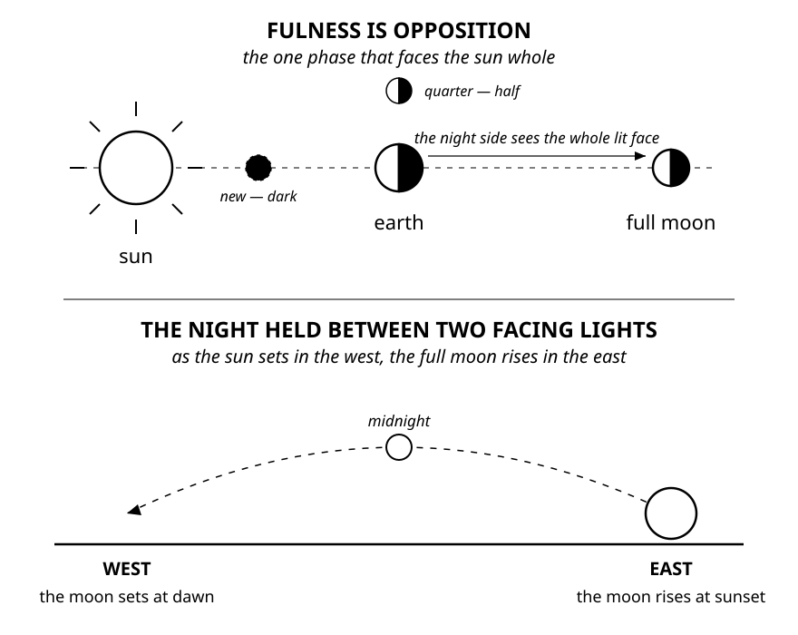

The prophecies of the Day of the LORD are written in words this book has already defined: sym:sym-sun[sun], sym:sym-moon[moon], sym:sym-day[day], sym:sym-night[night], sym:sym-east[east] and west, trumpet, silence.
Read them the way every symbol in this book has been read — each word taken to where Scripture uses it — and the prophets sketch not the date of that Day but its *configuration*: how the sky is arranged when it arrives.
Here is the claim to be tested: every physical mark the prophets give the Day of the LORD is a mark of the *full moon*, and no mark requires any other phase.
The witnesses come from the Writings, the Law's own history, the Prophets, the Gospels, and Revelation — and they agree on the phase while still concealing the date.
Yet the phase alone eliminates 97% of the possible days: one day in a month of 29 or 30 keeps the appointment hidden and still narrows the search to the night the moon is full.

[discrete]
=== The Appointment: Husband, Trumpet, Resurrection

Scripture names the phase in its portrait of an absent husband:

[quote.scripture, Proverbs 7:19-20, ASV]
____
For the man is not at home; he is gone a long journey:
He hath taken a bag of money with him; he will come home at the *full moon*.
____

The pointed text reads that phase-word, _keseh_, in exactly one other place — and there it carries the trumpet:

[quote.scripture, Psalm 81:3, NKJV]
____
Blow the *trumpet* at the time of the New Moon, at the *full moon*, on our solemn feast day.
____

Paul places the resurrection at a trumpet: __“the trumpet shall sound, and the dead shall be raised”__ (1 Corinthians 15:52), and __“the Lord himself shall descend from heaven with a shout, with the voice of the archangel, and with the trump of God: and the dead in Christ shall rise”__ (1 Thessalonians 4:16).
Set the three side by side and they are one scene.
Proverbs gives the returning Husband; the psalm gives the shofar; Paul gives the shout, the coming Lord, and the dead arising — and both texts the pointing reads as _keseh_ put the homecoming and the trumpet at the full moon.
That count — two — is the Masoretes' count, not the letters'.
Unpointed, _keseh_ and _kisse'_, the *throne*, are the same consonants in the same two spellings; the phase-word the points confine to two verses shares its letters with the seat of every king in Scripture.
The full moon and the throne were never two words — a second witness that the Husband who comes home at the full moon comes home to *reign*.

[discrete]
=== The Geometry of the Day

A full moon is not merely a brighter moon.
It is the one phase in which sym:sym-sun[sun] and sym:sym-moon[moon] face one another from opposite sides of the earth.
As the sun sets in the west, the full moon rises in the sym:sym-east[east].
It crosses the night and remains visible in the sym:sym-west[west] when the sun returns in the east.
The whole night is held between 2 facing lights.

.The geometry of fulness — opposition above, the observer's night below

Isaiah states the condition plainly, and names the day it belongs to:

[quote.scripture, Isaiah 30:26, KJV]
____
Moreover the light of the *moon shall be as the light of the sun*, and the light of the *sun shall be sevenfold*, as the light of seven days, in the day that the LORD bindeth up the breach of his people, and healeth the stroke of their wound.
____

The moon in this verse is _levanah_, the white or bright moon — the same word used when the bride is __“fair as the moon”__ (Song of Solomon 6:10).
Isaiah does not leave a crescent partly dark; the moon receives the glory of the sun while the sun bears seven days of light.
Whatever power produces that promised brightness, the portrait requires the moon's complete face — and the verse pins it to the day the LORD binds up the breach of His people.

Two more witnesses hint at the same arrangement.
Zechariah circles that day and leaves a strange mark on its evening:

[quote.scripture, Zechariah 14:6-7, NKJV]
____
It shall come to pass in that day that there will be no light; the lights will diminish.
It shall be one day which is known to the LORD — neither day nor night. But at evening time it shall happen that it will be *light*.
____

The day's own name seals it: __“one day”__ is _yom echad_, and _echad_ is the whole — __“the *whole* congregation *together*”__ (Ezra 2:64) — not one long day of unbroken light, but the *Whole-day*: the day of the whole sym:sym-moon[moon], whose evening is light.
At every other phase the moon rises either before or after sunset.
At fulness it rises opposite the setting sun.
Evening arrives, yet light rises from the other horizon.

Jesus draws His coming with the same span of sky:

[quote.scripture, Matthew 24:27, KJV]
____
For as the *lightning cometh out of the east*, and *shineth even unto the west*; so shall also the coming of the Son of man be.
____

_Astrapē_ can name lightning or a bright shining; Luke uses it for the bright shining of a lamp (Luke 11:36).
A flash of lightning owns no compass; light that comes *out of the east* and shines *even unto the west* is the sun's.
At fulness that shining crosses the whole sky and lands on a second light: the sun comes up in the east while the whole face of the moon, setting in the west, burns with its reflected fire.
No other phase places a light in the west to answer the light out of the east.
Zechariah's evening light and Matthew's east-to-west shining are the sky Isaiah demanded — the whole face answering the sun.

[discrete]
=== When Heaven Becomes Silent

Joshua's long day gives the geometry a history.
From the ascent of Beth-horon, Gibeon lay toward the east and the valley of Aijalon toward the west.
Joshua addressed the sym:sym-sun[sun] over one and the sym:sym-moon[moon] over the other:

[quote.scripture, Joshua 10:12-13, KJV]
____
*Sun, stand thou still upon Gibeon*; and thou, *Moon, in the valley of Ajalon*.
And the sun stood still, and the moon stayed, until the people had avenged themselves upon their enemies.
____

The 2 lights face one another across the sky.
That opposition is the geometry of a full moon.

The word translated __“stand still”__ is _damam_: to be still, to become silent.
Joshua's command can therefore be heard as __“Sun, be silent over Gibeon; and moon, over the valley of Aijalon.”__
The heavens become silent while the 2 great lights face one another.

Habakkuk preserves both halves of that scene.
First comes the command:

[quote.scripture, Habakkuk 2:20, KJV]
____
But the LORD is in his holy temple: let all the earth *keep silence before him*.
____

The next chapter sees the battle:

[quote.scripture, Habakkuk 3:11, KJV]
____
The *sun and moon stood still* in their habitation: at the light of thine arrows they went, and at the shining of thy glittering spear.
____

Revelation places the same silence immediately before the trumpets:

[quote.scripture, Revelation 8:1-2, KJV]
____
And when he had opened the seventh seal, there was *silence in heaven about the space of half an hour*.
And I saw the seven angels which stood before God; and to them were given seven trumpets.
____

The later Book of Jasher is not Scripture, but it preserves an interesting historical expansion of the event Scripture itself says was recorded in Jasher (Joshua 10:13).
Its account says the sun stood still __“six and thirty moments”__ while the moon also stood still (Jasher 88:63-64).footnote:fnlastdayjasher[The later Book of Jasher is cited here only as an outside witness to a remembered duration, not as authority for doctrine. Its __“36 moments”__ cannot be converted into modern minutes with certainty, but it is notably close to Revelation's __“about the space of half an hour.”__]
Revelation says about half an hour; Jasher preserves 36 moments.
Neither supplies the other, but both remember a measured silence in heaven.

Joshua's battle also tells us why this event belongs to the Day of the Lord.
God casts great hailstones from heaven, killing more than Israel's sword; Revelation ends the plagues with hailstones weighing about a talent (Joshua 10:11; Revelation 16:21).
Five kings flee into a cave and great stones close its mouth; at the sixth seal the kings of the earth hide in dens and among the rocks, begging the rocks to hide them from the face of the enthroned King (Joshua 10:16-18; Revelation 6:15-17).
The facing lights are not an isolated wonder.
They stand inside a small-scale rehearsal of the final judgment.

Joshua's earlier conquest of Jericho carries the same order.
Jericho's name belongs to the Hebrew moon-family; Israel keeps silent before the shout, the trumpets sound, the wall falls, the harlot's household is brought out, and then the city burns (Joshua 6:10, 20-24).
Silence, trumpet, deliverance, fall, and fire appear at the moon city before Revelation repeats them across the world.

[discrete]
=== The Whole Moon Becomes Blood

The prophets do not merely place a moon near the Day of the Lord.
They describe its face:

[quote.scripture, Joel 2:30-31, KJV]
____
And I will shew wonders in the heavens and in the earth, blood, and fire, and pillars of smoke.
The sun shall be turned into darkness, and the *moon into blood*, before the great and the terrible day of the LORD come.
____

John sees the same pair when the sixth seal opens:

[quote.scripture, Revelation 6:12 — literal Greek]
____
The sun became black as sackcloth of hair, and the *whole moon became as blood*.
____

The word _holē_, omitted from many English renderings, means whole or entire.
John sees not a thin red edge but the moon's complete face.
The full phase is the phase that presents the whole illuminated face to the earth.

Joel places blood, fire, and pillars of smoke beside the darkened sun and blood-red moon.
Revelation likewise darkens the sun and air with smoke (Revelation 9:2), while Babylon's burning sends up smoke visible from afar (Revelation 18:9, 18).
Whether the blood color comes through eclipse, smoke, or the direct act of God, the sign requires an illuminated moon capable of displaying a complete blood-red face.

This is why the prophets' repeated darkness matters.
Amos calls the Day of the Lord __“darkness, and not light”__; Joel calls it __“a day of darkness and of gloominess”__; Zephaniah calls it __“a day of clouds and thick darkness”__ (Amos 5:18-20; Joel 2:2; Zephaniah 1:15).
Darkness falling on the brightest night of the month is itself a sign.
The faithful witness that should be white becomes blood; the sun that should illuminate it becomes black.

[discrete]
=== One Phase, Many Witnesses

No single comparison carries the conclusion alone.
The force is in their convergence:

* the Husband returns home at the full moon;
* the shofar sounds at the full moon, and the Lord descends with the trumpet as the dead arise;
* the coming shines from east to west, while at evening there is light;
* the moon shines as the sun while the sun carries seven days of light;
* sun and moon face one another in Joshua's Day-of-the-Lord rehearsal and become silent;
* heaven keeps a measured silence before the trumpets; and
* the sun turns black while the whole moon becomes blood.

These witnesses do not name a modern date, a particular year, or even which full moon of the year.
They establish the structure before anyone attempts the calendar arithmetic.
The last day is repeatedly drawn with the physical marks of the full moon.
What the reader carries away is a decoded expectation: when the trumpet sounds, the sky is at fulness.

[discrete]
=== Why She Laughs

Now the full-moon bride's strangest line needs no explaining:

[quote.scripture, Proverbs 31:25 — MEAT rendering]
____
Strength and splendour are her clothing; and she *laugheth at the last day*.footnote:fn-last-day-laugh[The King James renders the ending “she shall rejoice in time to come.” The verb _sachaq_ means “to laugh,” and _le-yom acharon_ means “at the last or latter day.”]
____

Scripture defines the last day as the day of resurrection and judgment: __“I will raise him up at the *last day*”__ (John 6:39-40, 44, 54); __“I know that he shall rise again in the resurrection at the *last day*”__ (John 11:24); the Word judges at the last day (John 12:48).
Laughter joined to that approaching sym:sym-day[Day] is Scripture's picture of confidence in how it will unfold: the LORD laughs at the kings gathered against His Anointed (Psalm 2:4); He laughs at the wicked man because __“he seeth that his day is coming”__ (Psalm 37:13); and those who weep now __“shall laugh”__ in __“that day”__ (Luke 6:21-23).
He laughs because rebellion's appointed Day is coming; she reflects His laughter because that same Day is her deliverance.

The last day is her phase.
Her Husband comes home at the full moon.
The trumpet sounds.
Her children *arise*, her Husband *makes her shine*, and she has *gone up above* all the daughters (Proverbs 31:28-29).
The night's weeping becomes joy in the morning (Psalm 30:5); the dead arise and the living are __“caught up together with them… to meet the Lord”__ (1 Thessalonians 4:16-17).
The lunar portrait ends at the resurrection, laughing.

The four spirits sent to carry that Day across the whole earth wait in link:/books/symbolic-language/the-four-winds/[The Four Winds].
