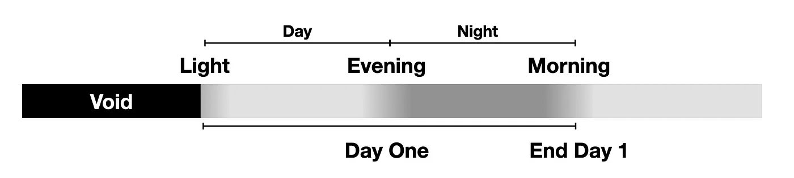
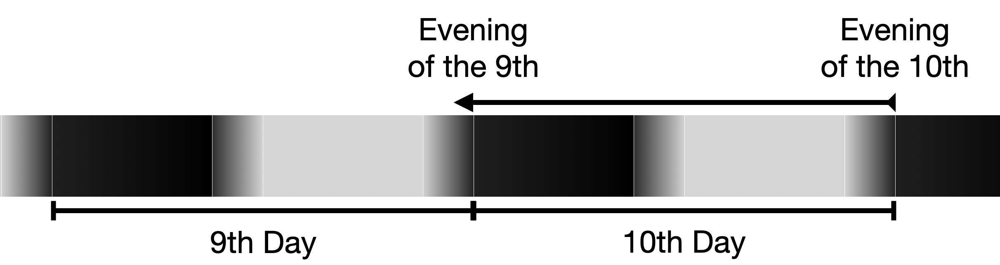
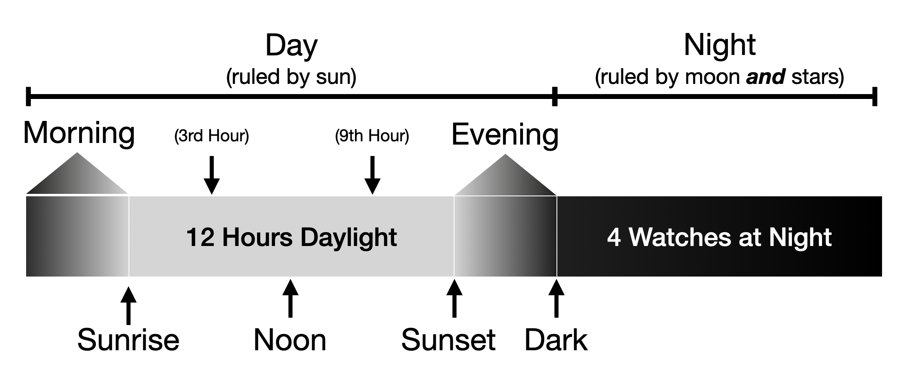
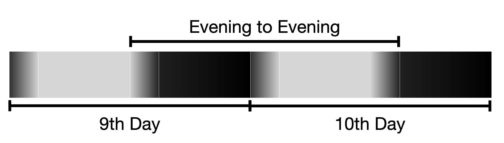
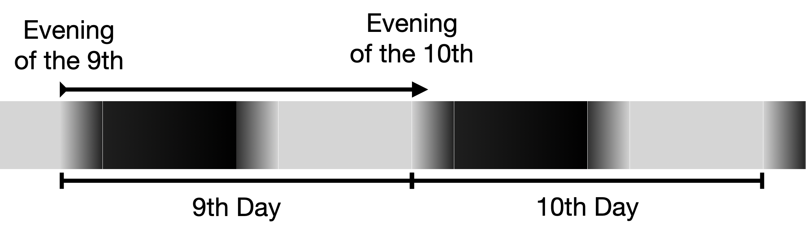
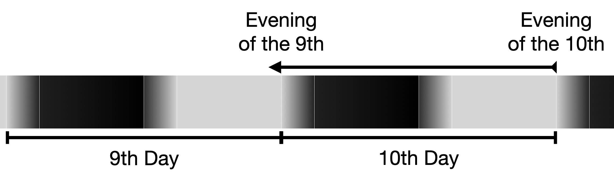
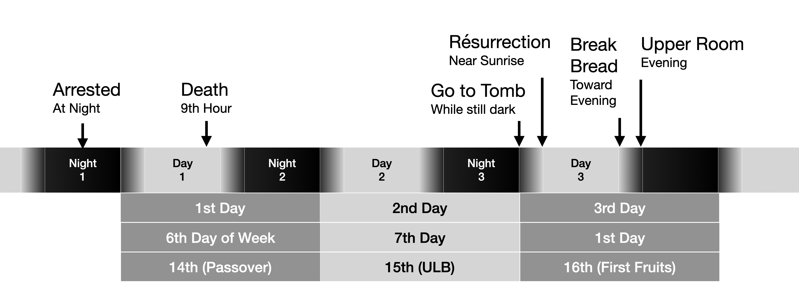
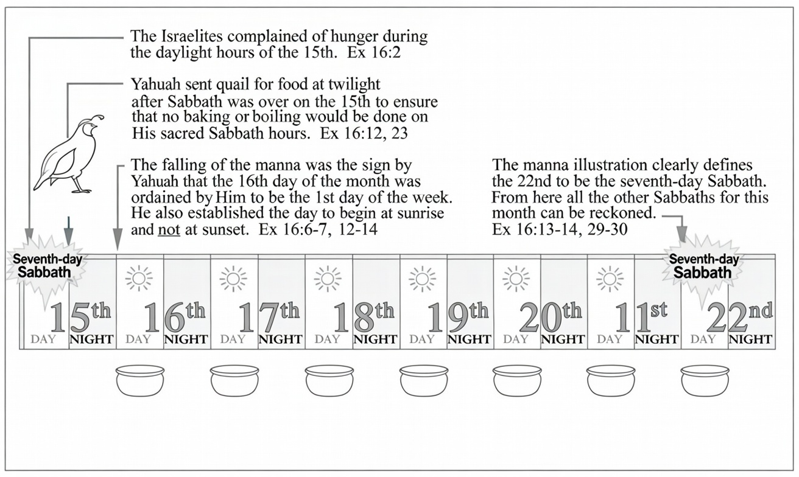

When does the day start?
It seems like a simple question whose answer would be inconsequential, but in reality there are major consequences in how we understand and obey God’s law.
Most have probably heard that the Jews start the day at sunset and simply assume they know what they are talking about.

Those who do dig into this question find that the Jews use the following rationale:

. Creation began in Darkness
. Evening and morning is repeated 6 times in Genesis 1
. Day of Atonement is kept evening to evening
. Unleavened Bread is kept evening (of 14th) to evening of 21st
. Evening used as boundary “unclean until evening”
. Nehemiah enforced sabbath by closing gates at evening.

On the surface this looks pretty compelling, but a deeper dive will reveal these to be rationalizations that sound good but are actually logically incompatible with the narrative structure in the text and the plain meaning of the Hebrew words.
In this chapter, we will investigate each of these claims in detail and demonstrate that their arguments are either inherently ambiguous or subjective interpretations and therefore worthless for establishing higher-order principles, or they are inversions of the plain reading of the text to support a preconceived conclusion.

After addressing the traditional position, I will dive into the compelling, objective, and practically incontrovertible evidence that the calendar day begins at daybreak, first light, or what is broadly called morning.
This lines up with our natural experience of life where our day begins when we wake up.

What came first, light or darkness?

For the sake of completeness we need to address the common rabbinic argument that “_biblical time always starts with darkness_”.
They use this theory as the basis for starting the month on a dark moon and starting the calendar day at night.
Some also view the year as starting in the fall.
Here is how their argument generally goes:

[quote.scripture, Genesis 1:1-5]
____
“In the beginning, God created the heavens and the earth.
The earth was without form and void, and *darkness* was over the face of the deep… And God said, ‘Let there be light,’ and there was *light*…And there was evening, and there was morning—the first day.”
____

[quote, 119 Ministries]
____
“Notice the sequence.
Creation began in *darkness*.
YHWH then introduced *light*.
That darkness-before-light sequence defined the first day.
This wasn’t just the start of creation—it was the start of time itself.
That same order—darkness first, then light—sets the pattern for how YHWH measures time”
____

This argument isn’t unique to 119 Ministries; it is inherited from Jewish oral tradition.
This tradition framed the context of Genesis 1 in a way that leads people to this conclusion, but the framing itself is not true evidence—it is a rationalization, an explanation crafted to reach a preconceived goal of justifying the tradition of the day starting in the evening.
If we had independent proof of evening before morning in the calendar day, then this argument could serve as corroborating evidence; however, it makes unsupported assumptions and leaps when it claims this is the one and only unambiguous way to understand the passage.
If there is reasonable ambiguity, then it cannot be the foundation for proving higher-level ideas about the structure of the day or the start of the month.

How does one prove something is a rationalization compared to true deductive reasoning?
Discernment between rationalization and deductive reasoning boils down to direction, motivation, openness to falsification, and emotional involvement.
Both can sound logical on the surface, but they operate in fundamentally different ways.

*Deductive reasoning* (true logical deduction): A structured, top-down process starting from general premises assumed to be true → applying rules of logic → arriving at a specific conclusion that must follow if the premises are accurate and the form is valid.
The conclusion is certain (in valid deduction), and the process is truth-seeking.
It's forward-looking: you follow the logic wherever it leads, even if the result is uncomfortable or contradicts your desires.

*Rationalization* (psychological defense mechanism): A post-hoc, after-the-fact, justification where you start with a desired conclusion (often driven by emotion, self-protection, guilt avoidance, or ego defense) → then work backward to construct seemingly logical reasons or explanations to support it.
It's conclusion-first, not evidence-first.
The "logic" is retrofitted to protect the ego or avoid discomfort, not to discover truth.

I will demonstrate that by presenting what I believe to be a much stronger “_rationalization_” for the light before darkness from this same text.
Then we can reflect on how we can honestly test these two theories to determine which potential rationalization is actually demonstrated throughout the Bible.

[quote.scripture, Genesis 1]
____
“In the beginning, God…”
____

[quote.scripture, 1 John 1:5]
____
“God is light, in whom there is no darkness at all”
____

[quote.scripture, Jesus, John 8:12]
____
“*I am the light of the world.* Whoever follows me will never walk in darkness, but will have the light of life."
____

[quote.scripture, John 1:1-3]
____
"*In the beginning was the Word*, and the Word was with God, and the Word was God.
He was with God in the beginning.
*Through him all things were made*; without him nothing was made that has been made.”
____

[quote.scripture, Psalms 119:105]
____
Thy *word is a lamp (light)* unto my feet, and a light unto my path.
____

Combine these verses with the observation that the first words were “_Let there be light_” and then “_darkness_” was separated from the light.
Genesis goes on to say “_The earth was without form and void_” which invokes a concept of “void” or “nothingness” and is a way of saying that nothing existed, neither time, space, darkness nor light.
Nothing or voidness is not the same as darkness, as darkness is “something” and not “nothing.”

In computer science it is the difference between a “null/undefined” value and a 0 value.
It is an uninitialized state beyond our ability to conceive.

[quote.scripture, Revelation 21:23]
____
The city does not need the sun or the moon to shine on it, for *the glory of God gives it light, and the Lamb is its lamp.*
____

Since God was in the beginning and he has never been without glory, his light must have been from the beginning.
We also see that Jesus is the Lamb and lamp and through his light all things were made.

[quote.scripture, John 1:5]
____
"The light shines in the darkness, and the darkness has not overcome it”
____

If darkness existed before light, then it implies a point in time when darkness had overcome the light, something scripture said has not happened.

[quote.scripture, Isaiah 45:7]
____
"I form the light and create darkness, I bring prosperity and create disaster; I, the Lord, do all these things.”
____

Here Isaiah clearly points to light forming before creating darkness and reinforces this order because generally speaking prosperity comes before disaster (loss of prosperity).

[quote.scripture, Psalm 139:11–12, ASV]
____
If I say, Surely the darkness shall overwhelm me, and *the light about me shall be night*; even the darkness hideth not from thee, but the night shineth as the day: *the darkness and the light are both alike to thee*.
____

This verse solves the mystery of “_darkness was over the face of the deep_”, which is compared to “_the Spirit of God was hovering over the face of the waters_”.
Thus, in this context the “darkness” is a symbol of the “Spirit of God” and the Psalm says that “_the darkness and the light are both alike_” to Him (the Spirit of God).
This verse also establishes the order of light turning into night, not night turning into light.

At the meta level, the rabbinic approach to Genesis 1 follows an inductive and retroductive pattern: it observes textual sequences and existing practices, then builds upward to general rules about time, often using verbal analogies, a fortiori reasoning, and creative expansions to fill gaps.
These interpretive tools—commonly called “*hermeneutical principles*”—were developed by rabbinic authorities themselves, which can *introduce circularity*: the rules help confirm the very conclusions the tradition already holds.
The method also frequently employs “midrashic” expansion, a style of interpretation that adds allegorical, narrative, or symbolic layers not directly stated in the text.
While this can produce rich insights, it risks implying access to hidden meanings known mainly within the tradition, prioritizing harmony with established customs over strict evidential constraints, and making the reasoning less accessible or falsifiable to outsiders.

In contrast, *the light-first reading* uses a deductive structure: it begins with broad scriptural statements about God’s nature and applies logical inference downward to specific conclusions about creation order.
This approach *emphasizes cross-canonical consistency*, symbolic *resolution of ambiguities*, and *openness to falsification by testing for contradictions* elsewhere in the Bible.
It relies less on self-defined interpretive systems or communal tradition, aiming instead for objective coherence that follows the logic wherever it leads.

To maximize the likelihood of discovering truth, we favor the deductive method grounded in comprehensive scriptural synthesis.
It starts from neutral premises, rigorously checks for internal contradictions, and minimizes retrofitted justifications or appeals to authority.
This aligns more closely with the Bible’s own portrayal of light as the path to revelation and understanding, encouraging interpretations that are transparent, testable, and less vulnerable to cultural or traditional bias.

*Only by establishing the order of day and night by other objective methods can we truly differentiate which is valid deductive reasoning and which is true rationalization.*
But before getting to the objective methods, I want to present a few more “subjective” arguments from scripture.

[discrete]
=== Order of Words Day and Night

[quote.scripture, Genesis 8:22]
____
While the earth remains, seedtime and harvest, cold (morning frost) and heat (afternoon), summer and winter, *day and night*, shall not cease.
____

There is a parallel verse in Jubilees, which is not scripture and cannot define doctrine, but does support what the canon already established by listing 4 things that have a definite order.
The word “frost” comes from a translation of the Aramaic Peshitta Holy Bible translated to English.
Since summer and winter are also listed, we can assume cold does not mean winter and, therefore, frost is likely referring to morning.

[quote, Jubilees 6:4–5]
____
All the days of the earth, seed-time and harvest shall never cease, cold (morning frost) and heat (afternoon), summer and winter, and *DAY and NIGHT shall not change their order* nor cease forever.
____

In this instance I am using Jubilees as evidence that at least one ancient highly influential commentary on scripture *agrees with my interpretation of Genesis 8:22 that this verse is demonstrating order by example.*
I consider this use of non-biblical text to be acceptable.
If it were not a parallel to the canon of Genesis 8:22, then I would reject it as introducing new doctrine.

If you search the Bible for the phrases “Day and Night” and “Night and Day” you will find:

31 references to “day and night”

13 references to “night and day”

It is fascinating that 31 and 13 are reversed just like day and night are reversed.
“Day and Night” is used over twice as often as “Night and Day”, so from a purely democratic perspective, it gets 2/3 of the vote.

In our modern culture 13 is considered evil and “unlucky”, but what meaning is associated with these numbers in the Bible?

[discrete]
=== Meaning of 31

Part of the meaning of the number 31 in the Bible comes from one of the Hebrew names for God.
Gematria is a way of interpreting Scripture by substituting the equivalent numeric values for the letters of a Hebrew (or Greek) word and arriving at a total.
*One reference to God is* *_El_* (see Deuteronomy 32:15, 17, Job 3:4, etc. in Hebrew), which is composed of the Hebrew letters Lamed and Aleph.
*Their numeric values are 30 and 1, respectively, for 31 total.*

One of the most commonly occurring names in God’s word is Moses, a type of Messiah.
It appears in 31 King James books.
Proverbs 31 is famous for being the “virtuous wife” chapter.

[discrete]
=== Meaning of 13

The number 13 is symbolic of rebellion and lawlessness in the Bible.
The Greek word _drakon_, Strong’s Concordance #G1404, occurs 13 times in Greek New Testament verses.
The word is used only in the book of Revelation.
It is always translated as the word “dragon,” a symbolic reference to God’s adversary Satan the devil.

Nimrod, the mighty hunter who was “before the Lord” (meaning he tried to take the place of God, Genesis 10:9), was generation 13 in Ham’s line (Ham was one of Noah’s three sons who survived the flood).

13 represents all the governments created by men, and inspired by Satan, in outright rebellion against the Eternal.
King Solomon spent a little more than seven years building Jerusalem’s temple, God’s house of prayer for the nations (1 Kings 6:38).
In contrast, *He spent 13 years building a home for himself*!
Solomon is also related to the number 666 and the dragon.

[discrete]
=== Prophetic Significance of Word Counts

The King James Version reveals subtle mathematical fingerprints that feel too precise for mere chance.
Key names tied to central biblical figures—*Father*, *Son*, *Jesus*, *Christ*, and *Holy Ghost*—appear in balanced, interlocking patterns that repeatedly circle back to 7, Scripture's number of divine completeness (seen in creation's seven days, the seven seals, and more).

These names align in groupings that hit multiples of 7 or combinations echoing perfect order.
Mentions of *Jesus* split perfectly even across odd- and even-numbered New Testament books—exactly 490 each way (total 980), mirroring Christ's own teaching on forgiveness: "seventy times seven" (70 × 7).

The entire KJV bible including verse numbers has exactly 823543 words which is 7 to the 7th power or 7^7^ words.
There are dozens of patterns like this in scripture that do not appear in any other body of text and for this reason when we see 31 occurrences of “_day and night_” and 13 occurrences of “_night and day_” we need to pay attention.

[discrete]
=== Evening and Morning

If you ask the Jews for the technical definition of a calendar day they will regularly point to this pattern in Genesis:

[quote.scripture, Genesis 1 (creation outline)]
____
light … and *there was evening and there was morning* — day one

firmament … and *there was evening and there was morning* — day two

waters gathered … vegetation … and *there was evening and there was morning* — day three

lights … and *there was evening and there was morning* — day four

waters teem … birds fly … and *there was evening and there was morning* — day five

living creatures … man in our image … and *there was evening and there was morning* — day six
____

They will then argue that, by repetition, scripture is demonstrating that the day is evening before morning.
The problem with this argument is the very definition of terms.
Consider the following passage which is universally understood as talking about night.

[quote.scripture, Exodus 27:21]
____
Aaron and his sons shall keep it in order *from evening to morning* before the LORD; it shall be a perpetual statute throughout their generations for the sons of Israel.
____

[quote.scripture, Leviticus 24:3]
____
Outside the veil of the testimony in the tent of meeting, Aaron shall keep it in order *from evening to morning* before the LORD continually
____

[quote, Mishnah Tamid 3:9]
____
"The lamps *burned the entire night* and would extinguish in the early morning...
After *they went out in the morning*, the lamps would be cleaned out and fresh oil and new wicks would be placed in them.
This service was known as 'hatavat ha-menorah'—preparing the Menorah for kindling [in the evening].”
____

In this context the oral tradition clearly understood evening to morning to be a way of saying “night”.
This is reinforced when one looks closer at the deeper meaning of the underlying Hebrew words for morning and evening.

In Biblical Hebrew, the word for *evening*, _erev_ (עֶרֶב), derives from the root ע-ר-ב, which carries meanings such as "to mix" or "to intermingle."
This etymology reflects the twilight period when light and darkness blend together, creating a sense of confusion or mixture (as objects become indistinct in fading light), or when the day transitions into night.
This root also appears in related terms like _erev rav_ ("mixed multitude") and _eruv_ (a symbolic "mixing" of domains for Shabbat observance).

The word for *morning*, _boker_ (בֹּקֶר), stems from the root ב-ק-ר, which means "to break through," "to split," or "to cleave."
This evokes the image of light breaking through the darkness at dawn (similar to English "daybreak"), piercing the night and bringing clarity and distinction.
The root also relates to inspection or discernment (as in _bikoret_, meaning examination), tying into the morning when things become visible and distinguishable.

The logical conclusion from studying the words is that days are split in the morning and connected in the evening.
Thus, the pattern Genesis establishes is that each day ends at daybreak.
Each day's work is done until evening; then daybreak ends the day.

[quote.scripture, John 11:9]
____
Jesus answered, 'Are there not twelve hours in the day?
If anyone walks in the day, he does not stumble, because he sees the light of this world.’

____

image::images/masters/when-does-the-day-start-fig3-p65.jpg["Figure from the print edition (pdf p. 65)",pdfwidth=85%,align=center]

In this verse we see that Jesus repeats the pattern of “working” or “walking” during the 12 hours of daylight.
Ancient sundials had 12 divisions, so all days had 12 hours; as the seasons changed, the length of the hour changed.
An hour was 8.33% of the daylight.
Therefore, all the work of creation was done during the daylight hours, and no work was done from evening until daybreak.

The end result of the traditional interpretation is that they must adopt logically inconsistent interpretations of the same phrase in different places.
They must expand the definition of “morning” to be from first light until noon and expand the definition of evening to be from noon until morning.
This is inconsistent with other definitions of evening.

The Hebrew phrase *"bein ha'arbayim"* (בֵּין הָעַרְבַּיִם), commonly translated as *"between the evenings"* or *"between the two evenings"*, appears in the Torah primarily in contexts related to the timing of key rituals, such as the daily Tamid sacrifices (Exodus 29:39, 41; Numbers 28:4, 8), the lighting of the menorah and offering of incense (Exodus 30:8), the Passover lamb slaughter (Exodus 12:6; Leviticus 23:5; Numbers 9:3, 5, 11), and the provision of quail (Exodus 16:12).

This expression has sparked debate over its precise meaning due to its literal wording ("between the evenings").
In mainstream Jewish tradition (reflected in the Talmud, Mishnah, and later halakhic practice), it refers to the *afternoon period*, roughly from midday or early afternoon (after the sun begins to decline, around noon) until sunset—often specified as the time for the afternoon/evening sacrifice (around the ninth hour, or 3 PM in later Temple practice).
This interpretation allowed the large-scale slaughter of Passover lambs in the Temple during daylight hours on the 14th of Nisan, as described by Josephus (who notes sacrifices from about 3–5 PM).
The "two evenings" are understood as the "evening" of the day's decline (post-noon waning) and the "evening" of sunset, creating an interval in the latter half of the daylight period.

*An alternative, more literal understanding*—held by groups like the Sadducees, Samaritans, Karaites, and some modern biblical scholars—takes it as the *twilight period* after sunset until full darkness (dusk), when the first "evening" (sunset) transitions into the second "evening" (complete nightfall).
This aligns with a stricter reading of the Hebrew and ties into the biblical day beginning at evening, placing rituals like the Passover killing at the start of the 14th (after sunset on what we might call the 13th evening).

For Rabbinic Jews, the morning Shema recitation (a key daily obligation) provides further definition: Mishnah Berakhot 1:2 states it must be recited from when one can distinguish between tekhelet (blue) and white (dawn/light) until the end of the third hour (ideally), though post facto until midday in some views (Talmud Berakhot 8a; Maimonides follows this).
This shows *ancient understanding placed the core of "morning" from first light to roughly halfway between sunrise and noon.*

While the Jews may have used the ability to distinguish between blue and white, I believe that scripture provides a more authoritative way to know when night ends and morning begins.
Morning has arrived when the light of the sun is able to wash out the constellations.
Evening has ended and night has begun when the constellations become visible.

[quote.scripture, Genesis 1:14-16]
____
And God made the *two* *great* *lights*— the greater light to govern the day, and the *lesser light to govern* the night *with the stars.*
____

These definitions of terms become critical when one desires to hold rationalizations to the accountability of logical consistency.

Without well-defined terms, people are prone to twist the meaning of words in different ways and circumstances to fit their conclusion.

[discrete]
=== Keeping your Sabbath from Evening to Evening

The next go-to scripture for establishing the traditional evening-to-evening interpretation of the calendar day is the instructions for the Day of Atonement.

[quote.scripture, Leviticus 23:26–32]
____
And the LORD spake unto Moses, saying, Also on the *tenth day of this seventh month there shall be a day of atonement*: it shall be an holy convocation unto you; and ye shall afflict your souls, and offer an offering made by fire unto the LORD… It shall be unto you a sabbath of rest, and ye shall afflict your souls: in the ninth day of the month at even, *from even unto even, shall ye celebrate your sabbath*.
____

At this point you will hear them say something like: The text directly states “_from even unto even, shall ye celebrate your sabbath_”.
QED!
End of story.
Game over.
Case closed.

They think they have won, but in reality have taken things out of context in the classic manner that Rabbinic Judaism takes many things out of context to invert their meaning.

[discrete]
=== The Oven of Akhnai

There is a well known story, known as the Oven of Akhnai from the Talmud (Bava Metzia 59b), which involves a rabbinic debate around 100 AD about whether a segmented oven (Akhnai's oven) could become ritually impure.
Rabbi Eliezer argued it was pure, citing logic and invoking miracles—a carob tree uprooted, a stream flowed backward, the academy walls leaned, and a heavenly voice declared him correct.
The majority of sages disagreed.
Rabbi Joshua rebuked the heavenly voice by quoting Deuteronomy 30:12: "_It [the Torah] is not in heaven_," meaning divine law is now in human hands, not subject to ongoing heavenly intervention.
The Talmud explains this via Rabbi Yirmeya: Since the Torah was given at Sinai, heavenly voices are ignored, as per Exodus 23:2's directive to "_incline after the majority._"
God reportedly smiled and said, "_My children have triumphed over Me_," affirming human authority in interpreting law.

Rabbinic Judaism uses "_Torah is not in heaven_" to emphasize that halakha (Jewish law) is determined by earthly rabbinic consensus and traditions (the Oral Torah), not miracles or new revelations, empowering sages to adapt and expand laws.
"_Incline to the majority_" supports following the rabbis' majority vote in disputes.

Here is the verse that the Rabbis use to elevate majority rule over a voice from heaven:

[quote.scripture, Exodus 23:2, ESV]
____
You shall not *fall in with the many* to do evil, nor shall you bear witness in a lawsuit, *siding with the many*, so as to pervert justice, nor shall you be partial to a poor man in his lawsuit.
____

They chose certain phrases to pull out of context claiming that they are the only ones who know the code for interpreting the passage.
Exodus clearly says “_do not follow the majority_”, but they inverted its meaning.

Here is how they determined that Torah is not in heaven:

[quote.scripture, Deuteronomy 30:11-14, ESV]
____
For *this commandment* that I command you today is not too hard for you, neither is it far off.
*It is not in heaven*, that you should say, ‘Who will ascend to heaven for us and bring it to us, that we may hear it and do it?’
Neither is it beyond the sea, that you should say, ‘Who will go over the sea for us and bring it to us, that we may hear it and do it?’
But the word is very near you.
It is in your mouth and in your heart, so that you can do it.
____

By systematically ignoring context they read a verse that says the commands are not too hard to mean that Torah, God’s very word, is not in heaven and that it only exists on earth where men, not God, have the sole authority to interpret it.
This clearly contradicts Psalms:

[quote.scripture, Psalm 119:89, ESV]
____
Forever, O LORD, your word is firmly fixed in the heavens.
____

This is the exact same pattern that we see unfold with the rationalization regarding the day of atonement instructions: a phrase referring to the Sabbath of Day of Atonement is taken out of context and applied to all weekly sabbaths.
But that’s not all, the very instructions for the Day of Atonement clue us into the calendar day being crossed during the fast.

We rigorously defined evening as being from sunset to dark and as the period of mingled light and dark.
It is not an exact moment in time.
Using inclusive counting this means _Evening to Evening_ is more than 24 hours long.
Furthermore, scripture clearly identifies one evening as belonging to the 9th calendar day and the other as belonging to the 10th calendar day.
This means that even if you give evening a definition of “sunset,” you must still determine whether you are going to assign that moment to the calendar day before or the twilight after and then apply that rule consistently.
If you were to say that sunset belongs to the start of evening, then you get the following diagram:

// FIGURE: diagram referenced in prose ("you get the following diagram") is missing from the Markdown source

This wouldn’t make any sense because logically this puts the Day of Atonement on the 9th day of the month and there is no reason at all to mention the 10th day.

The bigger problem is the consistency issue with using sunset because previously these same people argued that the day starts in darkness; however, forcing “evening” to mean just the moment of sunset attached to twilight means that the day starts mingled with light and darkness.
They would have to change the meaning of “evening” to “at dark” and then assign the moment of “at dark” to the calendar day after it, not before.
Here, “at dark” means the moment the stars appear (or you can no longer distinguish blue and white, in their parlance).
However, the majority have already committed to the idea that “_between the evenings_” is between noon and sunset.

Remember, in Genesis they have already claimed that the calendar day is defined as “Evening and Morning”.
Here they claim the calendar day is defined as “Evening to Evening”.
In order to resolve this issue they have to change the assignment of “Evening” to belong to the day leading up to it.
And this creates a paradox in Genesis because the “Evening and Morning — Day N” pattern now incorporates a reference to Day N-1 or Day 0.

Therefore, if you assign “sunset” to belong to the daylight before it then you get the following:

// FIGURE: diagram referenced in prose ("you get the following") is missing from the Markdown source

Once again, the day begins with mingled “light and dark” in contradiction to their Genesis interpretation, even if only for the “exact moment” of going from twilight to dark.
You end up with no need to reference the 9th day because you could simply say fast on the 10th day of the month, night and day.

The bottom line is that there is no way to interpret the Day of Atonement evening to evening instructions as consistent with an evening to evening, sunset to sunset, calendar day without fundamentally invalidating prior arguments in Genesis and excusing what would appear to be an unnatural reference to the 9th calendar day.
Given these issues, the best one could argue is that this verse is ambiguous and thus has no ability to contribute to the argument of when the calendar day begins.

[discrete]
=== Unleavened Bread from Evening to Evening

The next alleged proof of evening to evening calendar days is the instructions given for the seven days of unleavened bread.

[quote.scripture, Exodus 12:18]
____
For *seven days* you must eat unleavened bread (Exodus 12:15).
In the first month, on the *fourteenth day of the month at evening*, you shall eat unleavened bread, until the *twenty-first day of the month at evening*
____

All the arguments related to the Day of Atonement apply to this verse as well, with the only difference being that the Day of Atonement was a single day and this is 7 days in duration.
At issue is whether the days mentioned are aligned with calendar days or whether the explicit mention of evening suggests that the calendar day has been split for the purposes of the feast.

Scripture gives us much more to work with in interpreting the feast of unleavened bread because it is tightly connected to the Exodus story and in the gospels.

Let’s start by reviewing the instructions given to Moses regarding the 14th day.

[quote.scripture, Exodus 12:4-10, ESV]
____
…you shall keep it (the lamb) until the *14th day of this month*, when the whole assembly of the congregation of Israel shall **kill their lambs at twilight (between the evenings)…**you shall let none of it remain *until the morning (daybreak);* anything that remains until the morning you shall burn…They shall eat the flesh **that (14th) night…**I will pass through the land of Egypt *that (14th) night.*
____

These verses collectively point to the night of the 14th being connected to the day of the 14th.
They have all night until morning to eat the lamb, but must burn the remains before morning.
Rabbinic Jews attempt to get around this by rationalizing that the Passover refers to the lamb sacrificed between the evenings (~3 PM) on the 14th, but twice the verse connected the night as being part of the 14th day when it refers to it as “that night”.
People have to rationalize a difference between the “technical definition” they allege is provided by Genesis and the “common language” they say is being used here.
This is a level of imprecision that one would not expect from Moses or God.

[quote.scripture, Exodus 12:22]
____
Take a bunch of hyssop and dip it in the blood that is in the basin, and touch the lintel and the two doorposts with the blood that is in the basin.
*None of you shall go out of the door of his house until the morning.*
____

We are then told that on this Passover they are not to go out of their houses until morning.
This is a critical fact when you assume that Moses would obey God perfectly and the instructions clearly gave them until morning to finish eating and burn.

[quote.scripture, Numbers 33:3]
____
"They set out from Rameses in the first month, on the *15th day of the first month*; on the day *after the Passover* the children of Israel went out with a high hand in the sight of all the Egyptians.”
____

[quote.scripture, Deuteronomy 16:1]
____
"Observe the month of Abib and keep the Passover to the LORD your God, for in the month of Abib the LORD your God brought you out of Egypt by night.”
____

And now we bring it all together with God bringing Israel out at night on the 15th day of the month, which cannot be the night of the Passover lamb because they were commanded not to go out of their house until morning.

Now we need to circle back to the 7 days from the 14th until the 21st.
The Hebrew word for “day”, yom, is overloaded and can have different meanings depending upon context.
It could mean seven “daylights,” “calendar days,” or “24-hour periods.”
To impose any specific meaning of yom on this context goes beyond what the text says and thus cannot be used to “prove” calendar days, as that would be circular reasoning.

The narrative of Exodus goes on to say that they journeyed from Rameses and camped in Succoth.
This is approximately 20 miles (or less in some estimates) and is about 1 day's travel.

[quote.scripture, Numbers 33:5]
____
And the children of Israel removed from Rameses, and pitched in Succoth.
____

[quote.scripture, "Exodus 12:37, 13:2"]
____
The Israelites journeyed from Rameses *to Succoth*, about six hundred thousand men on foot, besides women and children…Consecrate to me all the firstborn.
*Whatever is the first to open the womb among the people of Israel, both of man and of beast, is mine*.
____

Here we see the introduction of the typology of “first fruits” when they camped after a day's journey.
A later chapter will provide the evidence that first fruits is always on the 16th of the month, and that aligns perfectly with them leaving the night of the 15th, traveling all night and into the day on the 16th where they set up camp just in time for the narrative to mention first fruits.

If they had left shortly after midnight on Passover (when the angel of death struck down the firstborn), then there would be almost 36 hours until daylight on the 16th, and the implied travel distance (in haste) would be over 60 miles, which is far more than archaeologists estimate as the distance between Rameses and Succoth.
Alternatively, they would have to argue that they traveled from shortly after midnight until after sunset and set up camp in the dark.
This is still closer to 30–40 miles and doesn’t naturally follow the narrative.
It seems far more natural for them to travel through the night and set up camp in the day so they can actually prepare unleavened bread and other things and be ready for travel the next night.
Traveling by night is much preferable in the desert!

[discrete]
=== Resurrection Day Timeline

While we are on the subject of First Fruits, let's talk about the events of the day Jesus rose from the grave.
It clearly starts early on the first day of the week after first light, while it was still dark, toward sunrise.

[quote.scripture, John 20:1]
____
Now on the *first day of the* week Mary Magdalene *came to the tomb early*, *while it was still dark*, and saw that the stone had been taken away from the tomb.
____

[quote.scripture, Mark 16:1-2]
____
and *early in the morning of the first of the sabbaths*, they come unto the tomb, *at the rising of the sun.*
____

[quote.scripture, Luke 24:1]
____
But *on the first day of the week, at early dawn*, they went to the tomb, taking the spices they had prepared.
____

[quote.scripture, Matthew 28:1]
____
Now after the Sabbath, *toward the dawn of the first day of the week,* Mary Magdalene and the other Mary went to see the tomb
____

This clearly establishes that the first day of the week, the 16th of the month, includes some time before sunrise while it is still dark but just enough light for people to see.
The next event is later in the afternoon, after the disciples had heard from the women, disbelieved it, and went to see for themselves.
They start walking to Emmaus when Jesus joins them.

[quote.scripture, Luke 24:13]
____
*That very day (first day of week)* two of them were going to a village named Emmaus, *about seven miles* from Jerusalem…but they urged him strongly, saying, 'Stay with us, *for it is toward evening and the day is now far spent.*'
So he went in to stay with them.
____

This walk ends near evening when the day was far spent, likely around sunset when it makes sense for their companion to stop walking and rest for the night.
They prepared food and Jesus broke bread and gave thanks.
At this moment the disciples recognized him.

[quote.scripture, Luke 24:33]
____
And they rose *that same hour* and returned to Jerusalem…And they found the eleven and those who were with them gathered together, saying, 'The Lord has risen indeed, and has appeared to Simon!'
*Then they told what had happened on the road*, and how he was known to them in the breaking of the bread.
____

If they were running like fit cross-country runners it would take them almost a full hour to return the 7 miles to Jerusalem.
If it was “near evening” and the “day far spent” before they started their return journey, it would almost certainly be well after sunset by the time they arrived and then shared their story.

[quote.scripture, John 20:19]
____
"*On the evening of that day, the first day of the week*, the doors being locked where the disciples were for fear of the Jews, *Jesus came and stood among them* and said to them, 'Peace be with you.’"
____

And here we have another direct assertion that Jesus appeared after the disciples returned from Emmaus and that it was evening on the first day of the week.
This strongly suggests that both the pre-sunrise and post-sunset periods were considered the first day of the week.
This dramatically undermines the traditional idea that the day begins at sunset, but still leaves open the possibility of the day beginning at dark.

This timeline has two ways of reconciling 3 days and 3 nights, the first is using inclusive counting of the day and night of any calendar day and the second is to recognize that the parallels with the story of Jonah start with Judas fleeing Jesus and end with Jonah’s journey to Nineveh (parallel to road to Emmaus).
I’ve dedicated an entire chapter to these parallels and establishing that Jerusalem was known as the “heart of the earth”.

[discrete]
=== Manna and Quail

The next demonstration-by-example of first light start of day comes from the second month in Exodus where God gave Israel manna every morning and quail every evening except on the sabbath.

[quote.scripture, Exodus 16:1]
____
"They set out from Elim, and all the congregation of the people of Israel came to the wilderness of Sin, which is between Elim and Sinai, *on the 15th day* of the second month after they had departed from the land of Egypt."

____

After some narrative about the people grumbling, we are told that quail came that evening and, in the morning, manna fell.

[quote.scripture, Exodus 16:13]
____
"*In the evening quail came* up and covered the camp and *in the morning* dew lay around the camp.
And when the dew had gone up, there was on the face of the wilderness a fine, flake-like thing, fine as frost on the ground.
When the people of Israel saw it, they said to one another, 'What is it?'
For they did not know what it was.
And Moses said to them, '*It is the bread that the Lord has given you to eat.*'"
____

On the 6th day Moses informed them that they would receive twice as much and instructs them to bake and boil.

[quote.scripture, Exodus 16:22–23]
____
*On the sixth day they gathered twice as much bread*, two omers each...
he [Moses] said to them, 'This is what the Lord has commanded: "*Tomorrow is a day of solemn rest, a holy Sabbath* to the Lord; bake what you will bake and *boil what you will boil*, and all that is left over lay aside to be kept till the morning."'
____

The next morning they went out to gather and found none.

[quote.scripture, Exodus 16:26–27]
____
"Six days you shall gather it, but *on the seventh day, which is a Sabbath, there will be none.*"
On the seventh day some of the people went out to gather, but they found none.
____

The key to understanding the start of day is that they were told to keep the extra prepared manna until tomorrow which starts in the morning.
The morning being the start of the sabbath when they would need the provisions prepared the night before.

Thus, the timeline demonstrates that the Sabbath is only during daylight hours.
This is confirmed in Genesis, where the sixth day ended in the morning, and then God rested during the seventh day's daylight.
We know that the evening hours are not sabbath hours because Quail came the evening of the 15th.

[discrete]
=== Tomorrow Always Refers to the Next Morning

One of the clearest and most consistent patterns in Scripture is how the word “tomorrow” is used.
In Hebrew, the primary term is _machar_ (מָחָר), and in nearly every narrative context, “tomorrow” points directly to the *next morning* or *dawn*—the moment light breaks and the new day begins in earnest.
It is not a vague reference to the next 24-hour period starting at sunset; it is tied to the arrival of morning light, when activity, provision, divine action, and obedience resume.

This usage is especially powerful in contexts that define sacred time, such as the manna cycle and Sabbath instructions.
“Tomorrow” repeatedly marks the transition to the next calendar day at first light, reinforcing the book’s central thesis: the biblical day begins at daybreak, not sunset.

Here are the key examples that demonstrate this pattern:

[quote.scripture, Exodus 16:23, ESV]
____
“This is what the LORD has commanded: ‘*Tomorrow* *is a day* of solemn rest, a holy Sabbath to the LORD; bake what you will bake and boil what you will boil, and all that is left over lay aside to be *kept till the morning.*’”
____

Moses speaks these words on the sixth day of the week.
He commands the people to prepare the double portion of manna so that “tomorrow” (the Sabbath) can be observed without gathering or cooking.
The very next verse says they laid it up “till the morning,” and then on the morning of the seventh day they went out to gather and found none.

“Tomorrow” here is explicitly the morning of the Sabbath.
The new day arrives when the sun rises and manna fails to appear—confirming that the holy rest begins at first light.
If the day had started at sunset the previous evening, Moses would have said something like “tonight begins the Sabbath” or “from evening you shall rest.”
Instead, the focus is on “tomorrow” and “the morning.”

[quote.scripture, Exodus 17:9]
____
“Moses said to Joshua, ‘Choose men for us and go out, fight against Amalek.
*Tomorrow* I will station myself on the top of the hill with the staff of God in my hand.’”
____

The command is given the day before the battle.
“Tomorrow” is immediately followed by action at dawn: “_Joshua did as Moses told him, and fought against Amalek_”, with Moses standing on the hill from morning until evening.
The new day of conflict begins with morning light.

[quote.scripture, Joshua 3:5]
____
“Joshua said to the people, ‘Consecrate yourselves, for *tomorrow* the LORD will do wonders among you.’”
____

The very next verse: “_Joshua rose early in the morning…_” (but the sequence ties consecration directly to the morning wonders).
“Tomorrow” means the coming dawn when God parts the waters and the people cross.

[quote.scripture, Judges 6:28]
____
“When the men of the town rose early in the morning, behold, the altar of Baal was broken down…”
____

Gideon acted at night (v. 27).
The discovery—the next significant event—occurs “early in the morning.”
“Tomorrow” (implied) arrives at daybreak.

[quote.scripture, 1 Samuel 19:11, ESV]
____
“Saul sent messengers to David’s house to watch him, that he might be killed in the morning.
But Michal, David’s wife, told him, ‘If you do not save your life tonight, tomorrow you will be killed.’”
____

“Tomorrow” means the morning execution.
The threat begins when light returns.

[quote.scripture, Esther 5:14]
____
“Then his wife Zeresh and all his friends said to him, ‘Let a gallows fifty cubits high be made, and *in the morning* tell the king to have Mordecai hanged on it.’”
____

Again, “in the morning” is parallel to “tomorrow”—the action is set for dawn.

[quote.scripture, Matthew 6:34, ESV]
____
“Therefore do not be anxious about tomorrow, for tomorrow will be anxious for itself.
Sufficient for the day is its own trouble.”
____

Jesus ties “tomorrow” to the concerns of the next daylight period—work, provision, and life’s troubles that occur under the sun.

[quote.scripture, Luke 13:32, ESV]
____
“Behold, I cast out demons and perform cures today and tomorrow, and the third day I finish my course.”
____

“Today and tomorrow” refers to consecutive days of daylight ministry.
“Tomorrow” is the next morning’s work.

Across these passages, “tomorrow” is never used to describe an evening start.
It consistently points to the *next morning*, when the day becomes active with light, obedience, divine intervention, or judgment.
In the manna narrative—the most detailed calendar test in Scripture—“tomorrow” and “the morning” are used interchangeably to mark the start of the Sabbath day.
The absence of manna at dawn confirms the holiness of that new day from first light onward.

This pattern is not accidental.
It aligns perfectly with the sun ruling the day (Genesis 1:16), the emphasis on light as the defining sign (Genesis 1:14–18), and the natural human experience of waking to a new day at dawn.
When Scripture says “tomorrow,” it means “when morning comes”—the next calendar day begins at daybreak.

Traditional evening-to-evening advocates address this body of verses collectively by arguing that "tomorrow" (_machar_) is an idiomatic expression for the *next full 24-hour cycle*, which—under their assumed sunset-start framework—begins at evening, even if the narrative spotlights morning events.
They claim the emphasis on "morning" or "early dawn" (e.g., in Exodus 16:23's "till the morning," Joshua 3:5's early rising, or 1 Samuel 19:11's morning threat) reflects the *practical, visible test* of the new day during daylight hours, when work, battles, or divine wonders occur, but does not redefine the day's boundary.
For instance, in Exodus 16, preparation happens before sunset, so rest can begin at evening ("tomorrow" starting then), with morning's lack of manna simply confirming the ongoing Sabbath.
Similarly, in battle or journey contexts (Exodus 17:9, Joshua 3:5), "tomorrow" includes the preparatory night if needed, but the story focuses on dawn action because that's when communal obedience or conflict unfolds under light.
In NT teachings (Matthew 6:34, Luke 13:32), "tomorrow" is said to mean the forthcoming worries or works of the next cycle, starting from evening rest leading into active daylight.
This harmonizes the verses by importing the evening-start premise, insisting the morning references are narrative conveniences, not boundary markers.

This counter-argument is lacking because it presupposes the evening-start framework without deriving it from the verses' own language, effectively begging the question and rendering the evidence circular.
Across all these passages, Scripture consistently omits any reference to "tonight," "evening," or "sunset" as the transition to "tomorrow"—instead tying the new day's arrival directly to morning light, provision, or action (e.g., no manna at dawn in Exodus 16, early rising in Judges 6:28 or Esther 5:14).
If evening were the true start, the texts could easily clarify with phrases like "from evening tomorrow" or "when night falls," but they don't; the plain reading demands "tomorrow" begins at daybreak.
Moreover, this explanation introduces inconsistency: why would God/Moses/Jesus/Joshua repeatedly frame sacred time around morning if the day had already begun hours earlier in darkness?
It prioritizes harmonization with tradition over the verses' internal logic, which uniformly presents "tomorrow" as the next dawn—the natural, light-based start of the calendar day.

[discrete]
=== Astronomical Description of the Day

Scripture gives us another way to identify the daily cycle and this comes from Psalms.

[quote.scripture, Psalm 19:4–6]
____
In the heavens God has *pitched a tent for the sun.*
Which is as a bridegroom coming out of his chamber, and rejoiceth as a strong man to *run a race*

His going forth is from the end of the heaven, and *his circuit* unto the ends of it: and there is nothing hid from the heat thereof.
____

The heavens are symbolically compared to a tabernacle, whose front door is in the east at sunrise.
The sun starts its cycle in the morning and runs a circuit that returns to the same point.
This provides a clear description of a morning to morning daily cycle that is hard to interpret as evening to evening.

Astronomically, this matches the apparent solar motion we observe: the sun "rises" in the east (its "going forth"), arcs across the sky in a full circuit, and "sets" in the west, only to reappear the next morning from the same eastern "end."
The bridegroom and runner metaphors evoke energy, new beginnings, and purposeful motion starting at daybreak, making it challenging to read this as an endorsement of days primarily defined by sunset.
Instead, it invites us to see the daily cycle as anchored in the sun's triumphant morning emergence—light overcoming darkness anew each day, declaring God's glory from the start.
This poetic astronomy supports viewing the fundamental "day" as morning-to-morning in its celebratory, experiential sense.

[discrete]
=== Unclean Until Evening

One of the most frequently cited arguments for an evening-to-evening calendar day comes from the numerous verses in the Torah that declare someone or something "unclean until evening."
Traditional interpretations—rooted in rabbinic Judaism and echoed in many Christian commentaries—assume this means the person remains unclean for the remainder of the current calendar day, with the transition to a new day at sunset somehow effecting ritual purification.
This view implies that the calendar itself, or the mere passage of time marked by evening, holds the power to cleanse.
However, a closer, context-driven reading reveals a different reality: "evening" here often serves as a shorthand reference to the daily evening sacrifice, part of the continual burnt offering system that provided ongoing atonement for the entire community.
It is this sacrificial atonement—not a calendar boundary or the setting sun—that restores cleanness.

To understand this, we must first examine the daily sacrificial system established in the Torah.
These offerings, performed every morning and evening, were central to Israel's worship and explicitly tied to atonement, creating a rhythmic cycle of renewal twice daily for the people.

[quote.scripture, "Exodus 29:38–39, 42–45 (NASB)"]
____
You shall say to them, This is the offering by fire that you shall offer to the LORD: two male lambs a year old without defect as a continual burnt offering every day.
You shall offer the one lamb in the morning, and the other lamb you shall offer at twilight...
This shall be a continual burnt offering throughout your generations at the doorway of the tent of meeting before the LORD, where I will meet with you, to speak to you there.
There I will meet with the sons of Israel, and it shall be consecrated by My glory.
I will consecrate the tent of meeting and the altar; I will also consecrate Aaron and his sons to serve as priests to Me.
And I will dwell among the sons of Israel and will be their God.
____

This continual offering sanctifies the people and the sanctuary, enabling God's dwelling among them—functioning as communal atonement.
The burnt offering ritual inherently involves atonement, as seen in the broader Torah instructions.

[quote.scripture, Leviticus 1:4 (NASB)]
____
He shall lay his hand on the head of the burnt offering, so that it may be accepted for him to make atonement on his behalf.
____

The phrase "unclean until evening" appears repeatedly in contexts of ritual impurity, such as bodily discharges, contact with unclean animals, or handling the dead.
In each case, the timing aligns with the evening sacrifice as the point of communal atonement, rather than an arbitrary calendar reset.

[quote.scripture, Leviticus 15:16 (NASB)]
____
And if a man has a seminal emission, he shall bathe all his body in water and be unclean until evening.
____

[quote.scripture, Numbers 19:22 (NASB)]
____
Whatever the unclean person touches will be unclean; and the person who touches it will be unclean until evening.
____

[quote.scripture, Leviticus 15:21 (NASB)]
____
Anyone who touches her bed shall wash his clothes and bathe in water and be unclean until evening.
____

These declarations do not suggest that "evening" itself purifies; instead, they point to the evening sacrifice as the mechanism for restoration.
The individual remains separated during the day, allowing time for personal washing or reflection, but cleanness is restored through the collective atonement of the blood offering.

A key scriptural link comes from the prophet Daniel, where "evenings and mornings" explicitly refer to the daily sacrifices, not calendar days per se.
In his vision of the abomination that desolates, the disruption is measured in terms of these offerings.

[quote.scripture, Daniel 8:14 (NASB)]
____
He said to me, "For 2,300 evenings and mornings; then the sanctuary will be properly restored."
____

This prophetic use of "_evenings and mornings_" directly echoes the Torah's morning and evening sacrifices (Exodus 29; Numbers 28), confirming that these terms symbolize the twice-daily atonement cycle.
The 2300 figure represents interrupted offerings, further decoupling "evening" from a calendar boundary and tying it to sacrificial renewal.

It is worth noting that Daniel 8:14 refers to the disrupted daily offerings as "evenings and mornings"—the reverse of the usual "morning and evening" order found in Exodus 29 and Numbers 28.
This reversal does not indicate a different ritual sequence; rather, it reflects the prophetic context of counting interrupted sacrifices starting from the point of desolation (likely beginning with the missing evening offering).
The flexibility of the phrase in Scripture confirms that "evenings and mornings" is a shorthand for the tamid sacrifice cycle itself, not a fixed definition of when a calendar day begins or ends.

In summary, the "unclean until evening" verses are not about waiting for a calendar day to end; they instruct waiting until the evening sacrifice, which provides communal atonement and restores purity.
This interpretation maintains logical consistency: cleanness comes from God's provision of sacrifice (a shadow of Messiah's ultimate atonement), not from the sun's position or human timekeeping.
It aligns with the Torah's emphasis on blood for purification, avoiding the strained assumption that a day change inherently cleanses.
By reframing "evening" as a reference to the tamid offering, we see these verses as pointing to divine mercy renewed daily, rather than rigid calendrical mechanics.

If one wants to use renewal as the basis of the calendar they must also consider other verses:

[quote.scripture, Lamentations 3:22–23 (NASB)]
____
The LORD’s loving kindnesses indeed never cease, For His compassions never fail.
They are new every morning; Great is Your faithfulness.
____

[quote.scripture, Psalm 30:5 (ESV)]
____
For his anger is but for a moment; his favor is for a lifetime.
Weeping may tarry for the night, but joy comes with the morning.
____

[quote.scripture, Psalm 90:14 (NASB)]
____
Satisfy us in the morning with Your lovingkindness, That we may sing for joy and be glad all our days.
____

[quote.scripture, Psalm 143:8 (ESV)]
____
Let me hear in the morning of your steadfast love, for in you I trust.
Make me know the way I should go, for to you I lift up my soul.
____

And finally, on the theme of sacrifices, consider the following verse, which clearly demonstrates that morning is the break, the end of being considered the “_same day as his offering_.”

[quote.scripture, Leviticus 7:15–17]
____
The flesh of the sacrifice of his peace offerings for thanksgiving shall be *eaten on the day of his offering*.
He shall not leave any of it *until the morning*.
____

[discrete]
=== Nehemiah's Gate-Closing: Practical Enforcement, Not Proof of Evening Start

One of the most frequently cited proofs for an evening-to-evening Sabbath is Nehemiah's action of closing Jerusalem's gates "before the Sabbath" or "as it became dark."
The assumption is that this closing marks the precise moment the Sabbath begins at sunset.
But this reading imports more into the text than it actually says, turning a practical security measure into a calendrical rule.

The key verses read:

[quote.scripture, Nehemiah 13:19–21 (NASB)]
____
And it came about that just as it became dark at the gates of Jerusalem *before the Sabbath*, I gave an order and the doors were shut (as he gives every night).
*And I gave an order that they were not to open them until after the Sabbath*. (the added order)
Then I stationed some of my servants at the gates so that no load would enter on the Sabbath day.

Once or twice the traders and merchants of every kind of merchandise spent the night outside Jerusalem. (Thinking the gates would open as normal)
Then I warned them and said to them, “Why do you spend the night in front of the wall?
If you do so again, I will use force against you.”
From that time on they did not come on the Sabbath.
____

The text does not state, “_Close the gates at sunset, for that is when the Sabbath begins_.”
Instead, Nehemiah orders the gates shut “before the Sabbath” and kept closed “until after the Sabbath.”
The critical phrase is *“until after the Sabbath”*—meaning the gates remain shut past the point where they would normally be opened in the morning.
This is the real insight: his command overrides the usual daily routine of opening gates at dawn.

In ancient walled cities, gates were routinely closed every evening at dark for security and opened again in the morning when it was safe and trade could resume.
This pattern appears elsewhere in Scripture:

[quote.scripture, "Joshua 2:6–7 (NASB, context: gate closed at dark)"]
____
But she had brought them up to the roof and hidden them with the stalks of flax which she had laid in order on the roof.
So the men pursued them on the road to the Jordan as far as the fords; and as soon as those who were pursuing them had gone out, *they shut the gate.*
____

[quote.scripture, "Judges 16:3 (NASB, implying gates closed at night)"]
____
And Samson lay until midnight, and at midnight he arose and took hold of the doors of the gate of the city and the two posts and pulled them up along with the bars; then he put them on his shoulders and carried them up to the top of the mountain which is opposite Hebron.
____

Closing gates at evening was standard procedure—every night, not just before Sabbaths.
Nehemiah’s innovation was not the evening closure itself (which happened routinely), but the additional order to keep them closed until after the Sabbath—i.e., not to open them at the usual morning time.

This reveals the practical motivation: over-enforcement to guarantee no Sabbath violation.
Merchants were camping outside overnight, presumably waiting to enter at first light to resume trade.
If the Sabbath began strictly at sunset, closing gates before dark would already prevent any Sabbath trading, yet Nehemiah went further by ensuring the gates stayed shut into the morning.
Why?
Because opening them at dawn would require someone to be present on the Sabbath to manage the gates and confront any lingering traders—defeating the rest commandment.
By keeping them closed “until after the Sabbath,” he eliminates the need for anyone to work or engage with commerce during the holy day, including the normal morning gate-opening routine.

The text is therefore silent on the exact moment the Sabbath “starts.”
It describes precautionary and sustained enforcement, not a definition of day boundaries.
To read “before the Sabbath” as proof of sunset start is circular: it assumes the Sabbath begins at evening in order to conclude that closing gates before evening proves the Sabbath begins at evening.
At best, the passage is ambiguous; at worst, it highlights human zeal to protect holiness through extra safeguards, not a revelation about timekeeping.

In short, Nehemiah’s order is about preventing dawn commerce and avoiding Sabbath labor in gate management—not about establishing when the day or Sabbath begins.
The key insight is the command to keep gates shut *until after the Sabbath*—overriding the normal morning opening—because practical rest required more than just an evening shutdown.
This strengthens the case for interpreting the actions as contextual enforcement rather than calendrical doctrine.

[discrete]
=== Seeing the Forest – A Morning-to-Morning Day

[#atlas-day-first-light]
After examining each tree in detail—the traditional arguments, their internal tensions, the Hebrew word studies, narrative timelines, sacrificial contexts, and poetic astronomy—we step back to view the whole forest.
When we remove anchoring bias (the assumption that tradition must be correct), tradition bias (the weight of centuries of rabbinic interpretation), and logical fallacies (circular reasoning, selective redefinition of terms, post-hoc rationalization), a clear pattern emerges: the mountain of direct textual evidence points to the biblical day beginning at *morning / daybreak / first light*, with evening marking the transition into rest and the end of the active cycle.

[discrete]
=== The Strongest Arguments for a Morning Start

The cumulative case for morning-to-morning is built on interlocking, objective layers that cohere without strain:

* *Creation's foundational pattern* (Genesis 1): God names light “day” first, separates it from darkness (named “night” second), and structures each completed cycle with “evening and morning — the [nth] day.”
Morning consistently serves as the boundary that ends the prior day and initiates the new one with light, work, and divine activity.
* *Astronomical and poetic renewal* (Psalm 19:4–6): The sun emerges rejoicing from its tabernacle at dawn, beginning its circuit with energy and glory-declaring purpose.
The bridegroom and runner metaphors evoke new beginnings at sunrise—hard to reconcile with a day primarily defined by sunset retreat.
* *Word order and emphasis* (Genesis 8:22): God promises enduring cycles in deliberate sequence—seedtime and harvest, cold and heat, summer and winter, *day and night*—placing day first as the initiating, productive element.
This is reinforced by the overwhelming asymmetry: “day and night” appears 31 times vs. “night and day” only 13 times.
* Narrative logic in major events:
* Passover lamb eaten “that night” (still the 14th), stay inside until morning, departure “by night” on the 15th (Numbers 33:3; Deuteronomy 16:1), travel to Succoth with camp setup during daylight—fitting naturally with morning as the reset.
* Resurrection timeline: Women arrive “while it was still dark” / “toward the dawn” on the “first day of the week,” events extend through evening (John 20:19)—pre-dawn darkness belongs to the new day, not the prior Sabbath.
* *Sacrificial boundaries* (Leviticus 7:15–17): Peace offerings eaten “on the day of his offering,” nothing left “until the morning”; leftovers permitted to the next day but burned by the third morning.
The morning cutoff defines “same day” limits more cleanly than sunset.
* *Daily renewal from God* (Lamentations 3:22–23; Psalm 30:5; 90:14; 143:8; 59:16): Mercies are “new every morning,” joy comes “in the morning,” satisfaction and love heard “in the morning”—Scripture repeatedly portrays dawn as the appointed time for fresh compassion, strength, guidance, and blessing.
* *Hebrew word roots* (erev = mixing/blending at twilight; boker = breaking through/clarity at dawn): Days are logically “split” (new clarity) in the morning and “connected” (blended transition) in the evening.

These elements form a holistic, self-reinforcing picture: light-first theology, observable solar cycles, consistent phrase priority, narrative flow, sacrificial timing, and explicit morning-renewal language all converge on morning as the natural, God-ordained start.

[discrete]
=== Dismissing the Traditional Arguments

Each traditional proof for evening-to-evening, when examined without preconception, reveals itself as ambiguous, contextually limited, or reliant on rationalization rather than plain reading:

* *Creation began in darkness* → Descriptive of pre-ordered chaos, not prescriptive for all days; light is named and rules “day” first; theological priority (God is light, no overcoming darkness) favors light-first order.
* *“Evening and morning” repeated in Genesis 1* → Evening-to-morning describes night watches (Exodus 27:21; Leviticus 24:3); Hebrew roots show morning as the splitting/starting point; formula completes each cycle at morning, not begins at evening.
* *Day of Atonement “evening to evening”* (Leviticus 23:32) → Special ritual extension for a high holy day (inclusive >24 hours, mentions 9th to avoid overlap); creates paradoxes when forced as universal (contradicts Genesis pattern, requires inconsistent “evening” assignments); ambiguous at best.
* *Unleavened Bread “at evening”* (Exodus 12:18) → Narrative ties night events to the same day (Passover lamb “that night” on 14th); departure “by night” on 15th after morning stay; travel/camp logic fits night travel on 15th with daylight setup on 16th; yom overloaded—cannot prove calendar days without circularity.
* *“Unclean until evening”* → Refers to waiting for evening sacrifice/atonement (tamid cycle, Daniel 8:14’s “evenings and mornings”); cleanness from blood atonement (Leviticus 17:11), not sunset/calendar flip; majority view assumes sunset transition, but text ties to sacrificial renewal.
* *Nehemiah closing gates “at evening”* → Gates closed every night for security (Joshua 2; Judges 16); innovation was keeping them closed “until after the Sabbath” (overriding normal morning opening); precautionary over-enforcement to prevent dawn trade/Sabbath labor; ambiguous and circular if used to prove sunset start.

The pattern is unmistakable: traditional arguments rely on selective emphasis, redefinition of terms in different contexts, post-hoc harmonization, and elevation of ritual exceptions to universal rules—classic rationalization to protect an inherited conclusion.
Strip away these biases, and the plain text, Hebrew etymology, narrative coherence, and repeated morning-renewal theme stand as a consistent mountain of evidence for the day beginning at first light.

When tradition no longer anchors our reading, the forest becomes clear: Scripture presents a light-centered, morning-renewed rhythm that aligns with creation’s order, the sun’s joyful circuit, God’s daily mercies, and practical obedience.
The day starts when light breaks through—declaring God’s glory anew.
