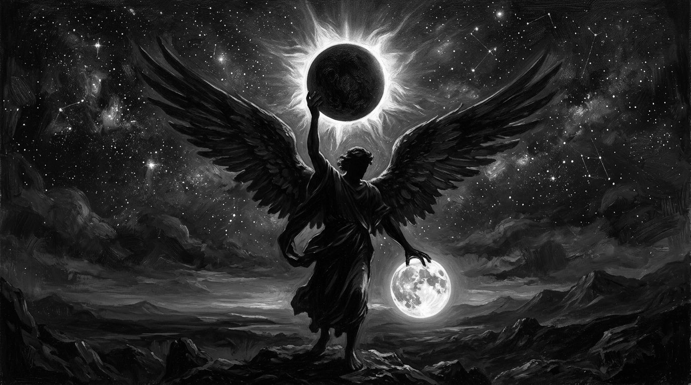

[quote.scripture, Isaiah 14:12-15 (alt translation)]
____
I will rise into the sky.
I will raise my fully dark moon over the stars of God.
I will establish the high place (head/authority) of the appointed times from the farthest extent of the darkness [of the moon].
I will rise at the height of the thick dark covering and I will silence the greatest [light].
____

This chapter will dive deep into the Hebrew of Isaiah 14 to discover Satan’s intent to substitute his “moon” as the start or authority over the appointed times.
His moon is the darkest phase, and the only phase that can cover or silence the greatest light (the sun) during a solar eclipse.
This is the most overt evidence that the true month begins on the full moon and that Satan’s great plan is to deceive and weaken the nations by seeking to change the times and seasons.

So how did I arrive at this translation considering the traditional rendering:

[quote.scripture, Isaiah 14:12-15 KJV]
____
How art thou fallen from heaven, O Lucifer, son of the morning! how art thou cut down to the ground, which didst weaken the nations!
For thou hast said in thine heart, I will ascend into heaven, I will exalt my throne above the stars of God: I will sit also upon the mount of the congregation, in the sides of the north: I will ascend above the heights of the clouds; I will be like the most High.
Yet thou shalt be brought down to hell, to the sides of the pit.
____

The key to decoding this is to remember once again that vowel points were not in the original text, but instead passed down to us by oral tradition, by the tradition of men.
When you remove the vowel points something amazing is revealed: the word for “full moon” and the word for “throne” are one and the same.
And with this in mind, one must revisit every mention of “throne” in the bible and consider the possibility that “full moon” may be a better translation given the broader context we have already covered.
We will explore this more “fully” in a later chapter.

Given this insight, Satan isn’t exalting his “throne” but his “full/covered moon”.
Satan’s moon swaps light for darkness.
It is a blueprint for calendar corruption — raising a counterfeit “covered moon” above God’s stars (his people), seizing authority from the two great lights: the full moon that governs the appointed times, and eclipsing the greatest light the sun, which governs the day.
It is the agenda Daniel 7:25 names plainly: “He shall think to change times and laws.”
And the consequences are not theoretical — Scripture ties calendar violations directly to exile, national destruction (enfeebled nations), and the burning of Jerusalem (Leviticus 26:33–35, Jeremiah 17:24–27, Amos 8:9–10).

Now let's look at how “Lucifer”, the “shining one”, is not so much “son of the morning”, but “producer of darkness”.

He is called ben shachar (son, descendant, member) which comes from the Hebrew word “to build.”
In Hebrew idiom, ben doesn’t just mean biological son.
It means the product of, the thing characterized by, or the thing built from.
For example, “Sons of Belial” means people characterized by worthlessness and “Children of light” means people characterized by light.

The word typically translated as “morning” means daybreak, but the root consonants are shared by “black, dark”.
Consider “Early on the first day of the week, while it was still dark” and “at dawn on the first day of the week”, and “very early in the morning, the women took the spices they had prepared and went to the tomb” all describe the same time.
And thus “son of the morning” is “son of the dark before sunrise”.

In the unpointed consonantal text, ben shachar could be read as the product of dawn or the product of darkness.
It is up to the translator to bring the context.
Considering the context is a “shining one” who has “fallen”, it seems logical to assume “Lucifer” is being described as the fallen light, that produces darkness.

The word translated as “heaven” is used equally for the night sky as it is for a spiritual realm.
Considering the context is “ascending above the heights of the clouds”, we are clearly not referring to a spiritual realm in this paragraph.
This gives further weight to “throne” being a moon and not an abstract seat of power.
This is further supported by Satan’s declaration that he will raise it above the “stars of God”.
So clouds and stars are two witnesses that the Hebrew word translated as throne is more likely to be “full” moon in this context.

*Mount of the Congregation*

There are several other phrases in this verse that should cause any reader of the English translations to pause and look deeper.
What exactly is the “mount of the congregation” and “sides of the north”?
The Hebrew word translated as “mount” has definitions that include “promotion, elevation, and authority” not just a geographical feature.
The word translated as “congregation” is “moéd” whose primary meaning is “appointed times”, often translated as “seasons”.
Thus “mount of the congregation” is “authority over the appointed times”.
This is the word throughout Leviticus 23 for God’s feasts: “The feasts (moedim) of the LORD.”
Genesis 1:14 says the luminaries are for moedim.
And Psalm 104:19 is explicit: “He appointed the moon for seasons (moedim).”
The moon governs the appointed times — that’s its stated purpose.
The “tent of meeting” (ohel moed) is literally the “tent of the appointed time.”
Thus mount of the congregation is a derived and stretched meaning that obfuscates what is happening in this verse.

*Sides of the North*

The KJV reads “north.”
But tsaphon does not mean “the direction opposite south.”
Its root means to hide, to conceal, to lurk in secret.
Strong’s defines tsaphon as: “properly, HIDDEN, i.e. dark; used only of the north as a quarter (gloomy and unknown).”
In a passage set in the sky among luminaries, “hidden/dark” is an astronomical concept.
“North” is a compass direction that makes no sense for a being already in the heavens.

The Hebrew word translated as “sides” does not merely mean “sides” but the farthest extent, the uttermost recesses.
The innermost part of a ship (Jonah 1:5).
The deepest part of a cave (1 Samuel 24:3).
As far as something goes.

Put them together: “I will establish the high place or authority of the appointed times from the farthest extent of the darkness [of the moon].”

This fallen shining one, Lucifer, is establishing himself on that position — seizing the calendar’s governing seat — but operating from the “farthest extent of the darkness [of the moon],” the dark conjunction, when the moon is completely invisible.
He takes the role of the full moon but operates from the opposite phase.

*Silence the Greatest Light (Solar Eclipse)*

The traditional reading of “I will ascend above the heights of the clouds; I will be like the most High” doesn’t capture the full meaning of the Hebrew and the traditional translators took some liberties with the ambiguity that make far less sense once you have all of the context we have established thus far.

For example, the word for “cloud”, av, is not merely the white puffy clouds we tend to think of, but a thicket of darkness.
Meanwhile, Hebrew has few preposition words compared to English, this creates ambiguity.
We must rely upon context, such that the word “above”, “upon”, “on”, “over”, “by”, “as”, “beside”, “of”, “off”, “than”, “to”, “with”, “at”, are all common ways the same Hebrew preposition has been translated.
So in this context we have “rising” and “thick ‘cloud’ of darkness” and “height”, “high point” or “extreme extent” — what prepositions make sense?
I submit that at the extreme extent of the thick darkness is when he will “silence the greatest [light]”… but this is typically translated “be like the Most High”.

The word translated “be like” has the same consonants as the Hebrew word meaning “to be dumb or make silent, cut down”.
To determine which verb to adopt means evaluating the subject “to/for high, greatest, uppermost”.
So “like the most high” or “like the greatest” or “silence the most high” or “silence the greatest”.
The translators chose to assume “Most High” as a title of God; however, that is purely a translator choice.
And once a translator makes that choice, only “be like the Most High” makes sense - who can silence God?
However, in the context of a “full moon/throne”, “stars of heaven”, “sky”, and “clouds” what is the “greatest” or “brightest” except the sun?

Now whether you view Most High as God or the greatest luminary, the issue is almost moot.
Because Psalms 84:11 says “For YHUH God is a sun and shield”.
Thus “Elyone” can refer to The Most High and the sun at the same time and the result is silencing His speech, his heavenly lights, which “declare the glory of God… and day after day they pour forth speech.” (Psalm 19)

Reading everything together, the five declarations are not five ways of saying “I, Lucifer, want to be God”, they are five sequential actions that describe an astronomical event: I will rise into the sky, and lift my full moon in front of God’s stars and establish the authority of the appointed times from the farthest extent of the darkness [of the moon].
I will rise at the height of the thick covering (height of a solar eclipse), and silence the greatest [light].

*The Father, the Son, and the Stars*

Scripture maps the celestial order onto relationship:

*The Sun is the Father.*
“The LORD God is a sun and shield” (Psalm 84:11).
“The Sun of righteousness shall arise with healing in his wings” (Malachi 4:2).
He is “the Father of lights, with whom is no variableness, neither shadow of turning” (James 1:17) — no phase change, no eclipse, constant and full.
The sun is the source of all light in the sky.

*The Full Moon is the Son.*
The moon generates no light of its own — it reflects the sun.
“I can of mine own self do nothing” (John 5:30).
The moon is “the faithful witness in heaven” (Psalm 89:37) — and Jesus is “the faithful witness” (Revelation 1:5), the same title.
At full moon the witness is at maximum — the entire face reflects the Father’s light.
“I am the light of the world” (John 8:12) — reflected light, given light, not self-generated light.

*The Stars are the Righteous.*
“They that turn many to righteousness shall shine as the stars forever” (Daniel 12:3).
“Among whom you shine as lights in the world” (Philippians 2:15).
The righteous are smaller lights who shine in the darkness beside and behind the moon.

Genesis 1:16 establishes this order: the greater light (the Father) rules the day.
The lesser light rules the night with the stars — the Son and the righteous together, governing the darkness with reflected light.

Scripture equates the night with the nations.
Isaiah 60:2: “Darkness shall cover the earth, and gross darkness the people.”
The Gentiles are “them that sit in darkness” (Luke 1:79).
Jesus calls His followers “children of light and children of the day” — “we are not of the night, nor of darkness” (1 Thessalonians 5:5).
There are children of the day and children of the night.
The lesser light and the stars rule the night — the Son and the righteous govern the nations.

And they will.
Revelation 20:4: the saints “reigned with Christ a thousand years.”
Revelation 2:26–28 makes the connection explicit — the overcomer receives “power over the nations”.
The stars ruling the night.
The righteous governing the nations.
The Genesis 1:16 order fulfilled.

Isaiah 14:13 is the counterfeit of this entire structure.
Lucifer raises his fully dark moon — clothed/covered in darkness instead of light — above the stars (people) of God.
He usurps the Son’s position as faithful witness.
He seizes authority over the appointed times.
He silences the Father (the greatest light).
And the stars — the righteous — are now following his calendar, keeping his appointed times, governed by a counterfeit moon that reflects nothing of the light of heaven.

That is how nations are weakened or enfeebled.
Not by raw power but by deception — the righteous themselves, following a false fully dark moon, keeping feasts on the wrong days, reading a calendar that began in darkness rather than in light.
The stars still shine.
But they follow the wrong moon.

