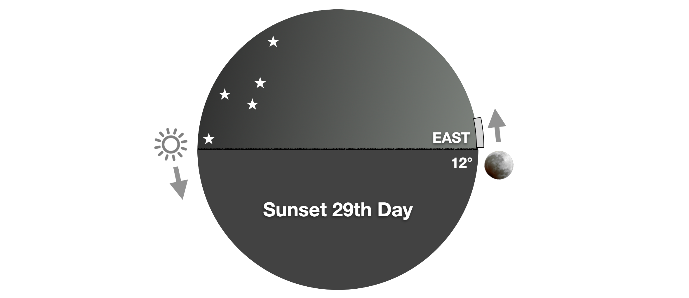

[#atlas-year-start]
The final variable we must nail down is identifying which month starts the year.
There are a number of different proposals out there, but before getting to the proposals, we must start with the principles and then test each proposal against them.

We have already established that the Sun, Moon, and stars are for days *_and years._*
We have also put forth the principle that everyone, everywhere, without reliance upon a subjective central authority, or impractically difficult manual mathematics, should be able to observe and obey God’s commands.
The reason for this is that Scripture says, “_it is not too hard for thee, neither is it far off._”
Scripture adds one additional constraint or principle that places the start of the year in the spring:

[quote.scripture, Exodus 12:2]
____
This month shall be unto you the beginning of months: it shall be the first month of the year to you.
____

This command comes directly from God to Moses and Aaron in the context of the first Passover and the Exodus from Egypt.
The month in view is Abib (later called Nisan), the spring month when Passover occurs.
This establishes Nisan (spring) as the starting point for the *religious/sacred calendar*—the counting of months for festivals, feasts, and redemptive events (e.g., Leviticus 23 frequently refers to "the first month" for Passover/Unleavened Bread).

Other verses reinforce this primacy of the spring new year for religious purposes:

[quote.scripture, Exodus 13:4]
____
This day came ye out in the month Abib.
____

[quote.scripture, Leviticus 23:5]
____
In the first month, on the fourteenth day of the month at even, is the LORD's passover.
____

The name *Abib/Aviv* is not arbitrary; it describes a precise stage of barley ripeness essential to the divine calendar.
Exodus reveals this during the plague of hail:

[quote.scripture, Exodus 9:31]
____
And the flax and the barley was smitten: for the barley was in the ear [abib/aviv], and the flax was bolled.
____

Here, "_in the ear_" (aviv) indicates barley that has formed heads—mature enough to be destroyed by hail, yet not fully ripe and dry.
This stage ensures the crop is brittle and vulnerable but still standing with kernels developing inside.

This matters for Passover timing because the first month must begin such that barley reaches harvest-readiness by the wave-sheaf offering (first fruits) on the 16th of the month.

[quote.scripture, Deuteronomy 16:9]
____
Seven weeks shalt thou number unto thee: *from such time as thou begin to put the sickle* to the standing corn [grain] shalt thou begin to *number seven weeks*.
____

The sickle begins on the standing barley during Passover week—typically 15–21 days after the month's start—so the month opens when barley is aviv (in the ear, heading, soft dough stage), ensuring it ripens fully by First Fruits without rotting in the field from over-maturity.
If barley were already overripe at month's start, the harvest would begin too early, spoiling the appointed timing; if too green, it could not mature in time for the omer offering.

The ripening season for barley—from the point when the first heads reach harvest-readiness to when the last heads in a field are fully ripe and ready for harvest (physiological maturity, hard kernels, low moisture)—typically spans 2 to 4 weeks, depending on variety, weather, and field conditions.

Lunar years do not perfectly align with solar years and the barley harvest is largely determined by the solar climate.
This means that there can be up to 29 days shift in the start of the lunar year which happens to be near the upper limit of the barley harvest tolerance.

The barley ripening season in ancient Israel (particularly in the warmer Jordan Valley and lowlands, where the earliest crops matured) generally began around 2–4 weeks after the vernal (spring) equinox (typically March 20–21 in the Gregorian calendar).

The earliest heads reach the aviv stage — young ears in the head, soft and milky, harvest-ready for the wave sheaf — around late March to early April, roughly 7 to 26 days after the equinox; the historical and modern records alike place the start of harvest in the Jordan Valley around the end of March in average years, with weather delaying it in others.
From those first heads to the last, full ripeness spreads across a region over 2 to 4 weeks, as microclimates, elevation, and varieties stagger the maturity — the Jordan Valley, lowest and warmest, running 1 to 2 weeks ahead of the hills around Jerusalem.

The equinox marks the astronomical start of spring, and barley's growth is solar-driven.
Aviv barley needed to be present at the month's beginning (new moon) so it could ripen in time for the wave sheaf ~15–21 days later (during Unleavened Bread).
Biblical and historical sources ensure the first month opens such that harvest aligns post-equinox without over-maturity/rot (barley spoils quickly once fully ripe).

Because we have a principle that everyone, everywhere must be able to discern the seasons, we cannot rely upon direct subjective observation of the state of the barley harvest to determine when the year starts because barley timing is largely location dependent and in many places you cannot even grow barley.
Instead, we use the barley as evidence of what kind of celestial events to look at.

[discrete]
=== The Spring Equinox

The most common sign that people use, one way or another, is the Spring Equinox which is the day when the sun rises due East and sets due West and at noon is directly overhead.
At this time there is about 12 hours of daylight and 12 hours of darkness.

Jesus once asked his disciples a simple yet profound question in the midst of rising danger:

[quote.scripture, John 11:9]
____
Are there not twelve hours in the day?
If anyone walks in the day, he does not stumble, because he sees the light of this world.
____

This wasn't casual small talk about the weather or the length of daylight.
It was a deliberate revelation of timing, purpose, and alignment with divine order.
When Jesus spoke of exactly *twelve hours*, he pointed to a moment of perfect balance—when day and night divide equally.
This occurs at the spring equinox, the turning point when light begins to overcome darkness in the Northern Hemisphere.
In the land of Israel, around latitude 31°N, this balance happens near March 20–22 in our modern reckoning.

Now consider the biblical calendar, which isn't arbitrary or man-made in the way modern civil calendars are.
The year begins with *Nisan*—the month of Aviv—tied directly to the ripening of barley and synchronized with the spring season.
The renewed moon that starts Nisan is the one closest to or following the spring equinox, ensuring Passover falls in spring, when renewal and liberation are manifest in nature itself.
The equinox marks the *tekufah*, the seasonal turning described in Scripture (Exodus 34:22), a natural turning point that aligns solar cycles with lunar months to keep the feasts in their appointed times.

The events surrounding Jesus' words in John 11 unfold just before Passover.
He had delayed going to Judea despite the threat to his life, then declared it was time to go—because the "day" had its appointed hours, and he was walking in the light of his Father's will.
After raising Lazarus, John 11:55 notes that "_the Passover of the Jews was at hand_," with many people already traveling to Jerusalem to purify themselves.
Then, John explicitly states:

[quote.scripture, John 12:1]
____
Six days before the Passover, Jesus came to Bethany, where Lazarus was, whom Jesus had raised from the dead.
____

The following table is the minimum reconstructed timeline given the available information.
It shows that the latest possible day for Jesus to say “are there not 12 hours in a day” is the 4th of the first month; however, if the stay in Ephraim was longer than one day then it could easily push the “12 hours in a day” comment to Renewed Moon day on the first day of the month.
In this context Jesus’s question could rhetorically be stating the precondition for the year starting.

[%unbreakable, frame=topbot, grid=none, cols="^1,6", options="header"]
|===
|Day |Event

|1st
|Renewed Moon Day (message about Lazarus' sickness sent)

|2nd
|Jesus receives message

|3rd
|First Day Jesus Waits, Lazarus Dies

|4th
|Second Day Jesus Waits, says "are there not 12 hours"

|5th
|Jesus travels to Lazarus (20+ miles)

|6th
|Jesus raises Lazarus on 4th day

|7th
|Jesus walks to Ephraim (15 miles)

|8th
|Sabbath (assuming Lunar Sabbath, no narrative points here)

|9th
|Jesus comes back to Bethany (15 miles), 6 days to Passover

|10th
|Triumphant Entry

|14th
|Passover
|===

Whether or not this was his intention, the fact remains that if the year were to start before the Spring Equinox then the barley would be unlikely to be ready.
Bad weather conditions such as being cold and wet can delay Barley, but good weather conditions cannot easily accelerate it.

[discrete]
=== Feast of Ingathering

[quote.scripture, Exodus 34:22]
____
You shall observe the Feast of Weeks… and the Feast of Ingathering at the turning (tekufah) of the year.
____

The Feast of the Ingathering is a name for the feast of Tabernacles which is the 15th of the 7th month.
Many scholars connect tekufah with the equinox as one of the turning points in the calendar.
If the Feast of Ingathering is at one turning point, then it stands that Passover should be near the other.

[discrete]
=== Traditional Start of Year

The traditional *calculated Jewish calendar* (established by Hillel II in the 4th century CE and still in use today) does *not always* place Nisan 1 after the vernal equinox.
While its primary goal is to ensure Passover (Nisan 15) falls in spring—typically after the equinox—through a combination of *intercalation* (adding Adar II in leap years on a 19-year Metonic cycle) and *postponement rules* (deḥiyyot for Rosh Hashanah/Tishrei 1), these mechanisms prioritize seasonal alignment for the feasts rather than strictly fixing Nisan 1 post-equinox.

The calendar relies on *calculating* *the equinox* (along with the molad/new moon conjunction and weekday rules) weeks in advance to decide intercalations and postponements.
This means that about 1 in 5 years they start the year so early that the Barley is unlikely to be ripe by first fruits.

A particularly notable year when this happens is 33 AD.
The second most popular date of the cross, April 3rd, 33 AD depends upon assuming a calendar that starts the month several days before the equinox.
This result is possible only by calculation and only if your calendar is indifferent to the need for barley ripeness.
When you add the necessary postponement, Passover in 33 AD falls on Saturday using the “visible crescent” calendar.

[discrete]
=== Spica

Some people put forth the idea that “Aviv” is a reference to the “barley seed” in the hand of the constellation virgo.
They then use the metric that the Renewed Moon (full moon) should set after the star Spica.
In recent centuries this approach can align with using the first full moon after the equinox on many years, but some years it falls a month later.
If you go back 2,000 years, then the two align more frequently, but if you go back 4,000 years, then this calendar comes in too early relative to the equinox.

The precession of the equinoxes is a slow, cyclical wobble in Earth's axial tilt, akin to a spinning top gradually shifting its orientation, caused by gravitational pulls from the Sun and Moon on Earth's equatorial bulge.
This precession completes a full cycle every approximately 25,772 years, causing the position of the vernal equinox (where the Sun crosses the celestial equator) to drift westward along the ecliptic by about 50 arcseconds per year relative to the fixed background stars.
As a result, the zodiac constellations that align with the equinoxes and solstices slowly shift over millennia—what was once Aries at the spring equinox in ancient times is now Pisces, and will eventually become Aquarius.

Linking the start of the year to any fixed stellar reference, such as the Sun or Moon's position relative to a star like Spica in Virgo (the "barley seed" in some interpretations), inevitably leads to seasonal drift over thousands of years because these alignments are sidereal (star-based) and ignore precession's gradual realignment of Earth's seasons with the zodiac.
A calendar tied to such a star will initially sync with solar seasons but slip backward by about one zodiac sign every 2,000 years—too early relative to the equinox 4,000 years ago, occasionally aligning 2,000 years ago, and lagging a month later in recent centuries and by the end of the millennial reign it will severely lag the seasons.
This drift disrupts harmony with the land's rhythms, as feasts wander from spring renewal to winter chill.

For these reasons it fails to meet one of the principles outlined for the start of the year.
However, principles must be recognized as a human aesthetic, and we are not to lean on our own understanding.
It is entirely possible that changes in the earth caused by the flood and future changes caused by something like a magnetic pole shift or God's renewal of heaven and earth, will change the projected celestial misalignment before it becomes an issue.

[discrete]
=== The Revelation 12 Sign

In an earlier chapter I introduced this translation of the Hebrew Revelation.

[quote.scripture, Revelation 12:1, literal rendering]
____
And was seen a great sign (light) in the heavens, a certain/one woman clothed in the sun and the moon under her feet and from her begins authoritative circle/cycle, one/first of twelve constellations (stars, Mazzaroth).
____

In Genesis, we are told that there are two "great signs" or "great lights" in the heavens and that the sun, moon, and stars are for times and seasons, and here we see a great light connected to a certain one woman, likely Virgo.
This verse appears to state that a cycle of 12 stars (constellations) starts from her.
This, in turn, implies that the months are named after the moons which are identified by the constellation of the moon.
So we now have a plausible translation and interpretation of scripture that directly tells us when the year begins.
This aligns with testimony from Josephus:

[quote, "Josephus - Antiquities of the Jews, Book 3, Ch 10.5"]
____
In the month of Xanthicus, which is by us called Nisan, and is the beginning of our year, on the fourteenth day of the lunar month, when the sun is in Aries, (for in this month it was that we were delivered from bondage under the Egyptians,)
____

In 32 AD, the time of Josephus, the full moon at the foot of Virgo aligns with the sun at the foot of Aries and happens to also be the first full moon after the equinox.
Therefore, in many years all three methods align, but in other years and other locations, this may not always be true.

The challenge with using Spica to determine whether the moon is at the foot of Virgo and the specific requirement that Spica set before the full moon is that every time zone has a different reckoning, and it is far more challenging to discern a global year than to use an equinox.

For example, in 2026 the Revelation 12 sign combined with Spica rule puts Israel an entire month ahead of the United States.
This creates a situation where not only can days be off-by-one depending upon your location, but months can be off-by-one depending upon your location.

[discrete]
=== The Location Problem: Why Observation Alone Creates Calendar Chaos

Some advocates of the Spica-based year start argue that observation is inherently superior to calculation because it requires no special knowledge—just look at the sky and see whether the full moon has passed Spica.
This sounds compelling until you examine what happens when people in different locations observe the same celestial event.

Consider the principle established earlier: everyone, everywhere, must be able to observe and obey God's commands without reliance upon a subjective central authority or faster-than-light communication.
This principle, when applied to the Spica rule, reveals a fatal flaw.

The full moon occurs at a specific moment in time—the instant when the moon reaches 180° from the sun.
But the observation of whether the moon has "passed" Spica happens at different moments for different locations.
If the rule is "observe the moon's position relative to Spica at your local sunrise on full moon day," then 24 different time zones will make 24 different observations spanning a 24-hour window.

The moon moves approximately 0.5° per hour in right ascension.
Over 24 hours, this amounts to roughly 12° of movement.
If the moon crosses Spica's right ascension during this global sunrise window, the following scenario unfolds:

* Eastern locations (sunrise first): Moon has not yet passed Spica → Year does not start
* Western locations (sunrise later): Moon has passed Spica → Year starts

This creates a situation where some locations are in Year X, Month 1, while others are still in Year X-1, Month 13.
They are not merely offset by hours or even days as with the daily dateline—they are offset by an entire month.

For the day and month boundaries, temporary desynchronization resolves within 24 hours through what we might call "teleportation"—when the celestial sign passes, everyone advances to the new period at their local day start.
But for the year boundary, the desynchronization persists for the entire year.
One group begins Month 1 while the other continues in Month 13, and this one-month offset carries through every subsequent month until the calendars potentially realign at the next year's Spica observation.

During this year-long desynchronization, the two groups celebrate all appointed times in different months.
One group celebrates Passover while the other is still in their 13th month; when that group finally reaches their Passover, the first group has already moved on to the second month.
This directly violates the principle that the holy times are objective and unchangeable—that our failure to read the clock properly doesn't change the holy times.

Some might argue that this is acceptable: each location observes locally, and they resynchronize at the next year boundary.
But this fundamentally undermines the unity of the appointed times.
The desynchronization doesn't last just a month—it persists for the entire year.
One group is perpetually one month ahead of the other for all twelve (or thirteen) months until the calendars finally realign at the following year's determination.

The Passover is not merely a personal observance—it commemorates a singular historical event that the entire community of Israel experienced together.
If half the world celebrates Passover a month before the other half, and this offset continues through Pentecost, through the Fall Feasts, through the entire sacred calendar, the very meaning of the appointed times is fractured.
The unity that Scripture assumes—"all Israel" appearing before the Lord at the appointed times—becomes impossible when different communities are operating on calendars offset by an entire month.

[discrete]
=== The Calculation Difficulty Problem

Advocates of the Spica rule often emphasize its observational simplicity: "Just look at the sky!"
But they overlook a critical distinction between observation and prediction.
For a calendar to be practical, people must be able to plan ahead.
You cannot wait until the full moon night to know whether this is Month 1 or Month 13—you need to know weeks in advance to prepare for Passover.
This is especially critical given the command for all males to appear before the Lord in Jerusalem three times a year (Deuteronomy 16:16).
Travel from distant locations required significant planning—arranging provisions, coordinating with travel companions, and timing the journey to arrive before the feast.
If you cannot determine until the last moment whether you are in Month 13 or Month 1, how can those traveling from Babylon, Egypt, or even the Galilee plan their pilgrimage?

This is where the calculation difficulty becomes relevant.

To predict the equinox by hand requires tracking the sun's position over several days and interpolating when day length equals night length, or when the sun rises due east.
The sun moves approximately 1° per day along a highly predictable path (Earth's orbit is nearly circular).
Historical tables based on centuries of observation can predict the equinox to within a day or two.
A trained person with basic astronomical knowledge and tables can determine the equinox weeks in advance.

To predict the moon's position relative to Spica requires far more complex calculation.
The moon's motion is notoriously irregular, affected by the elliptical orbit, inclined plane, precessing nodes, evection, variation, annual equation, and dozens of smaller perturbations.
The Babylonians spent centuries developing predictive tables for lunar motion, and even then, the accuracy was limited.
Calculating the moon's precise right ascension at any given moment requires extensive tables and significant expertise—well beyond what an ordinary person could accomplish.

Here is the irony: the Spica rule is trivially easy to observe (just look at the sky) but extremely difficult to predict.
The equinox rule is moderately difficult to observe precisely (which exact day is day equal to night?) but much easier to predict with basic tools and tables.

For a calendar that must serve people in planning their lives around the appointed times, predictability matters.
The equinox can be known weeks or months in advance with reasonable certainty.
The moon's position relative to Spica cannot be known with confidence without complex astronomical calculation—the very thing the observational advocates claim to avoid.

Furthermore, there is another advantage to the equinox rule: you are comparing two time-moments, not calculating an angular position.
"Did the full moon occur before or after the equinox?" is a question about the sequence of two events.
"What was the moon's right ascension at the moment of full moon?" is a question requiring precise positional calculation.
The former is far simpler than the latter.

[discrete]
=== The Precession Problem Revisited

As noted earlier, the precession of the equinoxes causes stellar positions to drift relative to the seasons by about 1° every 72 years, or one full zodiac sign every 2,000 years.
A calendar tied to Spica will drift out of alignment with the seasons over millennia.

Some might argue that God's calendar was designed for a specific era—the time of Moses, or the time of Christ—and that precession is irrelevant.
But consider: the Torah was given as an everlasting covenant, and the appointed times are described as "statutes forever throughout your generations" (Leviticus 23:14, 21, 31, 41).
A calendar that works for 2,000 years and then fails for the next 2,000 years is not an eternal statute.

The equinox, by contrast, is defined by Earth's relationship to the sun—the tilt of the axis relative to the orbital plane.
This relationship is stable over tens of thousands of years (with only minor variations in obliquity).
The equinox will mark the start of spring forever, regardless of which constellation happens to be behind the sun at that moment.

Still, this objection only bites far outside the window of time Scripture is concerned with.
The Spica / Revelation 12 sign holds true across that entire window—it aligns at the three pivotal dates of redemptive history: the Exodus, the Cross, and (if it arrives in the near future) the Second Coming.
Precession only breaks the alignment long after that—and from that time on, no one knows but the Father, for Scripture itself tells us nothing beyond it.
Just as the flood reset the face of the earth, the new heaven and new earth may well arrive with new signs and new revelation.
An objection that only matters thousands of years beyond the prophetic window may simply be reaching into a future God has reserved for Himself.

[discrete]
=== Resolving the Debate

When we apply the principles established in the Principles of Evaluation chapter, the equinox rule satisfies them more fully than the Spica rule:

. *Commands Are Accessible to All:* The equinox can be observed by anyone, anywhere (watch where the sun rises, measure day length) and predicted with basic tables.
The Spica rule can be observed but not easily predicted without complex calculation.
. *Universal Personal Accountability:* The equinox produces a single, global determination that applies to everyone.
The Spica rule can produce different results for different locations, fragmenting accountability.
. *Connected to Sun, Moon, and Stars:* Both rules use celestial observations, but the equinox uses the fundamental solar-seasonal cycle that directly determines agricultural timing.
The Spica rule uses a stellar reference that drifts relative to seasons.
. *Objective, Unchangeable Holy Times:* The equinox produces an objective result—the equinox either occurred before or after the full moon.
The Spica rule can produce subjective, location-dependent results in edge cases.
. *Agricultural/Seasonal Alignment:* The equinox directly ensures spring timing.
The Spica rule aligned with spring historically but drifts over millennia.
. *Practical Global Decentralized Observation:* The equinox can be determined identically by observers worldwide.
The Spica rule can yield different results for different locations.

The Spica imagery in Revelation 12 ("a woman clothed with the sun, with the moon under her feet") may well be prophetically significant for identifying a specific historical event, but using it as the perpetual mechanism for determining the year start raises the practical challenges explored above.

The equinox rule—first renewed moon (full moon) on or after the spring equinox—provides a stable, predictable, and globally consistent method for determining when the year begins.

[discrete]
=== Conclusion

You can be certain that if the first full moon is after the equinox, the barley is abib, and the full moon is at the foot of Virgo then your calendar year is starting on the right month.
If some of these signs do not align in certain years and regions, then there is legitimate ambiguity about whether to prioritize the interpretation of the Revelation 12 sign or the timing relative to the equinox.
As of this writing, I have no objective historical anchor points that can disambiguate these signs, as they all agree in both the year of the cross and the year of the Exodus.

[quote.scripture, Genesis 1:14]
____
And God said, “Let there be lights in the expanse of the sky to distinguish between the day and the night, and let them be signs to mark the seasons and days and years.

And let them serve as lights in the expanse of the sky to shine upon the earth.”
And it was so.
____

