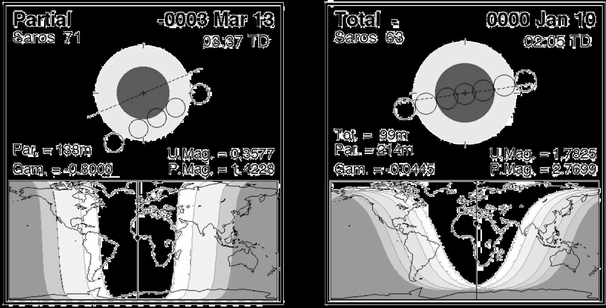
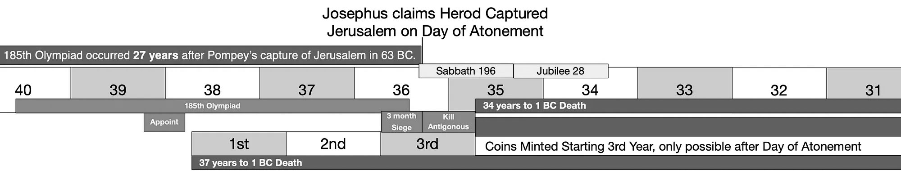

Understanding the years of Herod the Great is necessary because they impact the timing of other key markers, such as establishing a witness to the seven-year sabbatical cycle and the timeline of the construction of the temple.
The evidence we have from the Gospel of Luke and the 2 BC census should be enough on its own to establish that Herod died in 1 BC, but scholars have ended up using their interpretation of Herod’s death as the basis for questioning the legitimacy of Luke’s testimony and arguing that Luke used an unconventional means of counting the years of Tiberius.
For all these reasons, we will compare seven converging lines of evidence, several independently anchored, to test whether 1 BC best explains the surviving evidence.

[discrete]
=== Herod's Death

[#atlas-herod-eclipse]
Josephus tells the story with great detail.
Herod had just burned alive two revered rabbis and forty of their students for tearing down the golden Roman eagle he had placed over the Temple gate.
That same night the eclipse occurred:

[quote, Josephus, Antiquities 17.6.4 §167]
____
"But Herod deprived this Matthias of the high priesthood, and burnt the other Matthias, who had raised the sedition, with his companions, alive.
And that very night there was an eclipse of the moon."
____

Josephus mentions only one lunar eclipse in his entire twenty-one volumes of history.
He places it here, deliberately, as the opening act of Herod’s final collapse.
From that night forward Herod’s body rotted while he still lived: gangrene, worms, suicidal despair.
God, Josephus says, “was now punishing him for all his iniquities” (Ant. 17.6.5 §168–169).

The astronomical record confirms two possible dates.
NASA’s Five Millennium Catalog of Lunar Eclipses lists a deep total eclipse during the night of January 9–10, 1 BC (Julian calendar).
Over Jerusalem, the already-risen moon began entering the penumbra at approximately 10:45 PM and the darker umbra at approximately 11:45 PM.
Totality lasted from approximately 12:40 to 2:20 AM, with greatest eclipse near 1:30 AM local mean solar time, keeping the moon completely within the earth’s shadow for about one hour and thirty-nine minutes.
This was a far more conspicuous event than the shallow partial eclipse of 4 BC that is usually cited, whose maximum occurred around 3 AM.

If this were the only evidence you had, the full blood moon is hands down the most likely event within the 10-year window.
The only reason to consider the extremely partial eclipse of March 13, 4 BC, is if all the other evidence was pointing in that direction.
So this eclipse marks the third independent witness, the first being the census, and the second being 30 years from Tiberius’ 15th.

Aside from the visual distinction, Josephus describes a sequence of events leading to Herod’s death for which the shortest plausible timeline is 35 days and the longest plausible is 85 days.
On the calendar most assume from tradition, there were at most 29 days between the eclipse and Passover, which occurred after the public mourning for the king was over.

[quote, Josephus (Antiquities 17.9.3)]
____
When the public mourning for the king was over… before the feast which is called Passover
____

It requires extreme special pleading to fit that timeline if you are committed to a dark/sliver-moon start of the month and the 4 BC eclipse; however, if you reference the January 10, 1 BC eclipse, there are a full 114 days, which gives ample time for the timeline to unfold.
The only way to save the 4 BC eclipse is to consider the full-moon calendar, which would buy you another 15 days — enough to be plausible but still tight.

[discrete]
=== The Reign of Herod

[#atlas-herod-capture-reign]
Now that we have established Herod’s death by 3 witnesses, we can look at additional witnesses to support how his regal years were reckoned.
We will use additional independent proofs that don’t work backward from his death.
When taken together, the proofs of the years of his reign also contribute to the proof of his year of death, which in turn confirms that Luke used conventional dating for Tiberius.

The evidence from his death already strongly points to his regal years starting in 38 and 35 BC; however, conventional assumptions put them at 40 and 37 BC, a 2–3-year difference.
We can derive these dates by subtracting 37 and 34 years from 4 BC and 1 BC according to the testimony of Josephus.

[quote, Antiquities 17.8.1 §191; War 1.33.8 §665]
____
37 years from the time the Roman Senate proclaimed him king (39 BC), and 34 years from the time he captured Jerusalem and slew Antigonus.
____

Josephus gave us two witnesses, so let’s start with the year Herod captured Jerusalem.
Josephus tells us that Herod conquered Jerusalem 27 years to the day from when Pompey conquered Jerusalem.
Both events happened on the Day of Atonement (the 10th of the seventh month).

[quote, Josephus in Antiquities of the Jews]
____
This calamity befell Jerusalem during the consulship of Marcus Agrippa and Caninius Gallus in Rome, in the hundred and eighty-fifth Olympiad, in the third month [of the siege], on the day of the fast, as if it were a recurrence of the misfortune which befell the Jews under Pompey after so many years, on the day which even now they call the fast.
For it was on that day that Pompey, after breaking through the wall, entered the temple with his troops, and though the Romans did no harm to the holy objects, but slaughtered many of the people, and took the city, and carried off the people into captivity.
____

We know Pompey captured Jerusalem in 63 BC.
Every single ancient author who gives a specific year or consular pair for Pompey’s capture of Jerusalem agrees on 63 BC.
There is no ancient source that puts it in any other year.
63 BC is not a modern guess — it is the unanimous testimony of the original Roman and Greek historians who were either alive at the time (Cicero) or writing within a generation or two.

[quote, Josephus in Antiquities of the Jews]
____
Herod took Jerusalem on the very same day … after twenty-seven years’ time
____

Therefore, exactly 27 years later to the day, puts Herod taking Jerusalem in 36 BC on the Day of Atonement.
After he takes the city in the fall, his first “de facto” year of rule starts in spring of 35 BC as the Jews used spring-to-spring reckoning for local rulers.
This aligns perfectly with the 1 BC death.

The reason they can argue for 37 BC is that Josephus gave several other points of reference, including the consulships of Marcus Agrippa and Caninius Gallus and the 185th Olympiad, and these references do not appear to agree.
So let’s dig in deeper.

The 185th Olympiad ended before the Day of Atonement in 36 BC, but the siege started months beforehand, during the 185th Olympiad.
It is therefore plausible to reconcile this statement with both 37 and 36 BC, but it does lean slightly in favor of 37 BC because the entire event would fit in the Olympiad.

The consulship of Marcus Agrippa and Caninius Gallus ran from January to December 37 BC, which appears incompatible with a siege concluding in the fall of 36 BC.
Yet the same consulship is equally problematic for the 37 BC siege if we apply the conventional spring-to-spring (Nisan-based) reckoning for Jewish kings, where Herod’s de-facto reign would begin the following spring (35 BC for a 36 BC capture, or 36 BC for a 37 BC capture).
To force a 37 BC capture to align with Herod’s 34 de-facto years ending in 4 BC (or even 1 BC), the 37 BC side must plead that Josephus deviated from standard practice—either by using fall-to-fall (Tishri) reckoning or by counting the partial accession year inclusively as year 1.
Such adjustments are uncharacteristic of Josephus, who consistently applies spring-to-spring non-inclusive reckoning for pre-Herodian Jewish monarchs.
In contrast, the 36 BC case requires only a modest extension of the consular reference: Josephus frequently anchors ongoing campaigns to the consuls in power when hostilities began or orders were issued, rather than the exact year of completion.
Thus, while both interpretations demand some flexibility with the consulship, the 36 BC timeline aligns more naturally with Josephus’s typical regnal-year conventions and requires far less departure from his established historiographical habits.

The last bit of testimony we have from Josephus is that this event occurred on a Sabbath Year.

[quote, Antiquities 14.16.2]
____
This calamity befell Jerusalem in a sabbatical year, just as it had previously under Pompey.
____

Sabbath years start in the fall, the first season in which seeds are not planted, because no harvesting would be allowed in the spring.
Assuming that the 1406 BC Jordan River crossing started the cycle, spring 35 BC would be the seventh year of the cycle, and the timing would fit perfectly.

I’ve presented extensive evidence on this event due to the apparent internal contradictions in Josephus’s own statements, so let’s organize it into a helpful table to reveal the big picture.
What the table demonstrates is that a 37 BC date forces Josephus to appear inconsistent or erroneous on key details, while 36 BC requires only minor adjustments—such as referencing the start of the siege or decree rather than its end.
The consequence of assuming Josephus deviated to non-standard regnal-year reckoning or was outright wrong about the 27 years 'to the day' from Pompey is that it undermines his testimony on all other matters.

// FIGURE: missing table — prose says "let's organize it into a helpful table to reveal the big picture" (37 BC vs 36 BC comparison); no table present in the source (likely images/masters/herod-the-great-fig1-p230.png)

Allowing special pleading against Josephus’s plain words—whether reinterpreting “twenty-seven years to the day” or forcing non-standard regnal counting—opens the door to dismissing his other clear testimonies at will.
The lunar eclipse marking Herod’s death, the temple’s construction timeline, and every detail critics use to challenge Luke’s straightforward account of Tiberius’s fifteenth year could be similarly waved away.
Once we treat Josephus as malleable when inconvenient, his entire witness becomes unreliable, leaving us with no solid anchor for biblical chronology beyond tradition and preference.

[discrete]
=== Herod’s Age as a Chronological Constraint
[#atlas-herod-age]
The next line of evidence is a comparison between two proposed outcomes, not an appeal to a preferred chronology.
Josephus gives two age constraints: Herod was only 15 when Antipater entrusted Galilee to him, and Herod was nearly 70 during his final illness.
We can therefore ask which proposed death year makes the intervening evidence more likely.

[quote, Antiquities 14.9.2 §158]
____
Antipater … made his son Herod governor of Galilee, when he was but fifteen years old.
____

The Greek is emphatic: Herod was “very young,” having completed “only fifteen years.”
The next sentence again calls attention to his youth, and the parallel account calls him “very young” (War 1.10.4 §203).
No surviving manuscript is known to read “twenty-five”; that number is a conjectural correction, not an alternative textual witness.footnote:fifteenmss[Nadav Sharon's published collation of the manuscript evidence reports no manuscript support for “twenty-five”; see https://www.bsw.org/biblica/vol-95-2014/herod-s-age-when-appointed-strategos-of-galilee-scribal-error-or-literary-motif/548/article-p50.html[“Herod's Age When Appointed _Strategos_ of Galilee,” _Biblica_ 95 (2014), pp. 50–54].]

Josephus likewise describes Herod's age near death in both histories:

// the &amp; below is required — a bare & breaks the PDF attribution parser
[quote, Antiquities 17.6.1 §148 &amp; War 1.33.1 §647]
____
He was about seventy during his final illness.
____

_Antiquities_ places him “about his seventieth year”; _War_ says he was “already nearly seventy.”
These are approximate expressions, so they should produce an approximate window rather than a falsely exact birthday.
Their central implications can nevertheless be compared:

[%unbreakable, frame=topbot, grid=rows, cols="<3,<3,<3", options="header"]
|===
|Constraint
|If Herod died in 1 BC
|If Herod died in 4 BC

|Birth implied by “nearly seventy”
|Approximately 71–70 BC
|Approximately 74–73 BC

|Galilean commission at age 15
|Approximately 56–55 BC
|Approximately 59–58 BC

|Age at death if the commission belongs to 55 BC
|Approximately 69
|Approximately 66
|===

The question is therefore not whether 4 BC can be made mathematically possible.
It can, if “nearly seventy” is widened toward 68 and the commission is moved toward 57 BC.
The better test is which reconstruction most naturally intersects the documented political setting in which Antipater could create regional posts for his sons.

Gabinius reorganized Judea twice during his Syrian command.
In the earlier reorganization, around 57 BC, he divided the nation among five regional councils, including one at Sepphoris in Galilee, and Josephus describes the result as an aristocracy (Antiquities 14.5.4 §91; War 1.8.5 §170).
That reform provides a broad possible setting for the 4 BC reconstruction, but Josephus does not say that Antipater designed it or that it installed Antipater's sons.

The second reorganization followed Gabinius's Egyptian expedition and his victory over Alexander at Mount Tabor.
Independent Roman chronology places the Egyptian restoration in 55 BC.footnote:gabiniusdate[See https://lexundria.com/dio/39.55/cy[Cassius Dio, _Roman History_ 39.55–58] and https://lexundria.com/plut_ant/3/prr[Plutarch, _Life of Antony_ 3–4]. Plutarch independently places Antony with Gabinius first against Aristobulus and then in the Egyptian expedition.]
Josephus then records the feature that distinguishes this settlement from the earlier council system:

[quote, War 1.8.7 §178; compare Antiquities 14.6.4 §103]
____
Gabinius came to Jerusalem, and settled the government as Antipater would have it.
____

This is the only point in the 50s at which Josephus explicitly presents a Roman reorganization of Jerusalem according to Antipater's design.
It is therefore not a decorative parallel selected after the fact.
Josephus's two age notices first constrain Herod's commission to approximately the mid-50s; Roman chronology then identifies the 55 BC settlement as the closest and most specific office-making context.
The actor in the appointment notice is also Antipater—not Caesar or Sextus—just as this reconstruction requires.

There is an additional lower boundary on Herod's birth.
After naming Antipater's children, including Herod as the second son, Josephus says Antipater entrusted his children to the Arabian king while fighting Aristobulus (Antiquities 14.7.3 §§121–122; War 1.9.3 §181).
The natural reference is the original Hyrcanus–Aristobulus conflict in which Aretas supported Antipater, before Pompey's capture of Jerusalem in 63 BC.
The collective wording does not name Herod separately and therefore should not be treated as an exact birth record, but it makes a birth in 63/62 BC—required by a first commission at age 15 in 47 BC—very difficult.

The usual 47 BC placement comes from Josephus's narrative arrangement.
After describing Caesar's formal elevation of Antipater (Antiquities 14.8.5 §143), Josephus later narrates the commission of Antipater's sons (§158), Herod's action against Hezekiah, his controversy before Hyrcanus, and his further promotion by Sextus Caesar (§180).
Yet Caesar's act made *Antipater* procurator; it did not expressly give Herod his first Galilean post.
In 47 BC, a Herod born around 70 BC would have been in his early twenties—an appropriate age for the later judicial controversy, Roman patronage, and expanded command over Coele-Syria.

Josephus also demonstrates in this very portion of both histories that he condenses family history rather than maintaining an uninterrupted year-by-year sequence.
After narrating events involving Cassius, he pauses to recount Antipater's marriage, children, and their much earlier protection by Aretas during the pre-63 BC war (Antiquities 14.7.3 §§121–122; War 1.9.3 §181).
The earlier event is inserted retrospectively because it explains the family's later rise.
The placement of Herod's boyhood commission within the later account of that rise can be read in the same way: an initial Galilean commission under Antipater around 55 BC, followed by Caesar's formal enlargement of Antipater's authority and Herod's later promotion under Sextus.

This reconstruction is not an explicit statement that Herod was “appointed in 55 BC and reappointed in 47 BC”; no surviving source says that in those words.
It is a cumulative inference constrained by the evidence.
If 1 BC were already the known outcome, the observations are what we would expect: birth around 70 BC, a commission at 15 around 55 BC, an Antipater-directed Roman settlement in that year, and mature advancement in the early 20s under Caesar and Sextus.
The 4 BC outcome requires more adjustment: it must associate the commission with the less-specific 57 BC council reform, widen Josephus's “nearly seventy,” or leave a Herod commissioned in 55 BC only about 66 at death.

The Roman date does not independently name Herod, so this should not be presented as a separate Roman eyewitness to his appointment.
It is, however, an independently anchored, non-biblical chronological corroboration: the Roman date fixes the administrative setting, while Josephus's two age notices connect that setting to a death near 1 BC.

[discrete]
=== Start of His Regnal Years

The traditional chronology dates Herod's appointment as king by the Roman Senate to late 40 BC, shortly after the Treaty of Brundisium (October 40 BC).
This allows him to return quickly to Judea, begin campaigns in winter 40/39 BC, conquer Jerusalem in 37 BC, and die in 4 BC—fitting the 37- and 34-year reign spans Josephus records.
However, this timeline depends on the assumption that Herod's entire journey from Alexandria to Rome was completed swiftly enough to keep the Senate vote within the 40 BC consular year, with no significant delays from storms, ship repairs, or winter weather.

Our evidence for Herod's death in 1 BC and the conquest of Jerusalem in 36 BC requires the appointment to occur after Nisan 1 in 39 BC (around April/May in the Julian calendar), so that spring 38 BC becomes his first full regnal year under non-inclusive reckoning.
The voyage itself provides the natural explanation for this 5–6 month gap, and the full moon calendar's delayed Shavuot on July 1, 40 BC—already proven beyond reasonable doubt in this book—extends the journey timeline in a realistic way.

Josephus describes the Parthian invasion escalating around Shavuot, when the enemy exploited the large crowds gathering for the feast:

[quote, Antiquities 14.13.3]
____
But while there were daily skirmishes, the enemy waited for the coming of the multitude out of the country to Pentecost, a feast of ours so called.
____

Assuming Pentecost was fixed on the 15th of the third month in the Temple calendar, and months beginning at the visible full moon, the feast falls on July 1, 40 BC.
The invasion peaks in early July, prompting Herod's immediate overland escape to Masada, Petra, Rhinocolura, and Alexandria—a journey complicated by political rejections (no aid from Arabia or Cleopatra) that could take 4–6 weeks, placing his arrival in Alexandria in mid-August 40 BC.

From Alexandria, Herod sailed amid the summer etesian winds and encountered a violent storm that forced a detour to Rhodes:

[quote, Antiquities 14.14.3]
____
[Herod] sailed away in a storm, which fell upon him as he sailed, with great danger; and he was sorely shaken with the tempest, and was thereby in distress.
____

Refitting a large vessel in Rhodes—hiring crew, sourcing timber, and awaiting supplies—could easily require three or more months under typical ancient conditions, extending into late October or early November 40 BC.
The Mediterranean's mare clausum (closed sea) season began in November, with storms and short days making voyages rare and perilous until March.
Herod likely wintered in Rhodes or along the route to avoid disaster, as historical parallels (e.g., Paul's winter shipwreck in Acts 27) illustrate the risks of pressing on.

Sailing the windward leg to Brundisium (against northerlies) in early spring 39 BC (March/April) fits the safer post-winter window, with Herod then proceeding overland to Rome.
Appian sequences the appointment during Antony's eastern reorganizations after the treaty:

[quote, Civil Wars 5.75]
____
He [Antony] appointed kings over the nations who had assisted him, Herod over Idumaea and Samaria...
____

This narrative flow extends into Antony's winter 40/39 BC in Athens, allowing the Senate vote to slip past Nisan 1 in April/May 39 BC amid bureaucratic delays—quorums, auspices, or Antony's schedule.
Dio Cassius's account (Roman History 49.22) further supports this by placing Herod's campaigns after Ventidius's 39–38 BC Parthian victories, implying an early-to-mid 39 BC appointment without contradiction.

Scholars like Andrew Steinmann (From Abraham to Paul, 2011) and W.E. Filmer (1966 Journal of Theological Studies) affirm this minority view, interpreting Appian and Dio's ambiguities as permitting a 39 BC date to harmonize with a 36 BC conquest and 1 BC death.
The full moon calendar's two-week shift, combined with Shavuot's mid-summer placement, naturally extends the journey by three weeks compared to traditional thinking, making post-spring 39 BC not just possible but probable under realistic conditions.

Critics asserting a rigid late-40 BC appointment bear the higher burden: they must prove Herod's multi-leg odyssey defied storms, refit timelines, and winter risks to complete swiftly—without a shred of direct evidence for such haste.
Their speed is speculative, built on idealized assumptions to preserve the 4 BC death consensus, while this reconstruction meets plausibility through documented delays and source flexibility.
With five or more independent witnesses (including scripture) converging on 1 BC, the evidence demands we follow where it leads, not force-fit it to tradition.
It is not rational to allow something as flimsy as speculation about a journey’s length to serve as the foundation of Herod’s Regal years, especially in light of how much other objective evidence it would overturn.

[discrete]
=== Years of High Priests

[#atlas-herod-high-priests]
The sixth independent line of evidence for the reign of Herod the Great also comes from Josephus, who is proving to be reliably internally consistent in his testimony.

[quote, Josephus: Antiquities 20.10.2]
____
Accordingly, the number of the high priests, from the days of Herod until the day when Titus took the temple and the city, and burnt them, were in all 28; the time also that belonged to them was 107 years.
____

Since it is widely accepted that Titus took the temple and city in the summer of 70 AD, we can do some simple math and identify that the “days of Herod” points to the summer of 38 BC, Herod’s first regnal year after his appointment by Rome.
The alternative view is to use inclusive counting, yielding a range from 37 BC to 70 AD.
This has been used to support a 37 BC siege of Jerusalem instead of a 36 BC date.

Using exclusive counting in instances where Josephus references an exact day marking the end would be consistent, and it aligns well with the start of Herod's regnal authority after his appointment, reflecting the first full spring-to-spring year in 38 BC.
This yields approximately 107 years to 70 AD, treating the figure as a close, rounded span common in ancient historiography for symbolic or narrative emphasis.

Using inclusive counting implies 37 BC years + 70 AD years as the range.
This fact has been used to argue that Herod's de facto years count from 37 BC instead of from 35 BC.
The issue with assuming 37 BC as the start of his de facto regnal years is that it requires inclusive counting for de facto years, as a 37 BC capture would place the first spring-to-spring de facto year starting in 36 BC.
Alternatively, it forces moving the capture of Jerusalem to 38 BC to keep the spring-to-spring timeline, but if that adjustment is made, the 107 years wouldn’t span the first high priest appointment made shortly after the capture of the city.

The bottom line is that Josephus's 107-year number is close enough to fit both theories and not a perfect fit for any theory.
However, the 38 BC regnal / 35 BC de facto start is the better fit overall, as Josephus's phrase "days of Herod" emphasizes the era beginning with his effective control and first high priest appointment post-conquest (late 36 BC), yielding ~106 years—a near match to 107 that allows for rounding without shifting events or mixing reckoning methods.
This maintains internal consistency in Josephus's narrative, where the high priest span is tied to the practical onset of Herod's authority rather than a nominal or partial year, avoiding the traditional view's need for adjustments that misalign the first appointment or force inconsistent counting.

The 107-year figure is a broad summary interval, presented without precise markers like 'to the day,' so treating it as approximate by one year is reasonable and consistent with Josephus's occasional rounding in non-critical summaries.
In contrast, the 27-year interval from Pompey's capture is stated explicitly as 'after twenty-seven years’ time' and 'on the very same day' — a precise chronological claim that the traditional view must reinterpret as inclusive or non-literal to fit 26 years.
This is the crucial difference: my model preserves the plain sense of Josephus's most emphatic chronological marker, while allowing minor flexibility only on a summary number.
The traditional view does the reverse — it overrides the emphatic claim to preserve exactness in the summary.
That asymmetry favors the reading that requires fewer adjustments to the text itself.

[#atlas-herod-philip]
[discrete]
=== Herod's Son Philip's Reign

One of the primary arguments for Herod’s death in 4 BC is derived from the documentation of the reigns of his children.
We will address each child in turn, starting with Philip.

The disagreement at _Antiquities_ 18.4.6 (§106) is real, but the witnesses must be stated exactly.
No witness verified here preserves both “22nd year of Tiberius” and “37 years” together.

Benedict Niese's critical text prints the Greek reading “twentieth year” and “thirty-seven years.”
His apparatus records both Latin variations at the same words: _vicesimo secundo Lat_ (“twenty-second in the Latin”) against Greek “twentieth,” and _triginta duos (XXXV alii) Lat_ (“thirty-two; other Latin copies thirty-five”) against Greek “thirty-seven.”
See https://archive.org/details/gr-niese-4-1880/page/160/mode/2up[Niese, _Flavii Iosephi Opera_, vol. 4 (1890), p. 160].

The 22nd-year reading is therefore not a modern invention.
It can be inspected directly in https://api.digitale-sammlungen.de/iiif/image/v2/bsb00140762_00450/full/full/0/default.jpg[Bamberg, Staatsbibliothek, Msc.Class.78, fol. 223v], a Latin manuscript dated to the middle third of the ninth century:

[quote, Bamberg Msc.Class.78, fol. 223v]
____
_Tunc etiam Philippus Herodis huius frater vita defungitur, vicesimo quidem secundo anno imperante Tiberio._
____

That is: “Then Philip, this Herod's brother, also died, in the twenty-second year of Tiberius's rule.”
The same manuscript immediately gives Philip's reign as XXXII, thirty-two years—not thirty-seven.
The https://www.bavarikon.de/object/bav%3ASBB-KHB-00000SBB00000114?lang=en[Bavarian catalogue dates the manuscript to the middle third of the ninth century].
The ancient Latin _Antiquities_ translation belongs to the translation project Cassiodorus says he commissioned in the sixth century (_Institutions_ 1.17.1; https://www.latinjosephus.org/background/[Latin text and translation]), but the date of the translation must not be confused with the date of this surviving manuscript.

The reading also survived in print before 1544.
A https://opendigi.ub.uni-tuebingen.de/opendigi/image/Cd3152_fol/Cd3152_fol_330.jp2/full/full/0/default.jpg[Venice Latin edition of 1499, image 330] reads “twenty-second” and then thirty-five years.
The https://api.digitale-sammlungen.de/iiif/image/v2/bsb10139723_00614/full/full/0/default.jpg[1524 Froben Latin edition, p. 522] likewise prints “twenty-second,” followed by a reign figure of twenty-two years.
These editions show the early printed history of the Latin reading; they are not additional independent manuscripts.

The Greek evidence is also older than the 1544 Greek Froben edition.
Niese identifies the witnesses to this passage as A (Ambrosianus F 128 inf., about the eleventh century), W (Vaticanus gr. 984, copied in AD 1354), and M (Laurentianus plut. 69.10, about the fifteenth century).
They support twenty and thirty-seven.
Palatinus gr. 14 is older, but its text of Books 18–20 is lost, so it cannot testify to this sentence.

[%unbreakable, frame=topbot, grid=none, cols="<3,<2,<2,<4", options="header"]
|===
|Witness |Tiberius year |Reign length |What it establishes

|Greek A, W, M
|20
|37
|The extant Greek reading is not merely a post-1544 editorial correction.

|Bamberg Msc.Class.78, fol. 223v (ninth century)
|22
|32
|The 22nd-year Latin reading is directly attested before the extant Greek copies.

|Venice Latin edition (1499)
|22
|35
|The Latin date reading continued before the Greek edition of 1544.

|Froben Latin edition (1524)
|22
|22
|A second pre-1544 print preserves the date reading but illustrates the instability of the reign total.
|===

The textual evidence therefore supports a narrower, but defensible, conclusion.
The 22nd year is a genuine Latin reading attested by the ninth century and deserves chronological weight.
The 37-year reign is supported by the Greek text and by Philip's Year 37 coin.
Combining those two supported figures produces the 22/37 reconstruction that fits a 1 BC death of Herod, but that combination is a textual reconstruction, not a quotation preserved intact in a presently identified witness.

Loss of a word meaning “second” could readily turn twenty-second into twentieth in Greek.
On the other hand, the Latin reign totals of thirty-two, thirty-five, and twenty-two prove that numbers were unstable in that tradition too.
The fair conclusion is not that the Latin reading wins automatically, but that “twentieth” cannot be treated as uncontested and “twenty-second” cannot be dismissed as a late fabrication.

Now we can build a complete picture of what happened, as it was common for Herod’s family to antedate their reign to the day they were appointed, not the day they took power.
Herod the Great took power after 3 years, so his own reign was antedated by Josephus and Herod's own coins by 3 years.

Evidence for Antipas’ reign being back-dated can be inferred from a lack of coins from his first 3 years.
Scholars (e.g., Kogon/Fontanille's die study of ~800 specimens) confirm the "year 4" as the earliest, with no evidence of prior minting as earlier years show no surviving coins or die links.
While absence of evidence is not evidence of absence, the lack of coins is consistent with the written testimony.
Meanwhile, Archelaus’ coins are few and contain no dating inscriptions.

[discrete]
=== Herod's Three Sons: Testing the 4 BC Death Date

If Herod the Great died in spring 4 BC (before Passover), the regnal chronologies of his three sons should align with Josephus, Roman sources, and coin evidence.
Archelaus and Antipas fit reasonably well under standard Herodian ante-dating practices; Philip must be tested under both of the surviving textual traditions.

[discrete]
==== Archelaus (ethnarch of Judaea)

Josephus records a 10-year reign (Ant. 17.13.2), ending with exile in AD 6 (confirmed by Dio Cassius 55.27.6).
If power began immediately upon Herod’s death in spring 4 BC, the timeline works cleanly.
Coins begin in “Year 1” = 4 BC, with the usual 1-year ante-dating: the partial overlap with Herod’s final year is counted as Archelaus’s full first year.
No special pleading is required—this is normal Herodian practice.

[discrete]
==== Herod Antipas (tetrarch of Galilee and Perea)

Antipas ruled for 43 years according to Josephus (Ant. 18.7.2) and was banished in AD 39 (Dio Cassius 59.8.2).
Starting in spring 4 BC, the length matches exactly.
His coins also open in “Year 1” = 4 BC, again using the standard 1-year ante-dating (partial final year of Herod counted as full Year 1).
Like Archelaus, this requires no unusual justification.

[discrete]
==== Philip (tetrarch of Batanea and surrounding regions)

Here the textual disagreement matters.
The transmitted Greek combination—Tiberius's 20th year and a 37-year reign—fits a 4 BC accession under conventional regnal reckoning.
The Latin tradition moves the death notice two Tiberian years later, but its surviving reign totals vary.

Philip's Year 37 coin independently supports a reign that reached a thirty-seventh year, but a regnal number on a coin is relative rather than an absolute BC/AD date.
It therefore confirms the 37, not by itself whether Year 1 began in 4 BC or 1 BC.
The 1 BC case combines the Latin 22nd-year death notice with the Greek and numismatic 37-year total.
That is a plausible reconstruction from two lines of evidence, but it should be identified as such.

[discrete]
=== Conclusion

Philip does not by himself make the 4 BC scenario impossible: the Greek 20/37 text is internally coherent with it.
His value to the 1 BC case is different.
The ninth-century Latin manuscript proves that a 22nd-year death notice circulated centuries before the first Greek printing, while the coin supports retaining 37 rather than the varying Latin reign totals.
This gives the 1 BC reconstruction real textual and numismatic footing, though not a complete 22/37 manuscript witness.

However, it is far more plausible to conclude that the consul who started the hostilities was referenced than the consul who came after they had already happened.
In this case, the most plausible conclusion still favors the fall of 36 BC and a 35 BC start to his first de facto year.

To argue for 4 BC requires you to assume Josephus was being imprecise or there was a scribal error without any evidence to suggest such a thing.
Josephus is clearly indicating that his precision is to the day.
At this point you should start to see the pattern of extreme rationalization necessary to defend the Wednesday, Thursday, or Friday crucifixion.

Herod's years anchor the Gospel timeline, sabbatical cycles, and temple construction.
Luke's Tiberius fifteenth year and the 2 BC census alone place his death in 1 BC—yet the traditional 4 BC date prompts scholars to doubt Luke and invent unconventional Tiberius reckoning.

Seven converging lines of evidence, several independently anchored, support 1 BC:

. January 10, 1 BC total lunar eclipse — dramatic and visible, unlike 4 BC's faint partial.
. 114-day post-eclipse window to Passover, fitting Herod's illness and mourning.
. Exact 27 years "to the day" from Pompey's 63 BC capture to Herod's 36 BC conquest on Atonement.
. Sabbatical-year match from the 1406 BC Jordan cycle.
. Herod's age-15 Galilean commission intersects the Roman-dated 55 BC settlement made according to Antipater's design; that date makes him nearly 70 in 1 BC but only about 66 in 4 BC.
. 28 high priests across 107 years from Herod's "days" (38/35 BC) to 70 AD.
. The ninth-century Latin manuscript: Philip dies in Tiberius's 22nd year; combined with the Greek and coin-supported 37-year reign, this supports a 1 BC reconstruction, though no cited witness preserves 22/37 together.

These align Josephus without changing the transmitted age of 15 or imposing nonstandard counting.
The 4 BC reconstruction must dismiss or loosen “twenty-seven years to the day,” move the age-15 commission toward the less-specific 57 BC council reform or leave Herod much younger than “nearly seventy,” and prefer the Greek 20/37 combination over the independently attested Latin 22nd-year reading.
