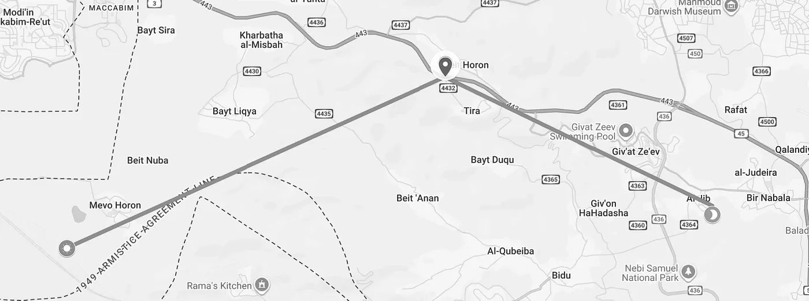

Every date this book defends was checked against the sky.
The Passover moons of 30-33 AD, the eclipse before Herod's death, the epoch of the Jordan crossing — each argument ends with a computed position of the sun or the moon on a named ancient morning.
That method rests on an assumption large enough to deserve its own chapter: that the sky of 1400 BC can be recomputed from the sky of today, because nothing has slipped in between.
If the heavens drifted, every retrocalculated date in this book is guesswork.
If they held, the sky is a witness that cannot be bribed, and the dates stand on evidence anyone can rerun.
So the assumption gets tested like everything else.

[discrete]
=== Tested Against Ancient Witnesses

The test is straightforward.
History preserves observations of eclipses and planets whose dates are known from the records alone — king lists, regnal years, dated tablets — without any help from astronomy.
Modern ephemerides (Stellarium, built on the NASA JPL tables) can then be asked what the sky did on those dates.
If the computation keeps matching the record at greater and greater depths of time, the method is sound.

Three questions grade each witness: how certain is its date from the records alone; how well does the computed sky match what was written down — path, timing, visibility; and how unique is the match — whether any other date could fit the same description.

[%unbreakable, frame=topbot, grid=none, cols="<,<,<,<,<,<", options="header"]
|===
| Event | Date | Date Certainty | Sky Match | Uniqueness | Confidence
| Solar Eclipse | November 30, 3340 BC | Medium | Good | Low | Medium
| Solar Eclipse | October 22, 2134 BC | High | Excellent | High | *High*
| Celestial Depiction | ~2000 BC | Medium-High | Good | Medium | Medium-High
| Venus Observations | ~1700 BC | High | Excellent | Very High | *High*
| Solar Eclipse | April 1448 BC | Low | Excellent | Low | Medium
|===

Two of these witnesses carry the case by themselves.
The Chinese eclipse of October 22, 2134 BC is dated by the annals that record it, matches the computed path, and admits no neighboring date that could reproduce it.
The Venus tablet of ~1700 BC records a planet's risings and settings across a run of years — a pattern far too specific to fit anywhere else on the timeline.
Retrocalculation therefore holds to at least 2134 BC — centuries deeper than any date this book computes.
Records claiming dates before ~4000 BC contradict the scriptural age of creation and are not used as evidence here.

[discrete]
=== The Promise Behind the Stability

The stability the eclipses demonstrate, Scripture had already promised:

[quote.scripture, Genesis 8:22]
____
While the earth remaineth, seedtime and harvest, and cold and heat, and summer and winter, and day and night shall not cease.
____

Seedtime and harvest, summer and winter, day and night — every item in the list is kept by the sun and the moon running their circuits without interruption, and the promise is unconditional for as long as the earth remains.
This verse is why a believer should expect retrocalculation to work: the clock was promised to keep running, and the ancient witnesses above confirm that it has.

[discrete]
=== Joshua's Long Day

One text is read as breaking that promise.
Joshua speaks to the two lights by name — __"Sun, stand thou still upon Gibeon; and thou, Moon, in the valley of Ajalon"__ (Joshua 10:12) — and if that means the gears of heaven halted, then a discontinuity stands between us and every earlier sky, and no retrocalculation could reach past it.
The Hebrew does not demand it.
The verb is _damam_ — to be still in the sense of *silent* — the word of a commanded hush, not a stopped orbit.
In the omen language of the ancient Near East, heavenly bodies "standing" at stations were read as verdicts; Joshua's prayer asks the two lights to stand posted as a sign over the battle, and the hailstorm of verse 11 supplies the darkness and chaos the enemy read as heaven fighting against them.
On this reading the sign is real, the victory is real, and Genesis 8:22 is kept — the cycles never stopped.

A stationed sign, unlike a stopped sun, can be surveyed.
The battlefield geometry is fixed: from Upper Beth Horon, where the pursuing army stood, Gibeon lies at azimuth ~117° — 27° south of east — and the valley of Aijalon at ~246° — 24° north of west — the two lights posted over them in near opposition, with ±8° of margin for site and observer uncertainty.
Stellarium supplies the ground truth for when sun and moon actually stand at those stations on a Renewed Moon Day — first light after the full moon, the waning moon still 12-24° above the western horizon:

[%unbreakable, frame=topbot, grid=none, cols="<,<,>,>", options="header"]
|===
| Year | Renewed Moon Day | Sun Azimuth (delta) | Moon Azimuth (delta)
| 1405 BC | January 23, dawn | 118° (+0.7°) | 296° (+1.7°)
| 2026 AD | February 2, 6:44 AM | 111° (-6.3°) | 289.5° (-4.8°)
|===

The deltas are measured from the surveyed stations — 117.29° to Gibeon, 245.68° to Aijalon with the northward skew of the moon's setting arc — and every one stays inside 7°: the computed sky of 1405 BC puts the two lights exactly where Joshua's prayer posts them, the sun barely risen, the waning moon still standing in the west.

The alignment is also rare, which is what makes it a sign rather than a coincidence.
It requires a late-winter full moon in opposition, a moonset lagging past sunrise, and the precise 24-27° deviations on both horizons at once.
The moon's 5° orbital tilt, the 18.6-year nodal precession, the 29- or 30-day month, and the 19-year Metonic cycle all have to cooperate; only about 1 year in 19 — 5.3% — opens the window.

Which month the battle fell in can be graded the same way:

[%unbreakable, frame=topbot, grid=none, cols="<,<,<,<,<,<", options="header"]
|===
| Month | Approx. Gregorian | Azimuth Deviation Fit | 19-Year Simulation | Hail Likelihood | Overall Fit
| 9 | Nov–Dec | 67% overlap | 0% (0/19) | Moderate | Good
| 10 | Dec–Jan | 33% overlap | 0% (0/19) | Very High | Also Viable
| 11 | Jan–Feb | 0% overlap | 5.3% (1/19) | High | *Best*
|===

The Renewed Moon Day of the 11th month fits best on every axis at once: the azimuths land inside the margin, the simulation finds the window, and a Judean late winter supplies the hail.

Because the Metonic cycle repeats the moon's stations against the solar year every 19 years, the same alignment can be watched for again:

[%unbreakable, frame=topbot, grid=none, cols="<,<,<,<", options="header"]
|===
| Year | Likely Date (Renewed Moon Day) | Expected Month | Notes / Probability
| 2045 | ~January 22–February 10 | 11th | +19 years from 2026; high chance if tilt aligns
| 2064 | ~January 20–February 8 | 11th | +38 years; another cycle repeat
| 2083 | ~January 18–February 6 | 11th | +57 years; continued pattern
| 2102 | ~January 16–February 4 | 11th | +76 years; strong candidate
|===

The text that seemed to break the clock turns out to be readable *on* the clock: a commanded silence of the two lights at surveyed stations, on a datable morning, of a kind the sky still repeats.

The sky, then, is this book's second witness.
Its cycles were promised in Genesis 8:22, its record verified against observers who died 4,000 years ago, and its testimony reaches every date these chapters compute.
Every computed position can be rerun by the reader with free software and a set of coordinates.
The heavens have kept the covenant — and their testimony has not changed.

// Print-edition figures not auto-anchored (pdf page in caption locates them):

