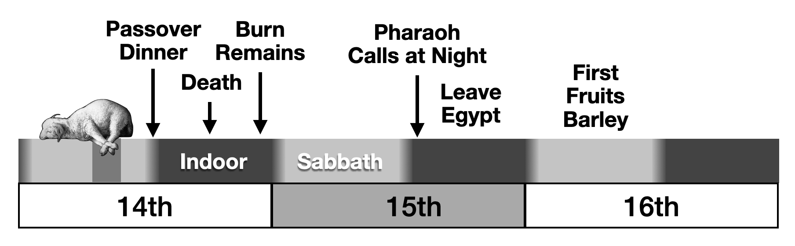
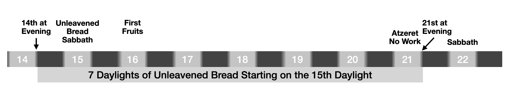
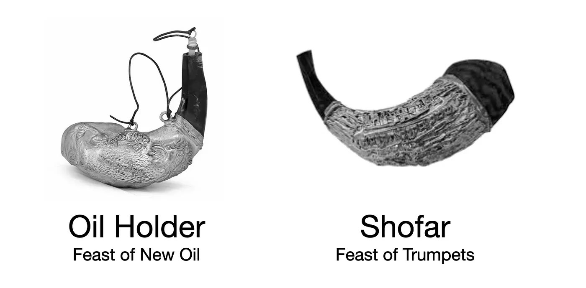

The LORD gives us appointed times, known as ‘moed’, seasons or feasts of the LORD during which he meets with mankind.
You may be familiar with the spring feast of Passover, during which Israel was brought out of slavery in Egypt in 1446 BC and Jesus was crucified as our Passover lamb in 32 AD.
Then there are the summer feasts of Shavuot and Pentecost, and finally the fall feasts, when we expect Jesus to return.
These feasts are known as The Feast of Trumpets, Day of Atonement, Feast of Tabernacles, and the Last Great Day (of Tabernacles) known as the Atzeret, but commonly translated as solemn assembly.
In order to understand the roadmap of the tribulation and major movements of the LORD, you must learn the timeline of these feasts.
It is by understanding His feasts that the Day of the LORD is identified with the Last Great Day, the Atzeret.
The chapters before this one carry the proofs of the calendar those feasts run on; what follows is an outline of the key appointed times that you will want to observe as a sign that the LORD is your Elohim (God).

[quote.scripture, Ezekiel 20:20]
____
And hallow my sabbaths; and they shall be a sign between me and you, that ye may know that I am the LORD your God.
____

The feasts also contain commands for us to observe and remember, so those seeking to obey the least of His commands do well to understand the days and their meanings.

[discrete]
=== New Days

Each calendar day starts at first light and goes until the next first light.
First light is about an hour before sunrise.
This is contrary to the Jewish tradition of sunset-to-sunset days, which they inherited from Babylon.
A later chapter will dive into the biblical evidence for this conclusion.

Every day there is supposed to be a morning and evening sacrifice of a lamb by the High Priest.
This is not something we can do directly, because we are not priests.
That said, we can still offer morning and evening prayers in remembrance of this appointed time.

[quote.scripture, Romans 12]
____
I appeal to you therefore, brothers, by the mercies of God, to present your bodies as a living sacrifice, holy and acceptable to God, which is your spiritual worship.
____

[discrete]
=== New Months

The month starts in the morning at first light after the night of the full moon.
A full moon can be identified as the first day on which the sun sets at or before the full moon rising.

[quote.scripture, Psalms 81:3, literal rendering]
____
You shall blow with the New Moon (month) Shofar in the Full Moon for the day of our festival sacrifice.
____

This translation of Psalm 81:3 reflects the literal order of the Hebrew words and factors in all the prefix and suffix letters.
Common translations, such as the KJV, substitute “appointed time” for “full moon,” but all modern texts, such as the NKJV, NASB, and ESV, recognize it as the full moon.
By tradition, all other cultures started the month on the dark or sliver moon.
This is why NASA considers the dark moon the “New Moon” because it was the moon phase at the beginning of the month.
That said, I have found nothing in Scripture that contradicts the interpretation of the full moon in Psalm 81:3 as the start of the month.
The evidence that the LORD reckons His Holy Days from the full moon is carried in the chapter link:/books/time-tested-tradition/when-does-the-month-start/[When Does the Month Start?].
The Bible gives specific instructions for the first day of the month, which suggests that this day was of greater significance than ordinary days and Sabbaths.

[quote.scripture, Numbers 28:11, AKJV, abridged]
____
And in the beginnings of your months you shall offer a burnt offering unto the LORD: Two Bulls, 1 ram, 7 spotless lambs… 1 kid goat, and along with the continual daily offering (1 lamb in the morning and 1 lamb in the evening).
____

Jesus was the ultimate sacrifice for our sins and other sacrifices can only be offered by priests; therefore, these instructions are not for us to follow at this time.
Nevertheless, they still indicate the value the LORD placed on the start of the month.
At the very least, if you have a Shofar, you can blow it on the daylight after the Full Moon.

[quote.scripture, Ezekiel 46]
____
Thus saith the Lord the LORD; The gate of the inner court that looks toward the east shall be shut the six working days; but on the sabbath it shall be opened, and in the day of the new moon it shall be opened.
____

This verse clearly establishes that there are three kinds of days on the LORD’s calendar: working days, sabbath days, and new moon days.
It further establishes that the month starts with the full moon, because scripture compares the sky to a tabernacle.

[quote.scripture, Psalm 19:4-6]
____
…In the heavens/sky He has set a tabernacle for the sun, which is like a bridegroom coming out of his chamber, And rejoices like a strong man to run its race.
Its rising is from one end of heaven/sky…
____

The east gate, or front gate, of the sky is the area where the sun and moon rise, and on the new months the east gate opens for the full moon to rise.
Notice that this verse also provides evidence for the day to begin at first light because this is the beginning of the circuit (circle, cycle) of the sun.
The sliver moon can only be sighted in the west at sunset.
On New Moons there is no buying or selling:

[quote.scripture, Amos 8:5]
____
“When will the new moon be over, that we may sell grain?
And the Sabbath, that we may offer wheat for sale,
____

[discrete]
=== Weekly Sabbaths

Many people are probably familiar with the Sabbath being the 7th day of the week during which everyone is to rest and there is no buying and selling.

[quote.scripture, Exodus 20:8]
____
“Remember the Sabbath day, to keep it holy.
Six days you shall labor, and do all your work, but the seventh day is a Sabbath to the LORD your God.
On it you shall not do any work, you, or your son, or your daughter, your male servant, or your female servant, or your livestock, or the sojourner who is within your gates.
For in six days the LORD made heaven and earth, the sea, and all that is in them, and rested on the seventh day.
Therefore the LORD blessed the Sabbath day and made it holy.
____

More broadly, the term Sabbath refers to a week ending in a day of rest.
The Hebrew word ‘yom’ is typically translated as “day”, but has many different meanings including:

[%hardbreaks]
daylight, as opposed to night
24-hour period
An abstract division of time, or a period of time
A year
A lifetime

With this understanding, a week ending with a daylight of rest could be called a “day” because it is an abstract division of time.
With this context, it makes sense why Exodus 20 mentions all seven days.
You could therefore translate it as:

[quote.scripture, Exodus 20:8 Interpreted]
____
Remember the Sabbath week, to keep it holy.
Six days you shall labor, and do all your work, but the seventh daylight is a Sabbath to the LORD your God.
On it you shall not do any work, you, or your son, or your daughter, your male servant, or your female servant, or your livestock, or the sojourner who is within your gates.
For in six daylights the LORD made heaven and earth, the sea, and all that is in them, and rested on the seventh daylight.
Therefore the LORD blessed the Sabbath daylight and made it holy.
____

Now that we understand that the Sabbath is a group of seven days ending in a day of rest, we must ask ourselves: When does the week start?
Some people believe the Sabbath daylight is Saturday; others believe it is Sunday; and still others, Friday!
Scripture gives us some insight:

[quote.scripture, Isaiah 66:23 (ESV)]
____
And it shall come to pass (after the day of the LORD), From new moon to new moon, and from Sabbath to Sabbath, all flesh shall come to worship before me.
____

Years are divided into months; months are divided into “New Moons” and “Sabbath Weeks”; and “Sabbath Weeks” are divided into “six workdays” and “one rest day.”
We know that months are not evenly divisible into the year; therefore, there are some years with a 13th month.
Likewise, “Sabbath Weeks” are not evenly divisible into some months; therefore, some months have an extra day after the 4th Sabbath week before the next New Moon day.
Scripture is silent on the nature of the 13th month and on the 30th day of some months.
Through careful study of Scripture and tests of history, I have proven beyond reasonable doubt that the Sabbath is the 8th, 15th, 22nd, and 29th day of each lunar month.
On these days there is a half-moon, dark-moon, or full moon.
A later chapter is dedicated to proving this out.

[quote.scripture, Genesis 1:14-18]
____
And God said, Let there be lights in the firmament of the heaven to divide the day from the night; and let them be for signs, and for seasons (moed/feasts/appointed times), and for days, and years: And let them be for lights in the firmament of the heaven to give light upon the earth: and it was so.
And God made two great lights; the greater light to rule the day, and the lesser light to rule the night with the stars.
And God set them in the firmament of the heaven to give light upon the earth, And to rule over the day and over the night, and to divide the light from the darkness.
____

We know that the sun, moon, and stars are for signs and appointed times, and we also know that the Sabbath is a sign and appointed time; therefore, it makes sense that the Sabbath should be governed by the sun, moon, and stars.

[quote.scripture, Exodus 31:16-17]
____
‘Therefore the children of Israel (and those grafted in) shall keep the Sabbath, to observe the Sabbath throughout their generations as a perpetual covenant. ‘It is a sign between Me and the children of Israel forever’.
____

With the Sabbath days connected to the phases of the moon, we have a clear sign for our appointed times with the LORD that cannot be corrupted by the tradition of men.
The traditional continuous weekly cycle has a number of contradictions and ambiguous situations that make it a logical impossibility.
For starters, if you count your days as the number of sunrises you observe, with the Sabbath starting every seventh sunrise, then two people leaving the Garden of Eden in opposite directions (one eastward and one westward) will meet on the opposite side of the globe and forever disagree about which day is the Sabbath.
With a Full Moon Lunar Sabbath, any disagreement would be resolved at the start of the next month; at historical travel speeds before trains and airplanes, they would be synced up before they even met.
A benefit of the Full Moon Lunar Sabbath understanding is that there are never any conflicts between the weekly Sabbath and other appointed times.
Sabbaths are days of rest, healing, and coming together to read the Bible.
It would be challenging to keep the Sabbath on Preparation Day for Passover which involved a lot of work.
A future chapter will provide the extensive proofs that this is the true Sabbath.
Jesus and Paul both had a custom of teaching in the synagogues on the Sabbath.
I blow the shofar in the morning to announce it and in the evening to close it while avoiding buying, selling, and chores.
To remind myself to avoid work and relax, I wear pajamas.
Do not fall into the trap of the Pharisees, who added traditions of men that prohibited travel, war, fasting, gleaning grain, and healing on the Sabbath.

[discrete]
=== New Years

The first month of the year begins on the daylight after the first full moon after the spring equinox.

[quote.scripture, Exodus 12]
____
And the LORD spoke unto Moses and Aaron in the land of Egypt, saying, This month shall be unto you the beginning of months: it shall be the first month of the year to you.
____

[quote.scripture, Deuteronomy 16]
____
Observe the month of Abib, and keep the passover unto the LORD thy God: for in the month of Abib the LORD thy God brought thee forth out of Egypt by night.
____

The word “Abib” means fresh, young barley ears, which means the first month of the year begins in the spring.
This is critical because the first fruits of barley are waved on the 16th day of the first month.
The spring equinox currently falls on March 20th.
Because there are an average of 29.5 days per month, there are only 354 days in a lunar year.
This means that in some years, the 12th month will end before the equinox, and in those years, there is a 13th month.
This occurs an average of 8 out of 19 years.

[discrete]
=== Passover & Unleavened Bread

The feast of Passover and Unleavened Bread is a remembrance of two of the most important events in biblical history: the Exodus from Egypt and the crucifixion and resurrection of Jesus.
From the evening of the 14th until the evening of the 21st you shall eat unleavened bread.
More specifically, no leaven should be found anywhere in the homes of the people and community.
We no longer have priests to kill a Passover lamb, and Jesus was the final Passover lamb to be offered as a sacrifice for sin.
That said, it is still possible for us to eat lamb and unleavened bread as a memorial.
The Last Supper was on the 13th of the month, and we were instructed to “do this in remembrance of him.”

[quote.scripture, Luke 22:18-20]
____
For I tell you that from now on I will not drink of the fruit of the vine until the kingdom of God comes.”
And he took bread, and when he had given thanks, he broke it and gave it to them, saying, “This is my body, which is given for you.
Do this in remembrance of me.”
And likewise the cup after they had eaten, saying, “This cup that is poured out for you is the new covenant in my blood.”

____

[quote.scripture, Exodus 12:3,6, BSB]
____
Tell the whole congregation of Israel that on the 10th day of this month each man must select a lamb for his family, one per household…You must keep it until the 14th day of the month, when the whole assembly of the congregation of Israel will slaughter the animals at between noon and sunset (about 3 PM).
____

[quote.scripture, Leviticus 23:5-8, BSB]
____
The Passover to the LORD begins at twilight on the 14th day of the first month.
On the 15th day of the same month begins the Feast of Unleavened Bread to the LORD.
For 7 days you must eat unleavened bread.
On the first day you are to hold a sacred assembly; you are not to do any regular work.
For 7 days you are to present an offering made by fire to the LORD.
On the 7th day there shall be a holy convocation; you must not do any regular work.’ ”
____

[quote.scripture, Deuteronomy 16:8]
____
Six days thou shalt eat unleavened bread: and on the seventh day shall be a solemn assembly (Atzeret) to the LORD thy God: thou shalt do no work therein.
____

[discrete]
=== First Fruits of Barley

[quote.scripture, Leviticus 23:9-14 (LXX)]
____
And the LORD spoke to Moses, saying, Speak to the children of Israel, and thou shalt say to them, When ye shall enter into the land which I give you, and reap the harvest of it, then shall ye bring a sheaf, the first-fruits of your harvest, to the priest; and he shall lift up the sheaf before the LORD, to be accepted for you.

On the [to]morrow of the first day [of Unleavened Bread] the priest shall lift it up.
____

[quote.scripture, Leviticus 23:15]
____
And ye shall count unto you from the morrow after the sabbath [week] starting the day that ye brought the sheaf of the wave offering;
____

The text of Leviticus appears to point to the 16th in two different ways.
First, it says it is the day after the Sabbath; second, it references the day the sheaf was offered, which we know was the 16th.
I added the implied [week] to clarify that the “Sabbath day/period of time” likely refers to six workdays followed by a Sabbath daylight, not a single calendar day, as we discussed earlier.
This interpretation is confirmed by Jewish historian Philo of Alexandria, Egypt, who wrote around the time of Jesus.

[quote, "Philo Special Laws II, XXX"]
____
The solemn assembly (Atzeret) on the occasion of the festival of the sheaf having such great privileges, is the prelude to another festival of still greater importance; for from this day the fiftieth day (Shavuot) is reckoned.
____

Since the Passover Atzeret is on the seventh day of Unleavened Bread, we have historical evidence that the Jews interpreted “the morrow after the Sabbath starting the sheaf wave offering” to be after the 21st of the month rather than starting on the 16th, which is what would be implied if “Sabbath” were interpreted as a single day rather than seven days.
Next, we have evidence from Biblical history that First Fruits was on the 16th day of the month.

[quote.scripture, Joshua 5:10–12]
____
And the children of Israel encamped in Gilgal, and kept the passover on the 14th day of the month at even in the plains of Jericho.
And they did eat of the old grain of the land on the morrow after the passover (1st day of Unleavened Bread), unleavened cakes, and parched grain in the selfsame day.
And the manna ceased on the morrow after they had eaten of the old grain of the land; neither had the children of Israel manna any more; but they did eat of the fruit of the land of Canaan that year.
____

The book of Joshua documents that they ate of the land on First Fruits of Barley, which is the 16th of the month.
We can confirm this interpretation with the writings of Josephus.
Josephus and Philo aren’t Scripture, but they are valuable second or third witnesses.

[quote, Josephus]
____
But on the second day of unleavened bread, which is the 16th day of the month, they first partake of the fruits of the earth, for before that day they do not touch them.
____

We are also told that Jesus was the first fruits of those who slept—that is, the first to rise from the dead.
This clearly implies that Jesus rose on the 16th day, which was the 3rd day after he was killed as our Passover lamb on the afternoon of the 14th day of the month.

[quote.scripture, 1 Corinthians 15:20]
____
But now is Christ risen from the dead, and become the first fruits of them that slept.
____

[discrete]
=== Shavuot: First Fruits of Wheat

[quote.scripture, Leviticus 23:15-17]
____
And ye shall count unto you from the morrow after the sabbath, from the day that ye brought the sheaf of the wave offering; seven sabbaths [weeks] shall be complete: Even unto the morrow after the seventh sabbath shall ye number fifty days; and ye shall offer a new meat offering unto the LORD.
Ye shall bring out of your habitations two wave loaves of two tenth deals: they shall be of fine flour; they shall be baked with leaven; they are the first fruits unto the LORD.
____

We know that the seven “Sabbaths” are units of “weeks” because this is also called the “Feast of Weeks.”

[quote.scripture, Exodus 34:22]
____
And thou shalt observe the feast of weeks, of (beginning from) the first fruits of wheat harvest, and [going to] the feast of harvest at the year's end (cycle).
Thrice in the year shall all your men children appear before the LORD, the God of Israel.
____

On closer study of the Hebrew, the word for “first fruits” has a ‘yod’ suffix, which indicates “beginning of” and implies going to the harvest at the cycle’s end, which is the first fruits of oil.
The very next verse lets us know that there are three first fruits celebrations in this period.
Combined with the first fruits of barley, there are a total of four first-fruit harvests: barley, wheat, wine, and oil.

[quote.scripture, Numbers 18:12]
____
All the best of the oil, and all the best of the wine, and of the wheat, the first fruits of them which they shall offer unto the LORD, them have I given thee.
____

[quote.scripture, 2 Chronicles 2:15]
____
Now therefore, the wheat, the barley, the oil, and the wine which my lord has spoken of, let him send to his servants.
____

[quote.scripture, Revelation 6:6]
____
And I heard a voice in the midst of the four beasts say, A measure of wheat for a penny, and three measures of barley for a penny; and see thou hurt not the oil and the wine.
____

[quote.scripture, Joel 2:24]
____
And the floors shall be full of wheat, and the fats shall overflow with wine and oil.
____

[quote.scripture, Jeremiah 31:12]
____
Therefore they shall come and sing in the height of Zion, and shall flow together to the goodness of the LORD, for wheat, and for wine, and for oil, and for the young of the flock and of the herd: and their soul shall be as a watered garden; and they shall not sorrow any more at all.
____

[quote.scripture, Deuteronomy 14:23]
____
And thou shalt eat before the LORD thy God, in the place which he shall choose to place his name there, the tithe (first fruits) of thy wheat, of thy wine, and of thine oil, and the firstlings of thy herds and of thy flocks; that thou mayest learn to fear the LORD thy God always.
____

[quote.scripture, Hosea 2:8]
____
For she did not know that I gave her wheat, and wine, and oil, and multiplied her silver and gold, which they prepared for Baal (false god, meaning lord).
____

As you can see, wheat, wine, and oil are used together throughout the Bible and are associated with the first fruits, which we are to give to the LORD.
Each of these first fruits is separated by seven complete sabbaths (weeks), starting after the first week after Unleavened Bread.
This gives us the following dates:

// Recovered from print PDF p. 323
[%unbreakable, frame=topbot, grid=none, cols="^2,^1,^1,<5", options="header"]
|===
|First Fruits |Month |Day |Feast

|Barley
|1st
|16
|Unleavened Bread, Jesus’s Resurrection

|Wheat
|3rd
|16
|Shavuot, Baptism and Ascension of Jesus

|Wine
|5th
|9
|Pentecost, 9th of Av, Birth of Jesus, First Miracle Water into Wine

|Oil
|7th
|1
|Feast of Trumpets, Rosh Hashanah, Conception of Jesus
|===

That said, depending upon the year, New Oil might be on the 30th day of the 6th month, being the last day of the cycle.
Typically, Rosh Hashanah is considered the “head of the year,” which lines up exactly with Exodus 34:22 when it says, “Feast of the harvest at the year’s end.”
An alternative interpretation is that first fruits is always offered on the first day of the week; therefore, the first fruits of oil might be the 2nd day of the 7th month.

[discrete]
=== First Fruits of Wine (Pentecost)

The narrative of Moses descending Mount Sinai in Exodus 32, during the events surrounding the Golden Calf, offers a scriptural foundation for recognizing a "New Wine Feast" as an appointed time (moed) in the biblical calendar.
This feast, declared by Aaron as a legitimate observance "to YHWH," aligns with the principles of harvest dedication and the inauguration of new wine.
The Septuagint's unique phrasing in Moses' identification of the camp's noise emphasizes the initiatory aspect of wine in the celebration, connecting it to Torah laws on first fruits.
Without delving into judgments on the execution, this account establishes the feast as a divinely oriented moed, marking the proper beginning of the vintage season through consecrated offerings and joyful partaking.

[discrete]
=== The Declaration of the Feast: An Appointed Time to YHWH

As the Israelites awaited Moses' return from Sinai, Aaron responded to their request by creating the Golden Calf and proclaiming a feast.
The text presents this as an intentional religious observance dedicated to the God of Israel, framing it as an appointed time for communal celebration.
In Exodus 32:5:

[quote.scripture]
____
"And when Aaron saw it, he built an altar before it; and Aaron made proclamation, and said, *Tomorrow is a feast to the LORD* [YHWH]."
____

The Hebrew word for "feast" here is _chag_ (חַג), often denoting a pilgrimage festival or appointed time (moed) in the Torah's liturgical calendar (e.g., Leviticus 23).
By declaring it "to YHWH," Aaron positions the event as a legitimate moed, akin to the appointed times outlined in Leviticus 23:2: "Speak unto the children of Israel, and say unto them, Concerning the *feasts of the LORD* [moedim of YHWH], which ye shall proclaim to be holy convocations, even these are my feasts."
The following day involved offerings, eating, drinking, and revelry (Exodus 32:6), elements consistent with biblical harvest feasts where wine plays a central role.

[discrete]
=== Moses' Descent and the Identification of the "Beginning with Wine"

Upon descending the mountain, Moses hears the sounds of the feast and discerns its nature.
The Septuagint (LXX) rendering of link:/reader/bible/lxx/Exodus/32[Exodus 32:18] provides a key insight into the wine-focused inauguration:

[quote.scripture, Exodus 32:18 (LXX)]
____
"And Moses said, It is not the voice of them that begin the battle, nor the voice of them that begin of defeat, but *the voice of them that begin of wine* do I hear."
____

The Greek *φωνὴν ἐξαρχόντων οἴνου*—literally "the sound of those leading off with wine" or "beginning with wine"—highlights the feast's initiatory character.
The verb *ἐξαρχόντων* (from ἐξάρχω) conveys starting or leading a ritual activity, such as commencing a harvest celebration with the new vintage.
This aligns with the feast's declaration as a moed, where the "beginning with wine" marks the appointed time for accessing and celebrating the fresh produce of the vine.

[discrete]
=== Torah's Provisions for Wine in Appointed Times: The Role of First Fruits

The Scriptures integrate wine into appointed times through laws ensuring its consecrated use, particularly via first fruits offerings.
These establish the proper framework for a feast inaugurating the vintage, as implied in the narrative's harvest-like elements.

* *Numbers 18:12* addresses the dedication of new wine:
+
[quote.scripture]
____
"All the best of the fresh oil and all the best of the *fresh wine* and of the grain, the *first fruits* of those which they shall offer unto the LORD, I give them to you [the priests]."
____
+
This positions the choicest new wine as an offering "to YHWH," mirroring the feast's intent and setting the moed's starting point with divine dedication.
* *Exodus 22:29* emphasizes timely presentation of harvest products:
+
[quote.scripture]
____
"Thou shalt not delay to offer the first of thy ripe fruits, and of thy *liquors* [including pressed wine]."
____
+
In the context of a feast "to YHWH," this supports beginning the celebration with the vintage's first fruits, aligning with the moed's proclaimed purpose.
* *Leviticus 23:13* (in the context of first fruits at Shavuot, an appointed time):
+
[quote.scripture]
____
"And the meat offering thereof shall be two tenth deals of fine flour mingled with oil, an offering made by fire unto the LORD for a sweet savour: and the drink offering thereof shall be of *wine*, the fourth part of an hin."
____
+
Wine libations accompany offerings in moedim, illustrating how a feast inaugurating new wine fits within biblical appointed times.

[discrete]
=== Affirming the New Wine Feast as an Appointed Time

The Golden Calf narrative, with its declared feast "to YHWH" and Moses' recognition of the "beginning with wine," establishes this as a moed tied to the vintage's commencement.
Assuming the observance followed Torah principles—focusing on dedication and joy—the account models a New Wine Feast: an appointed time in which first fruits of wine are offered, followed by communal celebration.
This resonates with broader harvest moedim (e.g., Shavuot in Leviticus 23), where wine symbolizes abundance and thanksgiving.
Prophetic echoes, like Joel 2:24 ("The floors shall be full of wheat, and the vats shall overflow with *new wine* and oil"), affirm such a feast as a time of restoration and divine blessing.

In essence, this biblical moed invites recognition of the New Wine Feast as a consecrated appointed time: declare it to YHWH, begin with the first fruits of the vintage, and partake in holy rejoicing, rooted in Scripture's calendar of sacred observances.

[discrete]
=== The Connection to Pentecost and Historical Significance

This feast is the least well known by traditional Christian and Jewish teaching, but once you study the scriptures it becomes a secret hidden in plain sight.

[quote.scripture, Acts 2]
____
And when the day of Pentecost was fully come, they were all with one accord in one place. And suddenly there came a sound from heaven as of a rushing mighty wind, and it filled all the house where they were sitting….
Others mocking said, These men are full of new wine.
… But Peter, standing up with the eleven, lifted up his voice, and said unto them, Ye men of Judaea, and all ye that dwell at Jerusalem, be this known unto you, and hearken to my words: For these are not drunken, as ye suppose, seeing it is but the third hour of the day.
____

When the Holy Spirit came down on Pentecost, they were accused of being drunk on New Wine, which is only available when grapes are freshly harvested at the end of July.
Peter’s defense is even more telling because, by law, you could not partake of New Wine until after the First Fruits were offered, and they were offered at the 3rd hour of the day (about 9 AM).
We can connect Pentecost to the worship of the Golden Calf by comparing the 3,000 killed with the 3,000 saved.
The timeline of Exodus has the Golden Calf incident occur at least 50 days after they arrived at Mount Sinai on the 3rd day of the 3rd month.
That would line up perfectly for the 9th day of the 5th month.

[quote.scripture, Exodus 32:28]
____
And the children of Levi did according to the word of Moses: and there fell (died) of the people that day about 3000 men.
____

[quote.scripture, Acts 2:41]
____
Then they that gladly received his word were baptized: and the same day there were added unto them about 3000 souls.
____

Historically, this is a tragic day for the Jews because both the first and second temple were destroyed on the 9th of Av, which we now know to be Pentecost.
After I had independently discovered that Jesus was born on the 9th of Av, I learned that Jewish tradition expects the Messiah to be born on this date.

[discrete]
=== Christmas in July

Most Christians celebrate the birth of Jesus on the birthday of the pagan sun gods, December 25th.
If you wish to celebrate his birthday, then Pentecost is the proper time to do so.
We are not to worship the LORD in the same way that the pagans worshiped their gods.
This is what happened when Moses came down the mountain with the Ten Commandments and found them having a “feast to the LORD” where they worshiped the LORD via a golden calf.

[quote.scripture, Exodus 32:4-5]
____
And he received them at their hand, and fashioned it with a graving tool, after he had made it a molten calf: and they said, These be thy gods, O Israel, which brought thee up out of the land of Egypt.
And when Aaron saw it, he built an altar before it; and Aaron made proclamation, and said, Tomorrow is a feast to the LORD.
____

Clearly, worshiping the LORD on the “sun gods’” birthday is similar to having a feast for the LORD celebrated with a golden calf.

[discrete]
=== First Fruits of Oil / Feast of Trumpets

The Feast of Trumpets is often associated with Rosh Hashanah (the head of the year) and the first fruits of new oil.
This is the time of year when olives are ripe.
Not much is known about how to celebrate this, but from Nehemiah, it appears they gathered and read the Scriptures.

[quote.scripture, Leviticus 23:23-24]
____
Then the LORD spoke to Moses, saying, "Speak to the children of Israel, saying: 'In the 7th month, on the first day of the month, you shall have a sabbath-rest, a memorial of blowing (shouting) of trumpets, a holy convocation.
____

[quote.scripture, Nehemiah 8]
____
When the 7th month came, the children of Israel were in their cities.
Now all the people gathered together as one man in the open square that was in front of the Water Gate; and they told Ezra the scribe to bring the Book of the Law of Moses, which the LORD had commanded Israel.
So Ezra the priest brought the Law before the assembly of men and women and all who could hear with understanding on the first day of the 7th month.
Then he read from it in the open square that was in front of the Water Gate from morning until midday, before the men and women and those who could understand; and the ears of all the people were attentive to the Book of the Law.
____

[quote.scripture, Nehemiah 8:9]
____
This day is holy unto the LORD your God; mourn not, nor weep.
For all the people wept, when they heard the words of the law.
____

Many people expect the Feast of Trumpets to be the rapture, but on the day of the rapture he comforts those who mourn.
Since Nehemiah had to instruct the people not to cry, we should assume that on this day we also should not cry.

[quote.scripture, Numbers 29:1-6]
____
‘And in the seventh month, on the first day of the month, you shall have a holy convocation.
You shall do no customary work.
For you it is a day of blowing the trumpets.
You shall offer a burnt offering as a sweet aroma to the LORD
____

[quote.scripture, Numbers 10:10]
____
On the day of your gladness also, and at your appointed feasts and at the beginnings of your months, you shall blow the trumpets over your burnt offerings and over the sacrifices of your peace offerings.
They shall be a reminder of you before your God: I am the LORD your God.”
____

Because the Feast of Trumpets always falls on a New Moon (full moon) day, we should also blow the trumpets along with the shouting.
This day also serves as a 10-day warning for the Day of Atonement, which is a day of judgment.

[discrete]
=== Day of Atonement

The Day of Atonement is considered a day of judgment, and the 10 days leading up to it are traditionally focused on examining our lives and repenting of our sins.
When the Day of Atonement arrives, we discover whether the LORD accepted us or not.
This is the only feast day on which we are expected to fast from the evening of the 9th day to the evening of the 10th day.
It is also a sabbath day of rest where there is no buying or selling.
It is on this day that our sins may be forgiven and every seven years we are commanded to forgive all debts to those in the body of Jesus.

[quote.scripture, Leviticus 23:27]
____
And the LORD spake unto Moses, saying, Also on the 10th day of this seventh month there shall be a day of atonement: it shall be an holy convocation unto you; and ye shall afflict your souls, and offer an offering made by fire unto the LORD.
And ye shall do no work in that same day: for it is a day of atonement, to make an atonement for you before the LORD your God.
For whatsoever soul it be that shall not be afflicted in that same day, he shall be cut off from among his people.
And whatsoever soul it be that does any work in that same day, the same soul will I destroy from among his people.
Ye shall do no manner of work: it shall be a statute for ever throughout your generations in all your dwellings.
It shall be unto you a sabbath of rest, and ye shall afflict your souls: in the ninth day of the month at evening, from even unto evening, shall ye celebrate your sabbath.
____

[quote.scripture, Leviticus 16:11-14]
____
And Aaron shall bring the bullock of the sin offering, which is for himself, and shall make an atonement for himself, and for his house, and shall kill the bullock of the sin offering which is for himself: And he shall take a censer full of burning coals of fire from off the altar before the LORD, and his hands full of sweet incense beaten small, and bring it within the vail: And he shall put the incense upon the fire before the LORD, that the cloud of the incense may cover the mercy seat that is upon the testimony, that he die not: And he shall take of the blood of the bullock, and sprinkle it with his finger upon the mercy seat eastward; and before the mercy seat shall he sprinkle of the blood with his finger seven times.
____

Because Jesus is our High Priest and He is not guilty of any sin, this part of the Day of Atonement is no longer necessary.
Going forward, Jesus makes atonement for our sins using his own blood.

Then shall he kill the goat of the sin offering, that is for the people, and bring his blood within the vail, and do with that blood as he did with the blood of the bullock, and sprinkle it upon the mercy seat, and before the mercy seat: And he shall make an atonement for the holy place, because of the uncleanness of the children of Israel, and because of their transgressions in all their sins: and so shall he do for the tabernacle of the congregation, that remains among them in the midst of their uncleanness.
And there shall be no man in the tabernacle of the congregation when he goeth in to make an atonement in the holy place, until he come out, and have made an atonement for himself, and for his household, and for all the congregation of Israel.
And he shall go out unto the altar that is before the LORD, and make an atonement for it; and shall take of the blood of the bullock, and of the blood of the goat, and put it upon the horns of the altar round about.
And he shall sprinkle of the blood upon it with his finger seven times, and cleanse it, and hallow it from the uncleanness of the children of Israel.

[discrete]
=== The Scapegoat

And when he hath made an end of reconciling the holy place, and the tabernacle of the congregation, and the altar, he shall bring the live goat: And Aaron shall lay both his hands upon the head of the live goat, and confess over him all the iniquities of the children of Israel, and all their transgressions in all their sins, putting them upon the head of the goat, and shall send him away by the hand of a fit man into the wilderness: And the goat shall bear upon him all their iniquities unto a land not inhabited: and he shall let go the goat in the wilderness.

And Aaron shall come into the tabernacle of the congregation, and shall put off the linen garments, which he put on when he went into the holy place, and shall leave them there: And he shall wash his flesh with water in the holy place, and put on his garments, and come forth, and offer his burnt offering, and the burnt offering of the people, and make an atonement for himself, and for the people.
And the fat of the sin offering shall he burn upon the altar.
And he that let go the goat for the scapegoat shall wash his clothes, and bathe his flesh in water, and afterward come into the camp.

Jesus is our “scapegoat,” and we put our sins on him, and he takes them away.
After we confess our sins, we are commanded to be baptized, and this is a reflection of the instructions given to the priests on the Day of Atonement.

[quote.scripture, Leviticus 16:15-34, AKJV]
____
And the bullock for the sin offering, and the goat for the sin offering, whose blood was brought in to make atonement in the holy place, shall one carry forth without the camp; and they shall burn in the fire their skins, and their flesh, and their dung.
And he that burns them shall wash his clothes, and bathe his flesh in water, and afterward he shall come into the camp.
The Day of Atonement
And this shall be a statute for ever unto you: that in the seventh month, on the tenth day of the month, ye shall afflict your souls, and do no work at all, whether it be one of your own country, or a stranger that lives among you: For on that day shall the priest make an atonement for you, to cleanse you, that ye may be clean from all your sins before the LORD.
It shall be a sabbath of rest unto you, and ye shall afflict your souls, by a statute for ever.
And the priest, whom he shall anoint, and whom he shall consecrate to minister in the priest's office in his father's stead, shall make the atonement, and shall put on the linen clothes, even the holy garments: And he shall make an atonement for the holy sanctuary, and he shall make an atonement for the tabernacle of the congregation, and for the altar, and he shall make an atonement for the priests, and for all the people of the congregation.
And this shall be an everlasting statute unto you, to make an atonement for the children of Israel for all their sins once a year.
And he did as the LORD commanded Moses.
____

It is on the Day of Atonement in the 49th year of the cycle that we proclaim liberty (freedom from debts) throughout all the land and consecrate the 50th year, the first year of the next jubilee cycle.

[quote.scripture, Leviticus 25:9-11]
____
Then you shall cause the trumpet of the Jubilee to sound on the tenth day of the seventh month; on the Day of Atonement you shall make the trumpet to sound throughout all your land.
And you shall consecrate the fiftieth year, and proclaim liberty throughout all the land to all its inhabitants.
It shall be a Jubilee for you; and each of you shall return to his possession, and each of you shall return to his family.
That fiftieth year shall be a Jubilee to you; in it you shall neither sow nor reap what grows of its own accord, nor gather the grapes of your untended vine.
____

[quote.scripture, Numbers 29:7-11]
____
‘On the tenth day of this seventh month you shall have a holy convocation.
You shall afflict your souls; you shall not do any work.
You shall present a burnt offering to the LORD as a sweet aroma: one young bull, one ram, and seven lambs in their first year.
Be sure they are without blemish.
Their grain offering shall be of fine flour mixed with oil: three-tenths of an ephah for the bull, two-tenths for the one ram, and one-tenth for each of the seven lambs; also one kid of the goats as a sin offering, besides the sin offering for atonement, the regular burnt offering with its grain offering, and their drink offerings.
____

It was on the Day of Atonement that Jesus went to Nazareth, opened the scriptures, and read Isaiah 61.
He then proclaimed it fulfilled in his hearing.

[quote.scripture, Isaiah 61:1-3]
____
The Spirit of the Lord the LORD is upon me; because the Lord hath anointed me to preach good tidings (news, the forgiveness of debts) unto the meek (poor, in debt); he hath sent me to bind up the brokenhearted, to proclaim liberty to the captives (indebted), and the opening of the prison to them that are bound; To proclaim the acceptable year of the Lord, and the day of vengeance of our God; to comfort all that mourn.
____

When Jesus read it, he stopped just before “and the day of vengeance of our God.”
That day will be proclaimed on the Day of Atonement in the last year of 70 jubilees.

[quote.scripture, Deuteronomy 15:1-3, BSB]
____
At the end of every seven years (On the Day of Atonement) you must cancel debts.
This is the manner of remission: Every creditor shall cancel what he has loaned to his neighbor.
He is not to collect anything from his neighbor or brother, because the LORD’s time of release has been proclaimed.
You may collect something from a foreigner, but you must forgive whatever your brother owes you.
____

Notice that the debts are only canceled among those in Israel, and Israel is who we are grafted into as the body of Jesus.
The foreigners are those outside the body of Jesus.
It is only by the blood of Jesus that we obtain forgiveness of sins and our resulting debt to the LORD.
This day is one of the most anticipated days for the LORD’s people.

[discrete]
=== Feast of Tabernacles

The next feast is known as the Feast of Tabernacles, or the Feast of Nations.
It starts on the 15th day of the 7th month.
This is a week-long feast during which people dwell in temporary structures (tents) and are expected to allocate a sizable portion of their income to the celebration so that both the rich and the poor can celebrate.
Traditionally, people would travel to Jerusalem for this feast, but now we honor it in spirit and truth wherever we find ourselves.
Every seventh year the entire book of the law, the first five books of the Bible, is to be read in the hearing of everyone during the Feast of Tabernacles.
This reading belongs to the Tabernacles of every seventh year, the year of release.

[quote.scripture, Leviticus 23:33-36]
____
And the LORD spake unto Moses, saying, Speak unto the children of Israel, saying, The fifteenth day of this seventh month shall be the feast of tabernacles for seven days unto the LORD.
On the first day shall be an holy convocation: ye shall do no servile work therein.
Seven days ye shall offer an offering made by fire unto the LORD.
____

[quote.scripture, Leviticus 23:39-43]
____
Also in the fifteenth day of the seventh month, when ye have gathered in the fruit of the land, ye shall keep a feast unto the LORD seven days: on the first day shall be a sabbath, and on the eighth day shall be a sabbath.
And ye shall take you on the first day the boughs of goodly trees, branches of palm trees, and the boughs of thick trees, and willows of the brook; and ye shall rejoice before the LORD your God seven days.
And ye shall keep it a feast unto the LORD seven days in the year.
It shall be a statute for ever in your generations: ye shall celebrate it in the seventh month.
Ye shall dwell in booths seven days; all that are Israelites born shall dwell in booths: That your generations may know that I made the children of Israel to dwell in booths (tents), when I brought them out of the land of Egypt: I am the LORD your God.
____

[quote.scripture, Deuteronomy 31:9]
____
And Moses wrote this law, and delivered it unto the priests the sons of Levi, which bare the ark of the covenant of the LORD, and unto all the elders of Israel.
And Moses commanded them, saying, At the end of every seven years, in the solemnity of the year of release, in the feast of tabernacles, When all Israel is come to appear before the LORD thy God in the place which he shall choose, thou shalt read this law before all Israel in their hearing.
Gather the people together, men, and women, and children, and thy stranger that is within thy gates, that they may hear, and that they may learn, and fear the LORD your God, and observe to do all the words of this law: And that their children, which have not known any thing, may hear, and learn to fear the LORD your God, as long as ye live in the land whither ye go over Jordan to possess it.
____

[quote.scripture, Nehemiah 8:13-18]
____
And on the second day were gathered together the chief of the fathers of all the people, the priests, and the Levites, unto Ezra the scribe, even to understand the words of the law.
And they found written in the law which the LORD had commanded by Moses, that the children of Israel should dwell in booths in the feast of the seventh month: And that they should publish and proclaim in all their cities, and in Jerusalem, saying, Go forth unto the mount, and fetch olive branches, and pine branches, and myrtle branches, and palm branches, and branches of thick trees, to make booths, as it is written.
So the people went forth, and brought them, and made themselves booths, every one upon the roof of his house, and in their courts, and in the courts of the house of God, and in the street of the water gate, and in the street of the gate of Ephraim.
And all the congregation of them that were come again out of the captivity made booths, and sat under the booths: for since the days of Jeshua the son of Nun unto that day had not the children of Israel done so.
And there was very great gladness.
Also day by day, from the first day unto the last day, he read in the book of the law of God.
And they kept the feast seven days; and on the eighth day was a solemn assembly, according unto the manner.
____

The feast of tabernacles is not just for the past.
The Prophet Hosea declares that the LORD will make us dwell in booths again in the future.

[quote.scripture, Hosea 12:9]
____
And I that am the Lord thy God from the land of Egypt will yet make thee to dwell in tabernacles, as in the days of the solemn feast.
____

[quote.scripture, Zechariah 14:16-19]
____
And it shall come to pass, that every one that is left of all the nations which came against Jerusalem shall even go up from year to year to worship the King, the LORD of hosts, and to keep the feast of tabernacles.
And it shall be, that whoso will not come up of all the families of the earth unto Jerusalem to worship the King, the LORD of hosts, even upon them shall be no rain.
And if the family of Egypt go not up, and come not, that have no rain; there shall be the plague, wherewith the LORD will smite the heathen that come not up to keep the feast of tabernacles.
This shall be the punishment of Egypt, and the punishment of all nations that come not up to keep the feast of tabernacles.
____

[discrete]
=== Atzeret of Tabernacles

The Atzeret always falls on the 22nd day of the 7th month and is considered the 8th day of Tabernacles which starts on the 15th day.
The Atzeret is the last feast day of the Biblical year.
The true calendar of the LORD has been hidden in the scriptures and I believe modern Jews have given us a tradition inherited from the Pharisees in which there is no profit.

[quote.scripture, Proverbs 25:2]
____
It is the glory of the LORD to conceal a matter and the glory of kings to search it out.
____

[quote.scripture, Jeremiah 16:19]
____
O LORD, my strength, and my fortress, and my refuge in the day of affliction, the Gentiles shall come unto thee from the ends of the earth, and shall say, Surely our fathers have inherited lies, vanity, and things wherein there is no profit.
____

These teachers who lean heavily on a particular calendar in their teachings conceded right out of the gate that they had no meaningful evidence from the canon.

[discrete]
=== The First Statute Given to Moses

The very first command or statute given to Moses was:

[quote.scripture, Exodus 12]
____
And the LORD spake unto Moses and Aaron in the land of Egypt, saying, This month shall be unto you the beginning of months: it shall be the first month of the year to you…
____

[quote.scripture, Deuteronomy 16]
____
Observe the month of Abib, and keep the passover unto the LORD thy God…And thou shalt keep the feast of weeks… and thou shalt observe and do these statutes.
____

The first statute mentioned in Deuteronomy 16 is observing the month of Abib, which means we must know when that month begins and ends if we are to walk in it as a sign that the LORD is our God.

[quote.scripture, Ezekiel 20]
____
“But I said to their children in the wilderness, ‘Do not walk in the statutes of your fathers’.
____

So the question one must ask is, what were the statutes of their fathers that they were not to walk in?

[quote, Google AI &amp; Wikipedia]
____
Ancient Egyptians started their lunar months when the waning moon disappeared just before dawn.
____

Here is what we know.
Every ancient culture from Babylon to Egypt to China had a calendar that started the month on the dark or sliver moon.
This is a tradition of the entire world!
The question is: Did the whole world happen to follow the LORD’s calendar, or were the Jewish people coerced or otherwise corrupted into following the world’s calendar?
How could we even determine which is true?
Were “some of the statutes” of our fathers, such as their Egyptian calendar months, “okay” and others “not okay”?
If so, how could we tell?
Right off the bat, the LORD addresses the calendar and gives them an instruction about the start of the year, and it is in this context that they were told not to walk in the statutes of their fathers, which could include the calendar of Egypt.

[discrete]
=== Pressure to Conform to Pagan Calendar Systems

Anyone who has ever attempted to keep a Full Moon Lunar Sabbath or celebrate Holy Days on dates different from everyone else knows the extreme pressure to conform, even in a “free” society where you are not threatened with violence for observing a different calendar.
Now imagine your town was overthrown, half of its population was carried away as slaves, and an entirely new generation or two was born and raised.
You would be a minority in a culture that uses a different calendar.
You can imagine the pressure to conform, potentially under threat to your life.
An entire generation of children would have no memory of prior ways of doing things, just as people have no memory of a gold standard or life before income tax!
This is the context of the Jewish people after they returned from exile in Egypt and Babylon.
Some people would clearly study history, and prophets from the LORD would speak to them and guide them until about 400 BC. Therefore, at least some of the population could know and follow the true calendar, while the rest would follow the tradition with which they grew up, assuming there was a difference.

[quote.scripture, Jeremiah 16:19]
____
O Lord, my strength, and my fortress, and my refuge in the day of affliction, the Gentiles shall come unto thee from the ends of the earth, and shall say, Surely our fathers have inherited lies, vanity, and things wherein there is no profit.
____

Once again, we have the Bible warning us that in the last days, people would return to the LORD’s ways from the ends of the earth and say, “Surely our fathers have inherited lies.”
Daniel tells us that among those lies from the spirit of the antichrist are changes to the times and the law.

[quote.scripture, Daniel 7:25]
____
He shall speak words against the Most High, and shall wear out the saints of the Most High, and shall think to change the times and the law
____

This is a major red flag that the antichrist seeks to change the LORD’s law, especially the calendar.

[quote.scripture, 1 John 4:3]
____
This is the spirit of the antichrist, which you have heard is coming and which is already in the world at this time.
____

Given this reality, we know that everything dealing with the calendar is shrouded in deception and that the majority will be deceived.
This means extra diligence must be given to all studies of calendar-related things.
The first trap we must be careful to avoid is what I call the “reactionary,” mindless behavior of doing the opposite simply because it is the opposite.
Basically, knowing the times are corrupted and changed doesn’t actually tell us what the truth is, only that Satan’s goal is to deceive, coerce, or otherwise hide the truth from as many people as possible and that he will be successful against our fathers.
This means that all “tradition” must be rejected as evidence for a calendar.
It doesn’t automatically mean all “tradition” is wrong, only that arguments built upon it are potentially building upon the lies we were warned that we would inherit from our fathers.
In effect, Scripture tells us that “tradition” carries no useful positive information and, if anything, is more likely to be wrong than correct.
Basically, it can be supporting evidence, but not proof in itself of what the calendar is not.
We must identify an alternative approach to discovering the truth rather than assuming our fathers properly interpreted and maintained it through thousands of years of exile and dispersion because the Bible explicitly tells us we cannot trust the teachings we inherit.

[discrete]
=== Map vs Territory

Before going forward, we must get a clear understanding of the difference between the map and the territory, or actual land.
There are an infinite number of maps, but only one territory or physical reality.
Proving that a map existed 2,000 years ago does not prove that it was accurate or even that it was in use.
We can prove that many different maps existed, and they all disagree with each other.
A calendar is a map of time, and the physical reality is the LORD’s appointed times.
If you want to test a map, you must go out into the physical world and see if the map accurately directs you to your destination.
If you want to test a calendar, you must know with near certainty that a particular point in time was one of the LORD’s appointed times, and you must know this without a direct or indirect circular reference back to an assumed calendar.
Just because your map says the treasure is buried under the X doesn’t mean the X is in the right place.
Instead, we must first find some treasure, then see which maps have an X in the right place.

[discrete]
=== Scripture & the Calendar

The first thing you will discover when searching for the scriptural evidence that the month starts with the dark or sliver moon is that everyone references books outside the canon.
The book of Enoch, Jubilees, or Sirach are examples.
This opens up a broader debate about whether these books are indeed “flawless Scripture,” merely commentary on Scripture, or even writings of false prophets.
However, if they contradict the canonical Scriptures, then they cannot be trusted for doctrine.
In other words, these extra-biblical books could be just another source documenting the tradition of men we were warned to avoid.
If canonical Scripture didn’t say anything about the moon, then we would have no basis for judging or testing these extra-biblical books to determine whether their additions are consistent with known Scripture.
But if the Scriptures do provide even a hint of evidence in a different direction, then we begin to have an argument that these noncanonical books are clearly not Scripture.
So while extra-biblical books can provide useful confirmation of concepts proven by canonical Scripture, they cannot be relied upon to introduce new doctrines, such as calendars.
It is my contention that the calendar is such a critical key to understanding prophecy, knowing Him, and knowing his laws and statutes that His calendar will be embedded implicitly throughout the canonical text in a way that is hard to corrupt.
Consider for a moment: If the Scriptures were too overt in describing the calendar, then the enemy would have a very easy target to corrupt by changing a word or two.
But if the Scriptures capture evidence of the calendar indirectly, then it wouldn’t be an obvious target to corrupt.
So those advocating the sliver or dark moon who admit right out of the gate that they have little to no canonical evidence have already conceded the point.
I am going to present an abundance of verses from the canon that support a full moon.
This leaves a high burden for Enoch, Jubilees, and Sirach to overcome if they are to be considered Scripture that doesn’t contradict the canon.
All of that said, because dark- and sliver-moon advocates rely on tradition and other works, it might simply be that they haven’t dug deep enough to find the evidence in the canon.
This is a wake-up call to stop lazily relying on tradition, start looking for real evidence, and avoid logical fallacies.

[discrete]
=== Evidence for Full Moon

Genesis 1:14 tells us that the sun, moon, and stars are the basis of the calendar.

[quote.scripture, Genesis 1:14]
____
And God said, Let there be lights in the firmament of the heaven to divide the day from the night; and let them be for signs, and for seasons (moed), and for days, and years.
____

It then goes on to tell us about the two great lights, which have authority or dominion: the sun over the day, and the moon over the night with the stars.

[quote.scripture, Genesis 1:16]
____
The light the greater to rule with the day, and the light the lesser to rule with the night and the stars.
____

Many translations list the stars as an afterthought, but the Hebrew clearly establishes that the moon rules with the combination of the night and the stars.
In other words, the sun has authority to define the day and the moon in combination with the stars has authority at night.
This authority is directly related to their purpose for signs, appointed times, days, and years.
This already eliminates using the dark moon, the “no moon,” as a sign for when the month starts because it isn’t a light.
Furthermore, there can be two or three days when no moon is visible; therefore, by observation alone, it isn’t possible to know which of those days starts the month.
Modern Jews keep a calendar that doesn’t even look at the moon and is entirely predetermined based upon the dark conjunction, similar to ancient Egypt’s months.
What this tells us is that they are knowingly following a tradition that goes against the Bible and their own prior tradition simply because it is more convenient to keep their more recent tradition.
Their own historical records document that they were forced to stop their tradition of looking for the moon and adopt a fixed calendar.
But once they regained their freedom, most didn’t go back to the old ways.
If we have this proven example of modern Jews knowingly abandoning what they used to believe the Scriptures taught and failing to return once persecution ended, then we have evidence that this kind of behavior could easily have occurred when leaving Egypt and Babylon.
In other words, they love the modern tradition of men more than the word of the LORD and more than their ancient tradition.
One major clue that they adopted the Babylonian calendar is that they adopted the Babylonian names for the months.
If they borrowed names that include references to foreign gods, such as Tammuz, then what other aspects of the Babylonian calendar did they adopt?

[discrete]
=== Authority with the Stars

The sliver moon does not rule the night with the stars because the sliver sets during sunset, long before the constellation that the moon is present in becomes visible.
The sunset in which the sliver moon is visible washes out all stars.
After all, the sliver moon is located next to the sun while the light of the sun is still washing out the western sky.
The only “stars” visible at sunset are usually Mercury and Venus and only occasionally are they visible with the moon.
The 12 main constellations are often referred to as 12 gates that divide the sky.
This is known as the Hebrew Mazzaroth.

[quote.scripture, Job 38:31–33]
____
Canst thou bind the sweet influences of Pleiades, or loose the bands of Orion?
Canst thou bring forth Mazzaroth in his season? or canst thou guide Arcturus with his sons?
Knowest thou the ordinances of heaven (night sky, abode of stars)? canst thou set the dominion (rule) thereof in the earth?
____

According to Strong’s Exhaustive Concordance, the Hebrew term “Mazzaroth” is a plural form for constellations, which in Greek are called the zodiac.
Taken together, we can reasonably assume that the moon only has authority when ruling all night with the Mazzaroth.
This fits a full moon perspective because on the full moon it rises in the east at the same time the sun sets in the west and is then out all night.
Furthermore, Genesis 1:16 says, “And God made two great (big) lights.”
The full moon and the sun have the same great size in the night sky and are indeed great lights; however, the first visible crescent is so hard to spot that tradition required two witnesses to verify.
This is hardly a “great light” to serve as a sign to start a month.
On the other hand, the full moon is observed by having the sun set at the same time the moon rises.
This produces two infallible witnesses in the sky.

[discrete]
=== Synchronizing the Hemispheres

One problem with the sliver moon is that there are often more than 24 hours between when the first visible sliver can be seen in the Northern and Southern Hemispheres.
This becomes obvious at the extremes of the North and South Poles, where 24 hours of darkness during part of the year means the sliver isn’t visible because the sliver is only visible when the moon is near the sun.
Meanwhile, other phases of the moon can be visible in broad daylight.
At more moderate latitudes, this difference in visibility between the Northern and Southern Hemispheres can cause two people at the same longitude to be on different calendar days. Because the sliver is visible for such a short period during a given night, it could easily be below the horizon or too close to the sun. In contrast, on a full-moon calendar, the Northern and Southern Hemispheres are synchronized by longitude in all regions that have at least some short period of darkness every night, which includes the majority of habitable land.

[discrete]
=== Marking the Feast Days

Some will claim that the full moon is a sign that marks the feast days; however, that would apply to only two days out of the year and ignores the fact that feast days are defined by counting from the start of the month, not by looking at the moon.
If you have to wait until halfway through the month to know whether you are on the right day, then you have a major problem.
An even bigger problem is that there is no objective definition of what is technically visible.
This means that every town could come to a different consensus, or two witnesses could collude and lie.
Before speed-of-light communication, it would be impossible to coordinate with a central authority.
The very idea of a central global authority runs in the same kind of rebellion as the Tower of Babel because it would be a small group of men in authority telling all mankind the LORD’s appointed times.

[discrete]
=== The Pearly Gates & Location of the Sign

[quote.scripture, Psalms 19]
____
The heavens declare the glory of God; and the firmament shows his handywork.
Day unto day uttereth speech, and night unto night sheweth knowledge.
There is no speech nor language, where their voice is not heard.
Their line is gone out through all the earth, and their words to the end of the world.
In them hath he set a tabernacle for the sun, Which is as a bridegroom coming out of his chamber, and rejoices as a strong man to run a race. His going forth is from the end of the heaven, and his circuit unto the ends of it.
____

So here we have the sun starting its race in the east at sunrise.
Where it rises is compared to the door or gate of a chamber from which it runs its cycle from beginning to end.
This could also be interpreted as evidence for the day starting at sunrise.

[quote.scripture, Ezekiel 46:1]
____
Thus saith the Lord the LORD; The gate of the inner court that looks toward the east shall be shut the six working days; but on the sabbath it shall be opened, and in the day of the new moon (month) it shall be opened.
____

The sky has already been compared to a Tabernacle in Psalm 19, and Ezekiel tells us the gate of the tabernacle facing east shall be opened in the day of the New Month.
It is only opened if something is supposed to come through it!
This verse could easily imply that we must look to the east for the sign of the new month.
The sliver moon rises in the east just before the sun on the day before the dark conjunction, like the Egyptian calendar, but once again it is so close to the stars that it lacks authority.
The full moon rises in the east at the start of the night and reigns all night, having full authority.

[quote.scripture, Revelation 21:21]
____
And the twelve gates were twelve pearls, each of the gates made of a single pearl.
____

Given that there are 12 gates and 12 constellations, and that constellations are compared to gates or divisions of the sky, it is not unreasonable to make a connection between a full moon and a pearl.
The sun rises in the east, beginning the daylight.
The gate looking east is to be opened on the start of the new month.
And the word “east” also means to begin or go in front of.
This would suggest that we should be looking to the east for signs in the sun, moon, and stars of when things begin.
But Pharisee tradition has everyone looking to the west for when things begin.
In order to see the first sliver, you must look west at sunset.
In order to see the “start” of the Pharisee day, you must look west for sunset.
Yet another bit of evidence for the day beginning at sunrise.

[quote.scripture, John 10:1]
____
“Truly, truly, I tell you, whoever does not enter the sheepfold by the [east/front] gate, but climbs in some other way, is a thief and a robber.
But the one who enters by the [east/front] gate is the shepherd of the sheep.
The gatekeeper (watchmen) opens the gate for him, and the sheep listen for his voice.
He calls his own sheep by name and leads them out.
When he has brought out all his own, he goes on ahead of them, and his sheep follow him because they know his voice.
But they will never follow a stranger; in fact, they will flee from him because they do not recognize his voice.”
____

[quote.scripture, Revelation 22:16]
____
I am the Root and the Offspring of David, and the bright Morning Star.
____

The Morning Star, Venus, is seen in the east at sunrise.

[quote.scripture, Ezekiel 46:12]
____
Now when the prince shall prepare a voluntary burnt offering or peace offerings voluntarily unto the LORD, one shall then open him the gate that looketh toward the east, and he shall prepare his burnt offering and his peace offerings, as he did on the sabbath day: then he shall go forth; and after his going forth one shall shut the gate.
____

He is our Prince, and he comes through the East Gate.
From this perspective, anyone looking to enter (or start) by another gate—say, the West Gate of sunset and the sliver moon—could be compared to a thief.

[quote.scripture, Psalms 81:3 (ESV)]
____
Blow the trumpet at the new moon, at the full moon, on our feast day.
____

[quote.scripture, Psalms 81:3 (New King James Version)]
____
Blow the trumpet at the time of the New Moon, At the full moon, on our solemn feast day.
____

[quote.scripture, Psalms 81:3 (Berean Standard Bible)]
____
Sound the ram’s horn at the New Moon, and at the full moon on the day of our Feast.
____

[quote.scripture, Psalms 81:3 (NASB)]
____
Blow the trumpet at the new moon, At the full moon, on our feast day.
____

The text pretty clearly implies that the new moon is the full moon, but this is so incongruent with the traditions of men that they torture the text, add words, reorder words, and redefine words to make it mean something—anything—that allows them to rationalize their tradition.
Some people will claim “full moon” means “covered moon,” as in covered in darkness instead of covered in light.
By that theory, the sliver moon is ruled out because it is neither covered in darkness nor light.
Others introduce the word “and,” which isn’t found in the text, to imply that trumpets should be blown on both the new moon and the full moon, and then assume the feast day is on the full moon in the middle of the month; however, the word for “feast day” applies equally to the New Month celebrations and to Passover or other celebrations, so it cannot disambiguate by ruling out the New Month feast.
Others will attempt to link this verse to the context of many later verses that refer to Egypt, but then forget that the first ordinance given upon coming out of Egypt was the start of the New Month at the start of the year.
For all this effort to manipulate the English translation to fit the dark or sliver moon, a closer look at the Hebrew clearly shows that even the traditional English translations that already imply the full moon have failed to render it as strongly as the Hebrew declares when translated literally, in order, and with all prefix and suffix characters accounted for and no words added.

You shall blow with the New Moon Shofar in the full moon for the day of our festival sacrifice.

[discrete]
=== Traveling by Full Moon

Some people have presented the case that surely Moses wouldn’t lead everyone out of Egypt at night without a full moon to travel by!
They then imply that this is evidence that Passover occurs on the full moon.

[quote.scripture, Exodus 19]
____
In the third month, when the children of Israel were gone forth out of the land of Egypt, the same (3rd) day came they into the wilderness of Sinai.
____

This verse can be interpreted as having them travel on the 3rd day of the month.
By the logic above, this would imply that the start of the month was the full moon.
There are some who maintain that “same day” means the 15th, but that is debunked by other Scriptures that document the timing of Shavuot as counted with seven complete Sabbaths from First Fruits.

[quote, Jasher 82:6]
____
And in the third month from the children of Israel’s departure from Egypt, on the sixth day thereof, the Lord gave to Israel the ten commandments on Mount Sinai.
____

Even though Jasher isn’t canon, it provides a witness that “same day” likely means the 3rd day, something that is also established in the canon by less direct means.
Furthermore, we know that Ezra traveled at the start of the month and arrived at the start of the month, and he didn’t have the benefit of a pillar of fire to light the way.

[quote.scripture, Ezra 7:9]
____
For on the first day of the first month he began to go up from Babylonia, and on the first day of the fifth month he came to Jerusalem, for the good hand of his God was on him.
____

So if we assume travel by full-moon light, then we have several verses that clearly place traveling at the start of the month.
Consider also that many people had to travel several days to arrive at Passover and Unleavened Bread.
Holding a feast day, when no travel is required, on the dark moon reserves the quarter- to full-moon light for the journey home.

[discrete]
=== Eclipse at the Cross & the Dog that Didn’t Bark

The three hours of darkness seen around the world at the time of the cross are clearly an appointed time.
What is strangely absent from all reports on this darkness is any reference to it occurring on a full moon, a time when eclipses of the sun were known to be impossible.
It would be very noteworthy to those whose government job is to make notes on celestial events if the sun was darkened anywhere near a full moon.
This reminds me of the Sherlock Holmes story in which he deduced a criminal’s identity because a guard dog failed to bark at the time of the crime, implying that the criminal and the dog’s master were one and the same.
Astronomers failed to bark about the darkness that people claim occurred around the time of a full moon.
It looks like the dog’s silence may have given away those trying to frame the full moon as the day of the cross.
That said, it may have been noted by someone, and we just haven’t found it, so absence of evidence is not evidence of absence.

// Section "Chinese Records of Cross Eclipse" removed (author's ruling 2026-07-13):
// the Han record is the natural annular eclipse of 10 May AD 31 (NASA #04850), not
// a Passover darkness — see research/research-guangwu-eclipse.md for the full case.

[discrete]
=== Why Didn’t Jesus Correct the Calendar?

Most people will claim that at the time of Jesus, the Jews kept the sliver moon, and this is based upon historical records documenting the sliver moon from Josephus to Philo to the Talmud and noncanonical works of Enoch, Jubilees, and Jasher.
They also claim the Sabbath was Saturday at this time.
This evidence, combined with limited records documenting the keeping of the full moon at the time, is used to imply that Jesus must have been killed on a Passover set by a sliver moon.
The first logical fallacy in this argument is the assumption that absence of evidence is evidence of absence.
I have just presented a ton of biblical and astronomical evidence to support a full moon, but historical evidence is sparse.
Anyone who has been around archaeology knows that secular scholars like to claim the Bible is inaccurate or mistaken, or that it even invented people such as King David, because they could find no historical evidence.
Then, time after time, they eventually find tangible evidence that the Bible was true.
Traditional biblical scholars can make the same mistakes because they are essentially making the exact same argument when they say, “They couldn’t possibly have kept a full-moon-based Passover in 32 AD because we don’t have any written evidence.”
The second fallacy is an assumption that everyone agreed on a single calendar at that time.
This is easily debunked by the evidence of the Essene calendar found in the Dead Sea Scrolls.
At least one sect of Jews kept a different calendar.
Throw in variations on the Enoch calendar, and we have three or four different documented calendars.
There is also evidence of a Lunar Sabbath calendar starting at a sliver moon from that time and earlier, in addition to the Roman calendars.
Clearly, there was no universal agreement on a single calendar.
You can view this type of argument as similar to the claims that “all the experts agree” or that no opposition exists.
A related fallacy known as the “appeal to a common belief” says that most Jews generally accept Saturday as the Sabbath and the dark or sliver moon as true; therefore, it is probably true.
The phrase “New Moon” could be best interpreted as “the phase of the moon that starts the month”; however, because almost everyone around the world has the tradition of starting the month around the dark moon, even science has adopted the term “New Moon” to mean “dark moon.”
If, by tradition, the full moon were widely adopted as the start of the month, do you really think we would still call the dark phase of the moon the New Moon?
It is impossible to separate this tradition from how the phrase “New Moon” got its meaning.
Consider that New Moon has at least two meanings, referring to either the sliver or the dark conjunction.
If it can have two meanings, then why not more?

[discrete]
=== Theory on the Absence of Evidence

My theory, for which I have no direct evidence beyond what is implied by Scripture and the stars, is that the Jews in charge of the Temple, those who derived their authority by virtue of being Levites, followed the true calendar of the LORD until sometime after 32 AD.
Meanwhile, the Pharisees attempted to usurp the divine right of Levitical priests by claiming authority derived from their status as “experts” at “teaching the law” and through other political processes, and adopted the Babylonian sliver-moon calendar.
When the temple was destroyed in 70 AD, all records of the Levitical priests were burned, and their authority over the temple was shattered along with any remaining power over the calendar schedule for feast days.
This created a power vacuum into which the Pharisees assumed power over teaching and tradition.
They naturally destroy or simply fail to preserve any evidence that is contrary to their position or supports the authority of the Levites.
On top of all this, the Spirit of Antichrist was alive and well, seeking to change the times and seasons, and destroying or persecuting those who followed the true calendar.

[discrete]
=== Calendar Dispute with Jesus’s Followers

[quote.scripture, Colossians 2]
____
“Therefore let no one pass judgment on you in questions of food and drink, or with regard to a festival or a new moon or a Sabbath.”
____

While some people take this out of context to justify disregard for His calendar, I believe it is better understood as highlighting a division among Jews as to what calendar to follow.
The Pharisees could have persecuted or judged those who kept the full moon calendar (or any calendar different from what we have inherited from the Pharisees).

[quote.scripture, Isaiah 1:13–14]
____
The New Moons, the Sabbaths, and the calling of assemblies — I cannot endure iniquity and the sacred meeting.
Your New Moons and your appointed feasts My soul hates; They are a trouble to Me, I am weary of bearing them.
____

Clearly, Isaiah is implying that the start of the month was corrupted or prophesying that it will be corrupted, and that the people were keeping different feasts and Sabbaths rather than the LORD’s New Moons.
The Epistle of Barnabas, while not scripture, offers one ancient interpretation of Isaiah:

Finally, he says to them: “I cannot bear your new moons and sabbaths.”
You see what he means: it is not the present sabbaths that are acceptable to me.

Granted, he had a broader take that the true Sabbath is the 1,000-year Sabbath.
Nevertheless, it is easy to interpret Isaiah to say that they changed the Sabbath day.
Taken as a whole, this means that evidence of the Pharisees’ tradition is more likely to indicate (but not prove) which calendar is wrong.
And by process of elimination, we are left with the full-moon start of the month as the most likely true calendar, which also happens to be the most strongly supported by canonical Scripture and the stars by a wide margin.

[discrete]
=== Sabbath Changes and Destruction of Temple in 70 AD

We know from the Gospels that at the time of Jesus, people appeared to take keeping the Sabbath very seriously. But imagine that sometime after the cross, political pressure from the Romans, the Pharisees, or both to conform with other calendars caused the Levites to change their official calendar.
People would be keeping a false Sabbath just as religiously but would end up doing work on the true Sabbath, leading to the destruction of the temple.

[quote.scripture, Jeremiah 17:20-25]
____
Thus says the LORD: Take heed to yourselves, … hallow the Sabbath day (week), as I commanded your fathers.
But they did not obey nor incline their ear, but made their neck stiff, that they might not hear nor receive instruction.
And it shall be, if you heed Me carefully, says the LORD, to bring no burden through the gates of this city on the Sabbath day, but hallow the Sabbath day, to do no work in it, then shall enter the gates of this city kings and princes sitting on the throne of David, riding in chariots and on horses, they and their princes, accompanied by the men of Judah and the inhabitants of Jerusalem; and this city shall remain forever.
____

[quote.scripture, Jeremiah 17:27]
____
“But if you will not heed Me to hallow the Sabbath day, …, then I will kindle a fire in its gates, and it shall devour the palaces of Jerusalem, and it shall not be quenched.”
____

Since the temple and Jerusalem were destroyed, we can conclude that the Jews did not heed the LORD and lost track of the Sabbath.
Following the Pharisee tradition risks survivorship bias because the antichrist spirit didn’t shoot it down.
The Jews may have systematically moved to a false Sabbath and forgotten the true Sabbath, meaning there would be little trace of the true Sabbath left by the time the temple was destroyed.
